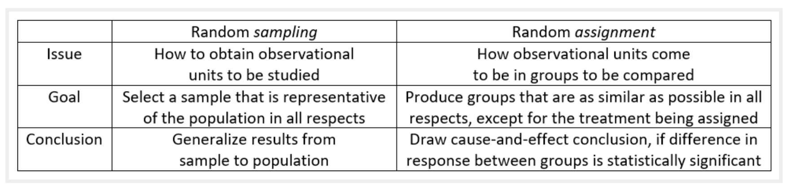

# Introduction {#intro}


<!--
## 1/21/20 Agenda {#Jan21}
1. Syllabus & Course Outline
2. Example: Friend or Foe
-->

## Course Logistics

**What is Statistics?**
Generally, statistics is the academic discipline which uses data to make claims and predictions about larger populations of interest.  It is the science of collecting, wrangling, visualizing, and analyzing data as a representation of a larger whole.  It is worth noting that probability represents the majority of mathematical tools used in statistics, but probability as a discipline does not work with data.  Having taken a probability class may help you with some of the mathematics covered in the course, but it is not a substitute for understanding the basics of introductory statistics.

<div class="figure" style="text-align: center">

<p class="caption">(\#fig:unnamed-chunk-1)Probability vs. Statistics</p>
</div>

* *descriptive statistics* describe the sample at hand with no intent on making generalizations.
* *inferential statistics* use a sample to make claims about a population

### Vocabulary {-}
* An **observational unit** is represented by a row in a dataframe.  It is the object on which we measure things.
* A **variable** is represented by a column in a dataframe.  It is the characteristic which is measured on an observational unit.
* A  **statistic** is a numerical measurement we get from the sample, a function of the data. [Also sometimes called an **estimate**.]
* A  **parameter** is a numerical measurement of the population.  We never know the true value of the parameter.

**What is the content of Math 58(B)?**
This class will be an introduction to statistical ideas using R.  We will cover the majority of statistical methods which are used in standard analyses (e.g., t-tests, chi-squared analysis, confidence intervals, binomial tests, etc.).  The main inferential techniques will be covered using both theoretical approximations (e.g., the central limit theorem) as well as computational methods (e.g., randomization tests and bootstrapping).  Focus will be on understanding he methods and interpreting results.

Our goal in this course is to learn how to better evaluate quantitative information with regards to data.  We'll be sure to keep in mind:

* Careful presentation of data 
* Consideration of variability 
* Meaningful comparisons 

**What is the difference between Math 58 and Math 58B?**

The two classes are remarkably similar in content and structure.  Indeed, there are more similarities to the classes than there are differences.  The main differences have to do with a handful of topics which are different across the two classes.  


|                       | topic for Math 58                   | topic for Math 58B                  |
|-----------------------|-------------------------------------|-------------------------------------|
| early in the semester | Binomial probabilities              | relative risk & odds ratios         |
| later in the semester | introduction to multiple regression | introduction to logistic regression |

**What are the Learning Outcomes for Math 58(B)?**

* Given a study, identify population, sample, parameter, statistic, observational unit, and variable.
* Describe the differences between, benefits of each, and conclusions which can be drawn in observational studies versus experiments.
* Given a dataset and research query, create an appropriate figure in R.
* Given a dataset and research query, compute appropriate statistics in R.
* Describe the difference between the distribution of a sample of data and a sampling distribution of a particular statistic.
* For a particular research question, identify whether the task requires descriptive analysis / model, graphic, confidence interval, or hypothesis test,
* Apply the empirical rule to as an approximation to confidence intervals and hypothesis testing in settings of means and proportions.
* Be able to describe in words what a p-value is and what it is not.
* Write down appropriate null and alternative hypotheses, and choose the correct analysis technique.
* Run the hypothesis test / confidence interval analysis in R.
* Identify when it is and when it is not appropriate to summarize the relationship between two variables using a least squares line.
* Describe the optimization procedure the leads to a least squares fit (although not necessarily to do the calculations).
* Provide the settings in which a causal claim is warranted, and when a strong correlation is possibly due to spurious relationships.
* Use a regression line to make predictions and distinguish between a prediction interval for an independent response as compared to a confidence interval for the slope parameter.
* For each descriptive analysis, visualization, confidence interval, or hypothesis test, in words communicate the conclusion of the analysis in the original context of the data.
* Use R Markdown to run reproducible analyses that include all aspects of the data analysis.

**Who should take Math 58(B)?**
Every educated citizen should have a basic understanding of statistics.  Ok, ok, I have my own biases, but I'm  <a href = "https://www.ted.com/talks/arthur_benjamin_s_formula_for_changing_math_education" target = "_blank">not the only person who thinks this!</a>  In terms of your academic interests, you should take introductory statistics if you would like to take upper division statistics or if you are planning to analyze data in a field outside of statistics (e.g., biology, EA, psychology, etc.).    Upper division statistics courses *require* introductory statistics, and it is not easy to just "learn" statistics on your own over the summer.  I highly recommend taking an introductory statistics course.

If you have already taken AP Statistics, you may or may not want to repeat the material.  If you had a strong course with an excellent teacher and scored well on the exam, you probably do not need to repeat the material.  If you are uncertain about many of the concepts, then you may want to re-take the course before jumping into upper division statistics courses.  We will use R extensively, and you probably didn't use R in your AP Statistics classes.  Most upper division statistics classes will expect you to be able to jump into R head first, and introductory statistics gives a more gentle introduction to R.   

**What are the prerequisites for Math 58(B)?**

The formal prerequisite is a semester of calculus, but we do almost no calculus in the entire semester.  However, a student in Math 58(B) should be quantitatively inclined and ready to see many new mathematical, algorithmic, and computational ideas quickly throughout the semester.

**Is there overlap with other classes?**
There is considerable overlap between Math 58 and Math 58B; you should not take both Math 58 and Math 58B.  The differences between the two sections lie in the examples as well as a handful of topics that are different across the two courses.  There is also quite a bit of overlap with other introductory statistics courses (e.g., Econ 57, Pysch 158, Politics 90, AP Statistics).  Some introductory statistics courses cover quite a bit of probability without getting deeply into inferential ideas.  We will focus on statistics instead of probability with an emphasis on understanding the intuition and mathematical derivations that inform the analysis tool.  We will also focus on how the computer can help us gain a deeper understanding of the analyses we are doing.
 

**When should I take Math 58 or Math 58B?**
Introductory (Bio)Statistics should be taken as early in your undergraduate schedule as possible.  By taking Math 58(B) you will open up the possibilities for taking upper division statistics classes.  Additionally, the background covered in Math 58(B) will provide you with a deeper understanding of the concepts you are covering in your science and social science courses.

**What is the workload for Math 58(B)?**
Math 58(B) meets twice a week for 75 min for lecture and once a week for an hour for lab.  Every week there will be one homework and one lab assignment.  There are two midterm exams, each with an in-class and take-home section.   The final exam will also have in-class and take-home parts.  The class is not known to be extremely difficult or time consuming; however, it does require that you stay up with the material, do all of the assignments, and come to all class meetings (participation is a part of your grade).


**What software will we use? Will there be any real world applications?  Will there be any mathematics?  Will there be any CS?**
All of the work will be done in R using RStudio as a front end.  You will need to either download R and RStudio (both are free) onto your own computer or use them on Pomona's server.  The class is a mix of many real world applications and case studies, some higher level math, programming, and communication skills.  The final project requires your own analysis of a dataset of your choosing.


* You may use R on the Pomona server:  https://rstudio.pomona.edu/  (All Pomona students will be able to log in immediately.  Non-Pomona students need to go to ITS at Pomona to get Pomona login information.)
* If you want to use R on your own machine, you may.  Please make sure all components are updated:
R is freely available at http://www.r-project.org/ and is already installed on college computers. Additionally, installing R Studio is required http://rstudio.org/.
* http://swirlstats.com/ is one way to walk through learning the basics of R.
* All assignments should be turned in using R Markdown compiled to pdf.


<div class="figure" style="text-align: center">

<p class="caption">(\#fig:unnamed-chunk-2)Taken from [Modern Drive: An introduction to statistical and data sciences via R](https://ismayc.github.io/moderndiver-book/), by Ismay and Kim</p>
</div>

<div class="figure" style="text-align: center">

<p class="caption">(\#fig:unnamed-chunk-3)[Jessica Ward](https://jkrward.github.io/), PhD student at Newcastle University</p>
</div>


## Example: Friend or Foe {#ex:helper}

This example comes from Investigation 1.1: Friend or Foe? @iscam.  The idea is to use simulation to determine how likely our data would be if nothing interesting was going on.


> In a study reported in the November 2007 issue of *Nature*, researchers investigated whether infants take into account an individual’s actions towards others in evaluating that individual as appealing or aversive, perhaps laying for the foundation for social interaction [@hamlin2007]. In other words, do children who aren't even yet talking still form impressions as to someone’s friendliness based on their actions? In one component of the study, 10-month-old infants were shown a “climber” character (a piece of wood with “googly” eyes glued onto it) that could not make it up a hill in two tries. Then the infants were shown two scenarios for the climber’s next try, one where the climber was pushed to the top of the hill by another character (the “helper” toy) and one where the climber was pushed back down the hill by another character (the “hinderer” toy). The infant was alternately shown
these two scenarios several times. Then the child was presented with both pieces of wood (the helper and the hinderer characters) and asked to pick one to play with. Videos demonstrating this component of the study can be found at http://campuspress.yale.edu/infantlab/media/.

> One important design consideration to keep in mind is that in order to equalize potential influencing factors such as shape, color, and position, the researchers varied the colors and shapes of the wooden characters and even on which side the toys were presented to the infants. The researchers found that 14 of the 16 infants chose the helper over the hinderer.


#### Always Ask {-}

* What are the observational units?
    - infants
* What is the variable?  What type of variable?
    - choice of helper or hindered: categorical
* What is the statistic?
    - $\hat{p}$ = proportion of infants who chose helper = 14/16 = 0.875
* What is the parameter?
    - p = proportion of all infants who might choose helper (not measurable!)

> **p-value** is the probability of our data or more extreme if nothing interesting is going on.

|           completely arbitrary cutoff | $\rightarrow$ | generally accepted conclusion          |
|---------------------------:|:-------------:|---------------------------------------------|
|           p-value $>$ 0.10 | $\rightarrow$ | no evidence against the null model          |
| 0.05 $<$ p-value $<$ 0.10 | $\rightarrow$ | moderate evidence against the null model    |
| 0.01 $<$ p-value $<$ 0.05 | $\rightarrow$ | strong evidence against the null model      |
|          p-value $<$ 0.01 | $\rightarrow$ | very strong evidence against the null model |


#### Computation {-}


```r
library(infer)

# to control the randomness
set.seed(47)

# first create a data frame with the Infant data
Infants <- read.delim("http://www.rossmanchance.com/iscam3/data/InfantData.txt")

Infants %>% head()
```

```
##     choice
## 1   helper
## 2 hinderer
## 3   helper
## 4   helper
## 5   helper
## 6   helper
```

```r
# then find the proportion who help
(p_obs <- Infants %>%
    specify(response = choice, success = "helper") %>%
    calculate(stat = "prop") )
```

```
## Response: choice (factor)
## # A tibble: 1 × 1
##    stat
##   <dbl>
## 1 0.875
```

```r
# now apply the infer framework to get the null proportion
null_help <- Infants %>%
  specify(response = choice, success = "helper") %>%
  hypothesize(null = "point", p = .5) %>%
  generate(reps = 1000, type = "simulate") %>%
  calculate(stat = "prop")

# then visualize the null sampling distribution & p-value
visualize(null_help, bins = 13) +
  shade_p_value(obs_stat = p_obs, direction = "two_sided")
```


```r
# calculate the actual p-value
null_help %>%
  get_p_value(obs_stat = p_obs, direction = "two_sided")
```

```
## # A tibble: 1 × 1
##   p_value
##     <dbl>
## 1   0.002
```

#### Logic for what we believe {-}

1. If we look back to the study, we can tell that the researchers varied color, shape, side, etc. to make sure there was nothing systematic about how the infants chose the block (e.g., if they all watch *Blue's Clues* they might love the color blue, so we wouldn't always want the helper shape to be blue).  

The excellent design survey rules out outside influence as the reason so many of the infants chose the helper shape.

2. We ruled out random chance as the mechanism for the larger number of infants who chose the helper shape.  (We reject the null hypothesis.)

3. We conclude that babies are inclined to be helpful.  That is, they are more likely to choose the helper than the hindered.  [Note:  we don't have any evidence for *why* they choose the helper.  That is, they might be predisposed.  They might be modeling their parents.  They might notice that *they* need a lot of help, etc.]

## Types of Studies {#experim}

The two basic types of studies encountered are **observational** and **experimental**.

* In an **experiment**, researchers assign treatments to cases.  That is, the researchers decide who gets which level of the treatment (also known as explanatory variable).  When the treatment is assigned randomly, the experiment is known as a **randomized experiment**.

* In an **observational** study, the researchers observe both the explanatory and the response variable without interfering in how the data arise.

The three most important types of variables in most studies, include the variables which are part of the model and then one more category of variables, **confounding**:

* **Explanatory variable** is one that is a potential explanation for any changes (e.g., smoking level).  
* **Response variable** is the measured outcome of interest (e.g., lung cancer).  
* **Confounding variable** is a variable (typically not measured!) that is associated with both the explanatory and response variables.

### Example: Hand Writing & SAT Scores^[@iscam, Inv 3.3]

> An article about handwriting appeared in the October 11, 2006 issue of the Washington Post. The article mentioned that among students who took the essay portion of the SAT exam in 2005-06, those who wrote in cursive style scored significantly higher on the essay, on average, than students who used printed block letters. Researchers wanted to know whether simply writing in cursive would be a way to increase scores.


* Identify the observational units, the variables, the types of variables, the parameter of interest, and the statistic which was measured.  What type of study was it?

* **Q1** does writing in cursive **cause** higher scores?  What are some potential confounding variables?

> The article also mentioned a different study in which the same one essay was given to all graders. But some graders were shown a cursive version of the essay and the other graders were shown a version with printed block letters. The average score assigned to the essay with the cursive style was *significantly* higher than the average score assigned to the essay with the printed block letters.

* Do any of these change?  the observational units, the variables, the types of variables, the parameter of interest, and the statistic which was measured.  What type of study was it?

* **Q2** can the conclusion include a causal statement now?  Why?  What changed?

### Example: Have a Nice Trip^[@iscam, Inv 3.4]

> An area of research in biomechanics and gerontology concerns falls and fall-related injuries, especially for elderly people. Recent studies have focused on how individuals respond to large postural disturbances (e.g., tripping, induced slips). One question is whether subjects can be instructed to improve their recovery from such perturbations. Suppose researchers want to compare two such recovery strategies, lowering (making the next step shorter, but in normal step time) and elevating (using a longer or normal step length with normal step time). Subjects will have first been trained on one of these two recovery strategies, and they will be asked to apply it after they feel themselves tripping. The researchers will then induce the subject to trip while walking (but harnessed for safety), using a concealed mechanical obstacle.

> Suppose the following 24 subjects have agreed to participate in such a study. Both males and female were recruited because females tend to have better balance (lower center of gravity). 

>Females: Alisha, Alice, Betty, Martha, Audrey, Mary, Barbie, Anna

>Males: Matt, Peter, Shawn, Brad, Michael, Kyle, Russ, Patrick, Bob, Kevin, Mitch, Marvin,
Paul, Pedro, Roger, Sam


> The applet at http://www.rossmanchance.com/applets/2021/sampling/Subjects.html is helpful for visualizing why confounding variables are removed when the treatment is randomly assigned.

* **Q1** Why would we not want to allow all the women to be trained in the "lowering" technique and all the men trained in the "elevating" technique?

* **Q2**  Why do we randomize the treatment?  How does it affect gender balance?  Height distribution? Gene distribution?  Factor "X"?

* **Q3** What if gender balance across the two treatments is required for the study?  How is the treatment randomly allocated to the observational units?  That is, what would change from Q2?

### Study conclusions

The ideas surrounding study design typically connect to the question of causality:  is it possible or not to infer causality at the end of the study?  However, the words we use ("random allocation") sound a lot like the words we used when describing sampling ("random sample" or "random selection").

Random sampling and random allocation are **VERY DIFFERENT** concepts!  And most importantly, the *conclusions* made from the two different study characteristics are different.  

* **Random selection** or **Random sample** - each unit in the population is equally likely to be chosen for the sample.
* **Random allocation** - each observational unit is equally likely to be assigned to any of the treatments (explanatory variable).


<div class="figure" style="text-align: center">

<p class="caption">(\#fig:randSleuth)Random Sample vs Randomized Experiment, taken from @sleuth</p>
</div>

<div class="figure" style="text-align: center">

<p class="caption">(\#fig:randgoodQ)Random Sample vs Randomized Experiment, taken from https://askgoodquestions.blog/</p>
</div>

In an ideal world, every study would have participants who were randomly sampled from the population and randomly allocated to the treatments.  However, the limitations of ethical research makes simultaneously doing both random processes difficult.  Why is that?  Consider the following:

* In a clinical trial, it makes sense to randomly allocate the subjects.  You cannot, however, randomly select people from the population to take part in the clinical trial.  Why not?

* In a political poll, it seems reasonable that the participants who are called (not necessarily the people who respond!) are a random sample from the population.  It does not make sense, however, to randomly allocate those people to different treatments.  Why not?

## <i class="fas fa-lightbulb" target="_blank"></i> Reflection Questions

### Types of studies: IMS Chapters 1 + 2

1. What is the difference between an observational study and an experiment?
3. What is a confounding variable?
4. Have you looked at Figure \@ref(fig:randSleuth) and Figure \@ref(fig:randgoodQ)? Do you understand the two figures?  Could you explain what their main message is to a friend? [Random sampling vs. Random allocation]
5. How is the statistical meaning of the word *cause* different from the usage in the sentence: *The ball that hit me in the head caused me to get a headache.*
6. What are the meanings of the words: randomized, double-blind (single-blind), control, placebo, and comparative.  Why are these ideas important to interpreting study results?

## <i class="fas fa-balance-scale"></i> Ethics Considerations

1. Why aren't all studies done as experiments?
2. Why do statisticians worry so much about claiming causation?
3. Why aren't all studies double-blind?
4. Why aren't all studies done on data that has been randomly sampled from a population?

