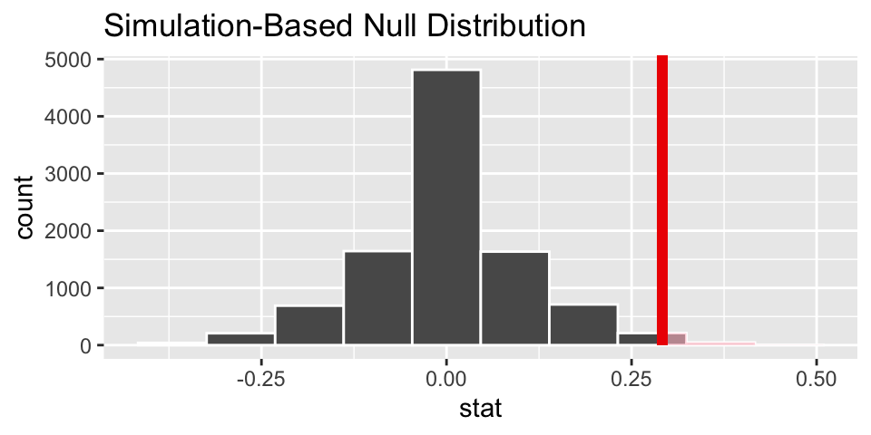
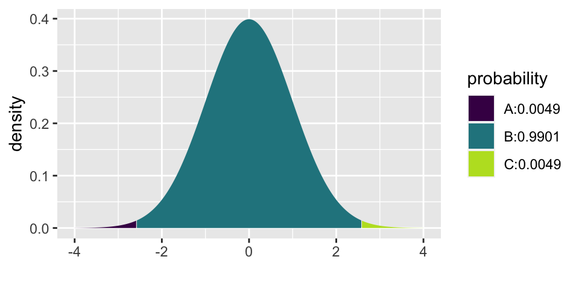

# Foundations for Inference


<!--
## 1/23/20 Agenda {#Jan23}
1. Example: gender discrimination
2. `infer` again
3. Hypothesis testing structure
-->

## Randomization Test {#randtest}

Hypothesis testing is arguably the most fundamental process for decision making in statistics.
The particular hypothesis test given here is called a Randomization Test.  Many other hypothesis tests (with slightly different structure but all of the same pieces) will be seen throughout the course.

::: {.definition}
**Randomization Test**

A hypothesis test that is based on simulated random assignment of the explanatory variable.  Each of the simulations is done under the condition that there is no association between the explanatory variable and the response variable.
::: 

In this section we describe the structure of a randomization test within the framework of an example on gender discrimination. 

::: {.example #gend} 
**Gender Discrimination**

> We consider a study investigating gender discrimination in the 1970s, which is set in the context of personnel decisions within a bank.^[Rosen B and Jerdee T. 1974. Influence of sex role stereotypes on personnel decisions. Journal of Applied Psychology 59(1):9-14.] The research question we hope to answer is, "Are females discriminated against in promotion decisions made by male managers?"

> The participants in this study were 48 male bank supervisors attending a management institute at the University of North Carolina in 1972. They were asked to assume the role of the personnel director of a bank and were given a personnel file to judge whether the person should be promoted to a branch manager position. The files given to the participants were identical, except that half of them indicated the candidate was male and the other half indicated the candidate was female. These files were randomly assigned to the subjects.

> For each supervisor we recorded the gender associated with the assigned file and the promotion decision. Using the results of the study summarized in Table 2.1, we would like to evaluate if females are unfairly discriminated against in promotion decisions. In this study, a smaller proportion of females are promoted than males (0.583 versus 0.875), but it is unclear whether the difference provides convincing evidence that females are unfairly discriminated against.   (@ims) 

|   |        |          | decision     |       |
|---|--------|----------|--------------|-------|
|   |        | promoted | not promoted | total |
|   | male   | 21       | 3            | 24    |
|   | female | 14       | 10           | 24    |
|   | total  | 35       | 13           | 48    |
:::


#### Always Ask {-}

* What are the observational units?
    - supervisor
* What are the variables?  What type of variables?
    - (1) whether the resume was male or female (explanatory, categorical)
    - (2) decision to promote or not promote (response, categorical)
* What is the statistic?
    - $\hat{p}_m - \hat{p}_f$ = 21/24 - 14/24 = 0.292  (the difference between the proportion of men who were promoted and the proportion of women who were promoted)
* What is the parameter?
    - $p_m - p_f$ = the true difference in the probability of a man being promoted minus the probability of a woman being promoted.
    
#### Hypotheses {-}

H0: Null hypothesis. The variables gender and decision are independent. They have no relationship, and therefore any observed difference between the proportion of males and females who were promoted is due to chance.

HA: Alternative hypothesis. The variables gender and decision are not independent. Any observed difference between the proportion of males and females who were promoted is **not** due to chance.

#### Computation {-}


```r
library(infer)

# to control the randomness
set.seed(47)

# first create a data frame with the discrimination data
discrim <- data.frame(gender = c(rep("male", 24), rep("female", 24)),
                      decision = c(rep("promote", 21), rep("not", 3), 
                                   rep("promote", 14), rep("not", 10)))

discrim %>% head()
```

```
##   gender decision
## 1   male  promote
## 2   male  promote
## 3   male  promote
## 4   male  promote
## 5   male  promote
## 6   male  promote
```

```r
# then find the difference in proportion who are promoted
(diff_obs <- discrim %>%
    specify(decision ~ gender, success = "promote") %>%
    calculate(stat = "diff in props", order = c("male", "female")) )
```

```
## # A tibble: 1 x 1
##    stat
##   <dbl>
## 1 0.292
```

```r
# now apply the infer framework to get the null differences in proportions
null_discrim <- discrim %>%
  specify(decision ~ gender, success = "promote") %>%
  hypothesize(null = "independence") %>%
  generate(reps = 10000, type = "permute") %>%
  calculate(stat = "diff in props", order = c("male", "female"))

# then visualize the null sampling distribution & p-value
visualize(null_discrim, bins = 10) +
  shade_p_value(obs_stat = diff_obs, direction = "greater")
```


```r
# calculate the actual p-value
null_discrim %>%
  get_p_value(obs_stat = diff_obs, direction = "greater")
```

```
## # A tibble: 1 x 1
##   p_value
##     <dbl>
## 1   0.026
```

#### Logic for what we believe {-}

1. We know that the study was an experiment, so there should be no **systematic** differences between the group who received "male" applications and "female" applications.

2. We've ruled out random chance as the reason for the huge difference in proportions.  (We reject the null hypothesis.)  if we lived in the null reality, we'd only see data like these about 2.5% of the time.

3. We conclude that gender and decision are not independent.  That is, knowing the gender changes the probability of promotion.


## Structure of Hypothesis testing

### Hypotheses

* **Hypothesis Testing** compares data to the expectation of a specific null hypothesis.  If the data are unusual, assuming that the null hypothesis is true, then the null hypothesis is rejected.  

* The **Null Hypothesis**, $H_0$, is a specific statement about a population made for the purposes of argument.  A good null hypothesis is a statement that would be interesting to reject. 

* The **Alternative Hypothesis**, $H_A$, is a specific statement about a population that is in the researcher's interest to demonstrate.  Typically, the alternative hypothesis contains all the values of the population that are not included in the null hypothesis. 

* In a **two-sided** (or two-tailed) test, the alternative hypothesis includes values on both sides of the value specified by the null hypothesis.

* In a **one-sided** (or one-tailed) test, the alternative hypothesis includes parameter values on only one side of the value specified by the null hypothesis. $H_0$ is rejected only if the data depart from it in the direction stated by $H_A$.


### Other pieces of the process

* A  **statistic** is a numerical measurement we get from the sample, a function of the data. [Also sometimes called an **estimate**.]

* A  **parameter** is a numerical measurement of the population.  We never know the true value of the parameter.

* The **test statistic** is a quantity calculated from the data that is used to evaluate how compatible the data are with the result expected under the null hypothesis.

* The **null distribution** is the sampling distribution of outcomes for a test statistic under the assumption that the null hypothesis is true. 

* The **p-value** is the probability of obtaining the data (or data showing as great or greater difference from the null hypothesis) if the null hypothesis is true.  *The p-value is a number calculated from the dataset.*


#### Examples of Hypotheses {-}
Identify whether each of the following statements is more appropriate as the null hypothesis or as the alternative hypothesis in a test:

* The number of hours preschool children spend watching TV affects how they behave with other children when at day care.  *Alternative*

* Most genetic mutations are deleterious.  *Alternative*

* A diet of fast foods has no effect on liver function.  *Null*

* Cigarette smoking influences risk of suicide.  *Alternative*

* Growth rates of forest trees are unaffected by increases in carbon dioxide levels in the atmosphere.  *Null*

* The number of hours that grade-school children spend doing homework predicts their future success on standardized tests.  *Alternative*

* King cheetahs on average run the same speed as standard spotted cheetahs. *Null*

* The risk of facial clefts is equal for babies born to mothers who take folic acid supplements compared with those from mothers who do not.  *Null*

* The mean length of African elephant tusks has changed over the last 100 years.  *Alternative*

* Caffeine intake during pregnancy affects mean birth weight.  *Alternative*

#### What is an Alternative Hypothesis? {-}

Consider the brief video from the movie Slacker, an early movie by Richard Linklater (director of Boyhood, School of Rock, Before Sunrise, etc.). You can view the video here from starting at 2:22 and ending at 4:30:  https://www.youtube.com/watch?v=b-U_I1DCGEY

In the video, a rider in the back of a taxi (played by Linklater himself) muses about alternate realities that could have happened as he arrived in Austin on the bus. What if instead of taking a taxi, he had found a ride with a woman at the bus station? He could have take a different road into a different alternate reality, and in that reality his current reality would be an alternate reality. And so on.

What is the point?  Why did we see the video?  How does it relate the to the material from class?  What is the relationship to sampling distributions?


###  All together:  structure of a hypothesis test

* decide on a research question (which will determine the test)
* collect data, **specify** the variables of interest
* state the null (and alternative) **hypothesis** values (often statements about parameters)
   - the null claim is the science we want to reject
   - the alternative claim is the science we want to demonstrate
* **generate** a (null) sampling distribution to describe the variability of the statistic that was **calculated** along the way
* **visualize** the distribution of the statistics under the null model
* **get_p_value** to measure the consistency of the observed statistic and the possible values of the statistic under the null model
* make a conclusion using words that describe the research setting


::: {.example}
**Randomization test on Gerrymandering:**

Note that the idea of creating a null distribution can apply to a wide range of possible settings.  The key is to swap observations around under the null hypothesis where "randomizing under the null hypothesis" helps get the researcher to a conclusion.  

Below is a youtube video describing permuting (i.e., randomizing) different voting boundaries to come up with a null distribution of districts.  The problem (as stated) is not possible to describe using mathematical functions, but we can derive a solution using computational approaches. [https://www.youtube.com/watch?v=gRCZR_BbjTo]
:::

::: {.example}
**Email or Paper & Pencil?**^[@iscam, Chapter 3, HW 5]
Are people more likely to lie with e-mail than with pencil and paper? A study reported at a meeting of the Academy of Management involved 48 graduate students studying business at a particular university who participated in a bargaining game (Naquin, Kurtzberg, & Belkin, 2008). The response variable of interest was whether the person misrepresented (lied about) the size of the pot when negotiating with another player. Some of the participants were randomly assigned to use e-mail for their communication, whereas others used paper and pencil. It turned out that 24 of 26 who used e-mail were guilty of lying about the pot size, compared to 14 of 22 who used paper and pencil.

As usual, state the following:  observational units, variables, population of interest, statistic to measure, parameter.

Let $p$ = probability of cheating (for anyone in the larger population, say of all graduate students studying business in the US)

$H_0: p_e = p_{pp}$  
$H_A: p_e \ne p_{pp}$

The statistic of interest is the difference in sample proportions:  $\hat{p}_e - \hat{p}_{pp} = 0.287$


* Using the [two-way tables applet](http://www.rossmanchance.com/applets/2021/chisqshuffle/ChiSqShuffle.htm?FET=1) from @iscam, we see a two-sided p-value of (approximately) 0.04.  
* What if the number of observations were half as big with the same proportions? (12 of 13 who used e-mail were guilty of lying about the pot size, compared to 7 of 11 who used paper and pencil.)  The two-sided p-value is (approximately) 0.13.  
* What if the number of observations were twice as big with the same proportions? (48 of 52 who used e-mail were guilty of lying about the pot size, compared to 28 of 44 who used paper and pencil. The two-sided p-value is virtually zero.

The original data shows borderline evidence to reject the null hypothesis  The half data is not at all convincing (we'd have to start over with our science).  The double data is extremely convincing.  That is all to say that when the variables are truly independent, a difference of 28.7% is a lot for large samples but not so much for small samples.

(For the conclusion below, let's assume that the decision to reject $H_0$ happens when the p-value is less than 0.05.)

**Conclusion:** (for the original data) Because the p-value was less than 0.05, we can reject the null hypothesis.  We conclude that the probability of cheating is larger for those who use email as compared to those who use pencil & paper.  Because the treatment was randomly allocated, we believe that it is the email vs pencil & paper that led to the increase in cheating.  Unlikely that we can generalize to all people, but it is probably reasonable to generalize to students of business at that institution, maybe even at all institutions.  
:::

<!--
## 1/28/20 Agenda {#Jan28}
1. Central Limit Theorem
2. Mathematical approximation for the distribution of one sample proportion
-->


## Confidence Intervals {#CI}

Randomization tests are best suited for modeling experiments where the treatment (explanatory variable) has been randomly assigned to the observational units and there is an attempt to answer a simple yes/no question.

For example, consider the following research questions that can be well assessed with a randomization test:

* Does this vaccine make it less likely that a person will get malaria as compared to not getting the vaccine? 
* Does drinking caffeine versus not drinking caffeine affect how quickly a person can tap their finger? 
* Can we predict which candidate will win the upcoming election?  

In this section, however, we are instead interested in estimating (not testing) the unknown value of a population parameter.  For example,

* How much less likely am I to get malaria if I get the vaccine? 
* How much faster (or slower) can a person tap their finger, on average, if they drink caffeine first? 
* What proportion of the vote will go to candidate A? 

For now, we explore the situation where focus is on a single proportion, and we introduce a new simulation method, bootstrapping.

### Bootstrapping {#boot}

Bootstrapping is best suited for modeling studies where the data have been generated through random sampling from a population.
The goal of bootstrapping is to get an understanding of the variability of a statistic (from sample to sample).
The variability of the statistic can be combined with the point estimate of the statistic in order to make claims about the population parameter.

In some cases (indeed, even in the case described here with one proportion!) a mathematical model can be used to describe the variability of a statistic of interest.  We will encounter the mathematical models (including distributions such as the normal distribution, the t-distribution and the chi squared distribution) in later sections.  However, for now, we will approximate the distribution of a statistic using repeated sampling.

> The **distribution** of a statistic (called the **Sampling Distribution**) contains information (through, for example, a graph like a histogram or a mathematical model) on the possible values of the statistic and how often each of those values is likely to appear.

Recall (Example \@ref(ex:helper) and Kissing example in HW) that with a hypothesized value of the true proportion (e.g., $p=0.5$ with babies helping; $p=0.8$ in kissing), we can understand / graph the possible values of $\hat{p}$ under repeated samples.
That is, if the true proportion of people who kiss to the right is $p=0.8$, then if we select randomly from a bag with 80% red marbles (and 20% white marbles) we can understand the variability associated with the sample proportion of couples who kiss to the right in a sample of 124 couples.

::: {.example #outyoutube}
Let's say you want to find out what proportion of videos on YouTube take place outside.  You don't have any idea what the true value is, but you'd like to estimate the population value.  You take a random sample of 128 videos (there are lots of websites which will take random samples of YouTube videos, but tbh, I don't know how "random" they actually are), and you find that 37 of them take place outside.
:::

If you had originally hypothesized that 47% of YouTube videos happen outside, then the variability of the sample proportion can be described by the following histogram.  That is to say, if each student in our class individually took a random sample of 128 YouTube videos (and again, with the condition that p = 0.47), their sample proportions would vary as below.  To do the simulation with the computer, think about repeatedly selecting 128 marbles from a bag with 47% red.





But remember we are trying to model the situation where there is *not* a hypothesized value of the parameter in mind.  That is, we need to use only the information in the sample to estimate the unknown characteristics about the population.

Due to theory that is beyond the scope of this book, it turns out that the if resamples are taken from the sample, they will vary around $\hat{p}$ in the same way that individual samples will vary around $p$.  Let's break that down a little bit.

As we saw in the figure above, when $p=0.47$, the sample proportions vary from about 0.37 to 0.57, and they are centered at 0.47.  That is, the sample proportions ($\hat{p}$ values) vary around $p=0.47$ by about plus or minus 0.1.  Also, note that the shape of the distribution is reasonably bell-shaped and symmetric.

What happens if we use the **data** as a pseudo-population?  In the actual dataset, 37 of the 128 videos took place outside.  So $\hat{p} = 0.29$.  If the bag of marbles now has 29% red marbles (and 71% white marbles), how would the new bootstrapped sample proportions ($\hat{p}_{BS}$) vary?  Note that with 29% red marbles in the bag, each resample has a bootstrapped proportion which now varies around 0.29!  The range of possible values is still roughly plus or minus 0.1, and the shape of the distribution is bell-shaped and symmetric.


::: {.definition}
**Resample.**  To resample is to select observations from the observed sample one at a time, measure them, replace them back into the population, and repeat until the new "resample" is exactly the same size as the original sample.

Note the physical object which connects to resampling is a bag of marbles.  For example, in the kissing setting, the bag of marbles has 37 red marbles and 91 white marbles.  By *replacing* the marble after it has been selected and its color recorded, we are effectively creating an infinitely large bag of marbles with 29% red.

The bootstrap process is typically referred to as **resampling with replacement**.
:::

Two good applets for understanding bootstrapping and sampling distributions are:
* StatKey (*Statistics: Unlocking the Power of Data*)  http://www.lock5stat.com/StatKey/bootstrap_1_cat/bootstrap_1_cat.html
* ISCAM http://www.rossmanchance.com/applets/2021/oneprop/OneProp.htm

### Bootstrapping Confidence Intervals {#bootCI}

A point estimate (also called a statistic) gives a single value for the best guess of the parameter of interest.
Although it is the best guess, it is rarely perfect, and we expect that there is some error (i.e., variability) in the estimated value.
A **confidence interval** provides a range of plausible values for the parameter.
A **confidence level** is the long-run percent of intervals that capture the true parameter.

Reminder of where we are:  

* The goal is to find an interval of plausible values for a parameter, the true proportion $p$.  
* We are working with only *one* dataset, that is, one sample proportion $\hat{p}$. 
* We can resample from the original dataset (where resample is called bootstrapping) to find out the shape of how sample proportions vary.  
* Due to theory that is beyond the scope of this book, it turns out that the if resamples are taken from the sample, they will vary around $\hat{p}$ in the same way that individual samples will vary around $p$. 


> If you are two feet from me, then I am two feet from you.


\BeginKnitrBlock{definition}<div class="definition"><span class="definition" id="def:unnamed-chunk-4"><strong>(\#def:unnamed-chunk-4) </strong></span>**95% Bootstrap Percentile Confidence Interval for $p$**  
  
From the bootstrapped proportions, find the bootstrap value at 2.5\% and 97.5\% and refer to them as "lower" and "upper" respectively.

The interval given by:  (lower, upper)  will be a 95% confidence interval for $p$.

Note that the "95%" value is the confidence level and describes how often the process outlined above will actually work to capture the true parameter of interest.</div>\EndKnitrBlock{definition}

As you might suspect, if the goal is to create intervals that capture the true parameter at a lower rate (say, 90%) then the endpoints of the interval will be taken from the 5% and 95% bootstrapped proportion values.
If the goal is to create intervals that capture the true parameter at a higher rate (say, 99%) then the endpoints of the interval will be taken from the 0.5% and 99.5% bootstrapped proportion values.
The larger confidence level will capture the true parameter at a higher rate (which is a good thing!), but it comes at a cost of also creating an interval that is much wider than a 90% interval.
An interval that is too wide will not be helpful in trying to understand the population at hand (which is why we don't attempt to create "100% intervals" which would be given by (0,1), useless for learning anything new).

####  A note on sample size

By working with the applets, you may notice that the variability of the proportions decreases substantially with larger sample sizes.  However the *rate* by which an confidence procedure captures the parameter is completely separated from the value of the sample sizes.
The confidence procedure will capture at the set rate regardless of sample size.
A larger sample size will create more narrow intervals (than a small sample size), but it will not capture the true parameter any more often.

## Normal Model


### Central Limit Therm {#CLT}


#### Example: Reese's Pieces^[Inv 1.8, Chance & Rossman, ISCAM] {-}

As with many of the examples, the Reese's Pieces example comes from @iscam.  The example focuses on how the samples of orange Reese's Pieces vary from sample to sample.  Today we aren't particularly interested in a specific research question, instead we are trying to understand the details of the model which describes how $\hat{p}$ varies from sample to sample.  [Spoiler: the distribution is going to look like a bell!  and the mathematical model which describes the variability is called the normal distribution.]

Notes from the applet: http://www.rossmanchance.com/applets/OneProp/OneProp.htm?candy=1

* How does the sampling distribution change as a function of $p$ and $n$?
* When a normal distribution is placed on top of the empirical (computational) distribution, does it fit well?


A *sampling distribution* is the probability distribution of all possible values of the *statistic* in all possible samples of the same size from the same population.  Note: increasing the sample size reduces the spread of the sampling distribution of a statistic (i.e., increases the precision).

##### Normal Probability Curve {-}

* symmetric
* bell-shaped
* centered at $\mu$
* $\sigma$ shows the point of inflection
* draw a picture **every** time you start a normal problem!

The Central Limit Theorem

> **The Central Limit Theorem** says that the sampling distribution of an  *average* will have a bell shaped distribution if $n$ is big enough.


The sampling distribution of $\hat{p} = X/n$ can be thought of as taking lots of random samples from a population, calculating $\hat{p}$, and creating a histogram.  We can easily calculate what we'd expect from that sampling distribution if we know $p$, the true population proportion.  

Because $\hat{p}$ is actually an average, the sampling distribution of $\hat{p}$ can be described by a normal distribution (as long as $n$ is big enough).

\begin{eqnarray*}
\hat{p} &=& \frac{X}{n}\\
SD(\hat{p}) = \sigma_{\hat{p}} &=& \sqrt{\frac{p (1-p)}{n}}\\
SE(\hat{p}) &=& \sqrt{\frac{\hat{p}(1-\hat{p})}{n}}\\
\hat{p} &\sim& N\bigg(p, \sqrt{\frac{p(1-p)}{n}} \bigg) \ \ \ \ \ \mbox{ (if the sample size is large enough)}\\
\end{eqnarray*}


Notice the slight difference between $SD$ (uses $p$) and $SE$ (uses $\hat{p}$).  We won't make a big deal of the difference here (and indeed, your book calls both equations $SD$).  We would expect 95% of our $\hat{p}$ values to be within 2 standard deviations of the mean.  That is, 95% of $\hat{p}$ are:
\begin{eqnarray*}
p \pm 2 \sqrt{\frac{p(1-p)}{n}}
\end{eqnarray*}
Or put differently, when referring to a randomly selected $\hat{p}$,
\begin{eqnarray*}
P\bigg( - 2 \sqrt{\frac{p(1-p)}{n}} \leq \hat{p} - p \leq 2 \sqrt{\frac{p(1-p)}{n}}\bigg) = 0.95\\
P\bigg(\hat{p} - 2 \sqrt{\frac{p(1-p)}{n}} \leq  p \leq \hat{p} + 2 \sqrt{\frac{p(1-p)}{n}}\bigg) = 0.95
\end{eqnarray*}

We'd love to create our interval for $p$ using $\hat{p} \pm 2 \sqrt{\frac{p(1-p)}{n}}$, but we don't know $p$!  One option is to use $SE(\hat{p})$ in the estimate of the variability.

##### The Empirical Rule {-}

In a bell-shaped, symmetric distribution,

| % of data | in what interval   |
|:-------------|:----------------------------|
|$\approx 68\%$ | of the observations fall within 1 st dev of the mean |
|$\approx 95\%$ | of the observations fall within 2 st dev of the mean |
|$\approx 99.7\%$ | of the observations fall within 3 st dev of the mean |


<!--
%Show gorilla move:
%\url{viscog.beckman.uiuc.edu/flashmovie/15.php}
-->


<!--
## 1/30/20 Agenda {#Jan30}
1. Normal distribution (no q-q plots)
2. Calculating normal probabilities
-->

### Normal Probabilities & Z scores {#norm}

#### Z score {-}

> A **Z score** of an observation is the number of standard deviations it falls above or below the mean. We compute the Z score for an observation x that follows a distribution with mean $\mu$ and standard deviation $\sigma$ using

$$ Z = \frac{x - \mu}{\sigma}$$

#### Normal probabilities {-}

We return to the Reese's Pieces example to investigate the probability of a particular number of orange candies, using the normal approximation. 

Remember:  $$SD(\hat{p}) = \sqrt{\frac{p(1-p)}{n}}$$

And the respective Z score is: $$ Z = \frac{\hat{p} - p}{\sqrt{\frac{p(1-p)}{n}}}$$

(a) What is the probability that in a sample of 25 candies, you would get less than 40% orange (provided that the machine colors 50% of the candies orange).  Answer: 0.1587

(b) What is the probability that in a sample of 250 candies, you would get less than 40% orange (provided that the machine colors 50% of the candies orange).  Answer: 0.0007888

(c) What is the probability that in a sample of 25 candies, you would get between 40% and 55% orange (provided that the machine colors 50% of the candies orange).  Answer: 0.5328


```r
library(mosaic)
# (a)
(0.4 - 0.5) / sqrt(0.5*0.5/25)
```

```
## [1] -1
```

```r
xpnorm(-1, 0, 1)
```


```
## [1] 0.1586553
```

```r
# (b)
(0.4 - 0.5) / sqrt(0.5*0.5/250)
```

```
## [1] -3.162278
```

```r
xpnorm(-3.16, 0, 1)
```


```
## [1] 0.0007888457
```

```r
# (c)
(0.55 - 0.5) / sqrt(0.5*0.5/25)
```

```
## [1] 0.5
```

```r
xpnorm(c(-1, 0.5), 0, 1)
```


```
## [1] 0.1586553 0.6914625
```

Note that normal probabilities can be estimated for any variable that has a distribution which is well approximated by the bell shape given by a normal curve.  Below we calculate Z scores and probabilities for a non-proportion setting and then ask whether the values could possibly be normal.  (What do you think?)

#### Example: Athletic comparison^[taken from https://askgoodquestions.blog/2019/08/26/8-end-of-the-alphabet/ by Allan Rossman, he borrowed from 2011 AP Statistics exam]

The example below allows for a comparison between two athletes based on speed and strength.  The following information is provided about the sample of individuals who were measured:

* Speed is measured by the time required to run a distance of 40 yards, with smaller times indicating more desirable (faster) speeds.  From the data, the times to run 40 yards have a mean of 4.60 seconds and a standard devotion of 0.15 seconds, with a minimum of 4.40 seconds.

* Strength is measured by the amount of weight lifted, with more weight indicating more desirable (greater) strength  From the data, the amount of weight lifted has a mean of 310 pounds and a standard deviation of 25 pounds.


|                      | mean     | std dev  | minimum  |
|:----------------------|:----------|:----------|:----------|
| Time to run 40 yards | 4.60 sec | 0.15 sec | 4.40 sec |
| Amount lifted        | 310 lbs  | 25 lbs   | NA       |


1. Calculate and interpret the Z score for a player who can lift weight of 370 pounds.

$$Z = \frac{370-310}{25} = 2.4$$

This z-score tells us that a player who can lift 370 pounds is lifting 2.4 SDs more than average.  Saying that this weight is 2.4 SDs away from the average would leave out important information about direction.


2. Consider two players, A and B (with data given as below).  Which player should be selected for the team if only one player can be selected?

|                      | Player A | Player B |
|:----------------------|:----------|:----------|
| Time to run 40 yards | 4.42 sec | 4.57 sec |
| Amount lifted        | 370 lbs  | 375 lbs  |


At a first glance, we can see that A is faster, and B is stronger.  Understanding how each player performs (in strength and speed) relative to the rest of the players is the first step in answering the question.  We will calculate four Z scores, one for each player and each task:

\begin{align*}
Z_{Aspeed} =  \frac{4.42 - 4.6}{0.15} = -1.2\\
Z_{Astrength} = \frac{370-310}{25} = 2.4\\
Z_{Bspeed} =  \frac{4.57 - 4.6}{0.15} = -0.2\\
Z_{Bstrength} = \frac{375-310}{25} = 2.6\\
\end{align*}


After calculating Z scores, it is found that Player B is only slightly stronger than Player A, but Player A is considerably faster than Player B.  Because the question advised us to consider both criteria as equally valuable, Player A is the better choice.

3. Using the full information about the speed data, do you think that the distribution of 40 yard running times is approximately normal?

NO! The minimum is too close to the mean for the normal distribution to provide a reasonable model.  What does "too close" mean here?  Let's see how many standard deviations the minimum is below the mean:

$$ Z = \frac{4.4 - 4.6}{0.15} = -1.33 $$

The Z score tells us that the minimum speed is only -1.33 standard deviations below the mean.  According to the normal distribution (see the plot below), we would expect about 9% of the observations to be lower than 4.4 seconds, so the normal distribution does not seem to be a great fit to these observations.


```r
xpnorm(-1.333, 0, 1, plot = TRUE)
```


```
## [1] 0.0912659
```

<!--
## 2/4/20 Agenda {#Feb4}
1. Theoretical basis for confidence intervals
2. $Z^*$  (different from Z score!)
3. Example: extreme poverty
-->


### Normal Theory Confidence Intervals {#normCI}

#### Conditions for when the sampling distribution of $\hat{p}$ is nearly normal  (The Central Limit Theorem!!) {-} 

The sampling distribution for $\hat{p}$, taken from a sample of size $n$ from a population with a true proportion $p$, is nearly normal when:

1. the sample observations are independent
2. we expected to see at least 10 successes and 10 failures in our samples.  Said differently, $np \geq 10$ and $n(1-p) \geq 10$.  This is sometimes called the **success-failure condition**.

If the conditions are met, then the sampling distribution of $\hat{p}$ is nearly normal with mean $p$ and standard error:

$$SE_{\hat{p}} = SE (\hat{p}) = \sqrt{\frac{p(1-p)}{n}}$$

#### How far is $\hat{p}$ from $p$ ???  {-}

Great news, the $SE(\hat{p})$ measures the distance we can expect between $\hat{p}$ from $p \ !!!$  Indeed, a Z score tells us the distance between $\hat{p}$ from $p$ in units of standard error.

The normal distribution provides **percentages** for how often Z scores should fall in certain ranges.

From the empirical rule, we would expect 95% of our $\hat{p}$ values to be within 2 standard deviations of the mean.  That is, 95% of $\hat{p}$ are:
\begin{eqnarray*}
p \pm 2 \sqrt{\frac{p(1-p)}{n}}
\end{eqnarray*}
Or put differently, when referring to a randomly selected $\hat{p}$,
\begin{eqnarray*}
P\bigg( p - 2 \sqrt{\frac{p(1-p)}{n}} \leq \hat{p} \leq p + 2 \sqrt{\frac{p(1-p)}{n}}\bigg) = 0.95\\
P\bigg( - 2 \sqrt{\frac{p(1-p)}{n}} \leq \hat{p} - p \leq 2 \sqrt{\frac{p(1-p)}{n}}\bigg) = 0.95\\
P\bigg(\hat{p} - 2 \sqrt{\frac{p(1-p)}{n}} \leq  p \leq \hat{p} + 2 \sqrt{\frac{p(1-p)}{n}}\bigg) = 0.95
\end{eqnarray*}

Putting it all together, we create a confidence interval for $p$ which says that 95% of all samples will create confidence intervals that capture the true (unknown $p$):

$$95\% \mbox{ CI for }p:  \hat{p} \pm 1.96 \sqrt{\frac{p(1-p)}{n}}$$

And if a different percentage is needed, change the multiplier appropriately:

####  Confidence Interval Formula {-}

$$\mbox{ CI for }p:  \hat{p} \pm Z^* \sqrt{\frac{p(1-p)}{n}}$$

What is $Z^*$?  It is defined using the normal distribution which is centered at zero with a standard deviation of one.  

For example, if a 99% confidence interval is desired, find the $Z^*$ value that captures 99% of the observations between $-Z^*$ and $Z^*$.

$$99\% \mbox{ CI for }p:  \hat{p} \pm 2.58 \sqrt{\frac{p(1-p)}{n}}$$

::: {.definition}
$Z^*$ is a value taken from a standard normal distribution (that is, N(mean = 0, sd = 1)) that contains a pre-specified amount of area between $-Z^*$ and $+Z^*$.
:::


```r
xpnorm(c(-2.58, 2.58), 0, 1, plot = TRUE)
```


```
## [1] 0.004940016 0.995059984
```


####  What does the percentage level *mean*? {-}

A *confidence level* is the long-run percent of intervals that capture the true parameter.

### Example: changes in extreme poverty

#### In-class activity set-up {-}

Recall from the in-class activity:

Some of you may be familiar with Hans Rosling who founded the website https://www.gapminder.org/ and dedicated his life to promoting awareness of global health issues, see his Ted talks here: https://www.ted.com/playlists/474/the_best_hans_rosling_talks_yo.  One question he liked to ask is:

> Has the percentage of the world's population who live in extreme poverty doubled, halved, or remained about the same over the past twenty years?

* Before you go on, answer the question.  Has the extreme poverty doubled, halved, or remained about the same?  What do you think?


>The correct answer is that this percentage has halved, but only 5% of a sample of 1005 U.S. adults in 2017 got this right.  Rosling liked to say that chimpanzees would do better than people: With only three options, we would expect 33.33% of chimpanzees to answer correctly.

* If in fact the students are randomly guessing, how many standard deviations away from the "random guess" value is 0.05?  [Hint:  use proportions and not percentages in your calculations.]

Do not use the computer here (except as a calculator, and feel free to use a calculator or use the computer / R as a calculator).  Note:  you need to know how many people were asked, look above.

**Solution**

$$SD(\hat{p}) = \sqrt{p(1-p)/n} = \sqrt{(1/3)(2/3)/1005} = 0.0149$$


```r
sqrt((1/3)*(2/3)/1005)
```

```
## [1] 0.01486999
```

How far is 0.05 from (1/3) in units of standard deviation?  That's just a Z score!  Yikes, the 5% value is MORE THAN 19 STANDARD DEVIATIONS BELOW RANDOM GUESSING!!!


```r
Z_p = (0.05 - (1/3)) / sqrt((1/3)*(2/3)/1005)
Z_p
```

```
## [1] -19.05404
```


* What does this say about humans doing so much *worse* than random guessing when answering the question about poverty?  (No hypothesis test here, just a reflection on the distance between the observed data and the random guess answer.)

**Solution**

Not only are humans *wrong*, but they are *wrong* at an extremely high rate.  That is, they are wrong in such a way that they can't possibly be guessing.  There must be something about the question that makes so many people get it wrong (maybe that they are all seeing the same media narrative which describes continued problems with extreme poverty?)

We could find the percent of samples that would have produced such a small $\hat{p}$ if people were indeed random guessing.  Unsurprisingly, the proportion of such samples is exceedingly small:


```r
xpnorm(-19.05, 0, 1, plot=TRUE)
```



```
## [1] 3.28511e-81
```


#### Confidence Interval for true population proportion

Given the extreme poverty set-up above, the question turns from one of a hypothesis test to one of a confidence interval.  Note that we are making one more change to the question, we are curious about the proportion of people who think that the rate has doubled.

\begin{eqnarray*}
p &=& \mbox{true proportion of people who incorrectly believe that the % of the}\\
&=& \mbox{ world's population who live in extreme poverty has doubled}\\
\hat{p} &=& \mbox{sample proportion of people who incorrectly believe that the % of the}\\
&=& \mbox{ world's population who live in extreme poverty has doubled}
\end{eqnarray*}

It turns out that in the sample of 1005 adult Americans, 593 people thought that the rate had doubled.^[see results here: https://www.gapminder.org/ignorance/gms/]

$$\hat{p} = \frac{593}{1005} = 0.59$$

A 95% confidence interval for the true proportion of adult Americans who think the rate has doubled is (0.56, 0.62).  We are 95% confident that the true proportion of adult Americans who think the extreme poverty rate has doubled is between 0.56 and 0.62.

$$ \hat{p} \pm 1.96 * \sqrt{\frac{\hat{p}(1-\hat{p})}{n}}$$


```r
593/1005 - 1.96 * sqrt((593/1005)*(412/1005) / 1005)
```

```
## [1] 0.5596421
```

```r
593/1005 + 1.96 * sqrt((593/1005)*(412/1005) / 1005)
```

```
## [1] 0.6204574
```

Question: Survey researchers typically select only one random sample from a population, and then they produce a confidence interval based on that sample.
How do we know whether the resulting confidence interval is successful in capturing the unknown value of the population parameter?  

Answer: we don't know!  We never know if the interval actually captures the parameter or not.  We just know that over our lifetime as scientists, we will capture at the rate we set.

Question: If we can't know for sure whether the confidence interval contains the value of the population parameter, on what grounds can we be confident about this?

Answer: well, we agree about the **process** that created the CI.  

### Modifying CIs {#modCI}

#### Changing $n$ {-}

As we can see from the CI formula, increasing $n$ has the effect of **decreasing** the width of the CI.  

$$ \hat{p} \pm 1.96 * \sqrt{\frac{\hat{p}(1-\hat{p})}{n}}$$

#### Changing $p$ {-}

A different value of $p$ means that the sampling distribution will have a different center (and a different SE), but the coverage rate will not change, and the SE probably won't change very much.

#### Changing the confidence level {-}

The choice of $Z^*$ determines (over, say, your lifetime as a scientist) the percent of your research confidence intervals that will capture the true parameter of interest.  Note that the larger the $Z^*$ value, the more likely it is that a sample will produce a CI which captures the true parameter.

Note that $Z^* = 1.645$ produces CIs that capture at a 90% rate.  $Z^* = 2.58$ produces CIs that capture at a 99% rate.


```r
xpnorm(1.645, 0, 1)
```


```
## [1] 0.9500151
```

```r
xpnorm(2.58, 0, 1)
```


```
## [1] 0.99506
```

Question:  why don't we always use 99.99% CIs?

Answer:  because the intervals would typically be too wide to provide any real information about the actual population parameter.

<!--
## 2/6/20 Agenda {#Feb6}
1. Putting together all the pieces of the CI
2. Effects of sample size, $p$, and confidence level on CI
3. What is the confidence level?

## 2/11/20 Agenda {#Feb11}
1. Biased sampling
2. Simple Random Sampling
-->

## Sampling {#samp}

### Example: aliens on Earth^[From Allan Rossman: https://askgoodquestions.blog/2019/10/07/14-how-confident-are-you-part-1/]


Assume that an alien has landed on Earth and wants to understand the gender diversity of humans.  Fortunately, the alien took a good statistics course on its home planet, so it knows to take a sample of human beings and produce a confidence interval for this proportion.  Unfortunately, the alien happens upon the 2019 US Senate as its sample of human beings.  The US Senate has 25 senators who self-identify as having a female gender (its most ever!) among its 100 members in 2019.

a) Calculate the alien's 95% confidence interval. (uh... confidence interval for *what*?)  

This calculation becomes .25 $\pm$ .085, which is the interval (.165 $\rightarrow$ .335).

b) Interpret the interval.  

The alien would be 95% confident that the proportion of all humans on earth who self identify as female is between .165 and .335.

c) Is this consistent with your experience living on this planet?  

No, the actual proportion of humans who self identify as female is much larger than this interval, closer to 0.5.

d) What went wrong?  

The alien did not select a random sample of humans.  In fact, the alien's sampling method was very biased toward under-representing self-identifying females.

e) As we saw with the applet, about 5% of all 95% confidence intervals fail to capture the actual value of the population parameter.  Is that the explanation for what went wrong here?  

No!  The explanation about 5% of all intervals failing is only relevant when you have selected random samples over and over again.  The lack of random sampling is the problem here.

f) Would it be reasonable for the alien to conclude, with 95% confidence, that between 16.5% and 33.5% of US senators in the year 2019 self-identify as female?

No.  We know (for sure, with 100% confidence) that exactly 25% of U.S. senators in 2019 self identify as female.  If that's the entire population of interest, there's no reason to calculate a confidence interval.  

Confidence intervals are not appropriate when the data were collected with a biased sampling method.  A confidence interval calculated from such a sample can provide very dubious and misleading information.

Confidence intervals are not appropriate when you have access to the entire population of interest.  In this unusual and happy circumstance, you should simply describe the population.

### Example: Gettysburg Address^[From Inv 1.12, @iscam]

> The authorship of literary works is often a topic for debate. Were some of the works attributed to Shakespeare actually written by Bacon or Marlowe? Which of the anonymously published Federalist Papers were written by Hamilton, which by Madison, which by Jay? Who were the authors of the writings contained in the Bible? The fields of “literary computing” and “forensic stylometry” examine ways of numerically analyzing authors' works, looking at variables such as sentence length and rates of occurrence of specific words.

> The above passage is of course Abraham Lincoln's Gettysburg Address, given November 19, 1863 on the battlefield near Gettysburg, PA. In characterizing this passage, we would ideally examine every word. However, often it is much more convenient and even more efficient to only examine a subset of words.


* Step 1: sample 10 representative words.

Are they representative of the Gettysburg Address in *all* ways?  What about in length?  [Note, the parameter representing the the true average word length is 4.29 letters.]

In class, we found that different samples (i.e., different student's selection of 10 words) produced different sample means.  But that generally, those sample means varied well above the true population mean of 4.29 letters.

* Step 2: sample 10 random words.

Again, in class different sample produced different sample means.  But now the sample means varied around the center of 4.29 letters.

* Step 3: sample 20 random words.

The in-class samples are again centered around 4.29 letters, but they are less variable (from sample to sample) when 20 words are selected than when 10 words were selected.

### Key sampling terms

**convenience sample** where individuals who are easily accessible are more likely to be included in the sample. For instance, if a political survey is done by stopping people walking in the Bronx, it will not represent all of New York City. It is often difficult to discern what sub-population a convenience sample represents.

**simple random sample**  equivalent to using a raffle to select cases. This means that each case in the population has an equal chance of being included and there is no implied connection between the cases in the sample.

A **sampling distribution** is the distribution of all possible values of the *statistic* in all possible samples of the same size from the same population.

* increasing the sample size reduces the spread of the sampling distribution of a statistic (i.e., increases the precision).
* the sampling distribution of a statistic does *not* depend on the population size! (we assume it is "big enough" so that the sample isn't basically the same set as the population.)
* when characteristics of the resulting samples are systematically different from the population, we call the sampling mechanism *biased*.  If the distribution of the sample statistics, under repeated samples from the same population, is centered at the value of the population parameter, the distribution of the statistic is said to be *unbiased*.

<!--
## 2/13/20 Agenda {#Feb13}
1. Type I & Type II errors
2. Power
3. CI and HT together
-->

## Errors & Power {#errors}

* The *significance level*, $\alpha$, is a probability used as a criterion for rejecting the null hypothesis.  If the p-value for a test is less than or equal to $\alpha$, then the null hypothesis is rejected.  If the p-value is greater than $\alpha$, then the null hypothesis is not rejected.  **The significance level is a number calculated before the experiment  is run and not based on the dataset.**  (Often the significance level is set by the journal or granting agency.)

* The *rejection region* is the values of the statistic we would need to be able to reject $H_0$. 

*  A *type I error* is rejecting a true null hypothesis.  The significance level $\alpha$ sets the probability of committing a type I error.

*  A *type II error* is failing to reject a false null hypothesis. 

* The *power* of a test is the probability that a random sample will lead to rejection of a false null hypothesis.

|      |                      |     Test    |               |
|------|----------------------|:------------:|:-------------:|
|      |                      |  Reject $H_0$  |  Fail to reject $H_0$ |
| Truth | $H_0$ true        | type I error |    😄   |
|      | $H_A$ true |   😄  | type II error |


### Example: baseball player^[Inv 1.7, Chance & Rossman, ISCAM] 

The following example is taken from @iscam, and is used to explain many of the most important and nuanced ideas related to the structure of hypothesis testing.  I will provide the basic idea here, but you are encouraged to go to the applet on your own to convince yourself that the idea is true and that you understand why the idea is true.  http://www.rossmanchance.com/applets/2021/power/power.html

**Set-up:**  Assume that you are a manager of a professional baseball team.  One of your players has (for many years) been a 0.250 hitter.  That means every time he goes up to bat he has a 1 in 4 chance of hitting the ball (baseball aficionados may want to talk about baseball errors at this point, but we won't be mentioning baseball errors in today's example).

Your player tells you that he has been working extremely hard over the off-season and has improved to become a 0.333 hitter.  That is, he now believes that every time he goes up to bat he has a 1 in 3 chance of hitting the ball. 

You may be aware that profession baseball players who are good make a lot of money.  And an increase from hitting the ball 1 in 4 tries to 1 in 3 tries is worth many millions of dollars.  Of course, your player is trying to convince you that he is now worth many additional millions of dollars and should be paid accordingly.

What should you do?  Well, you need him to convince you that he has, indeed, improved.

Before we get started, we'll just ask one of our usual questions:  what is the parameter of interest?

$p$ = baseball players **current** probability of hitting the ball

###  Errors: lessons learned 

You are encouraged to go to the applet on your own to convince yourself that  you understand why the ideas below are true.  http://www.rossmanchance.com/applets/2021/power/power.html

**What are the Type I and Type II errors/**  A Type I error means the manager became convinced the player is better than a 0.250 hitter but in reality he is just still a 0.250 hitter.  A Type II error means the player has improved but does not do well enough in his 20 at-bats to convince the manager.

**Who is worried about which type of error?**  Player would like to minimize the probability of a Type II error – of the manager missing his improvement.  The manager would like to minimize the probability of a Type I error – incorrectly thinking the player has improved

**What factors impact power? And how?**

* Increasing sample size increases power.  As the sample size increases, the distribution of the sample proportion gets more narrow (the SE decreases).  The SE decrease means that the null and alternative curves overlap less.  You will always have the ability to take more observations, although it might be extremely expensive or time consuming to measure more data.

* Increasing the significance level $\alpha$ will increase the power.  Ideally, the probabilities of both types of errors would be small, but unfortunately they are inversely related: as one error probability decreases, the other increases (unless other factors change also). What's typically done in practice is to set the maximum allowable probability of Type I error in advance by setting the level of significance $\alpha$, the most common value is 0.05, followed by 0.10 and 0.01, and then determine the sample size necessary for the probability of a Type II error to be below a specific value.

* Increasing the distance between the null and alternative will increase the power.  Unfortunately, you have very little control over the alternative value.  Your science will determine the alternative (in this case, the baseball player's ability determined his alternative value).  The better your science (i.e., the more non-null) it is, the better your chances are of convincing your audience (i.e., publishing) that your results are interesting.  (Consider this:  it is much easier to convince someone that 8th graders are taller, on average, than kindergartners than it is to convince someone that 1st graders are taller, on average than kindergartners.)

**Why does the Type I error rate double if we consider two sides?**

* Consider the situation where the null hypothesis really is true.  And you wait to make your alternative hypothesis until after you've seen the data.  You choose your rejection region to be the 5% tail region on **one** side.  You reject if the observed statistic is in that tail (reminder: in this example the null hypothesis is really true!).  Well, instead of making a Type I error 5% of the time, the process described above actually makes a "rejection" 10% of the time!

**If a CI for $p$ does not overlap a particular number, why is it consistent with rejecting a null HT for that value of $p$?**

* If a 95% CI does not overlap $p$  (for example, p=0.47), then $p$ and $\hat{p}$ are more than 1.96 SEs away from each other.  If $p$ and $\hat{p}$ are more than 1.96 SEs away from each other, then the Z score associate with $\hat{p}$ is larger (in absolute value) than 1.96 (by definition of the Z score!).  If the Z score is larger (in absolute value) than 1.96, then the two-sided p-value will be less than 0.05.


<!--

i took my dog to the vet to see if she had eaten anything she shouldn't have.  the vet took an x-ray and said "I do not see anything foreign in her body, but that does not mean there is no foreign object eaten."  

we cannot accept the null.

-->


## Reflection Questions

### hypothesis testing: IMS Chapter 5

1. What is the difference between a statistic and a parameter?
2. In a typical study, do you have one statistic or more than one statistic?  And do you know the value of the statistic?
3. In a typical study, do you have one parameter or more than one parameter? And do you know the value of the parameter?
4. Explain what it means for a statistic to have a sampling distribution.  How does the distribution different when it is referred to as a null sampling distribution?
5. What is a p-value?
6. What is the difference between a one- and two-sided hypothesis?
7. What is the difference between a null hypothesis and an alternative hypothesis?

### Bootstrapping: IMS Section 5.2

1. How is the bootstrap sampling distribution (of a statistic) created?  That is, what is the process?
2. The bootstrap distribution is similar to the true sampling distribution in two of the following three ways (which two?):  center, variability (spread), shape (we've mostly seen bell-shaped so far).
3. In what one way is the bootstrap distribution fundamentally different from the true sampling distribution?  Is it center, variability, or shape?
3. How does the similarity of the bootstrap distribution to the true sampling distribution provide information about the true population parameter of interest?
4. What does the confidence level (e.g., 90%, 95%, or 99%)?  That is, what is happening some percentage of the time?  
5. If we are lucky (and most of the time we are), then the confidence interval will capture what value?

### normal model: IMS Section 5.3 

1. What does it mean for something to have a normal distribution?
2. How can you use the normal curve to calculate percentages or probabilities?
3. What does it mean for $\hat{p}$ to have a distribution?  Can you explain in words?
4. What does the central limit theorem tell us about the distribution of $\hat{p}$?
5. What technical conditions are important in order for the central limit theorem to apply?
6. What does a Z score measure?

### confidence intervals: IMS Section 5.2

1. What is a confidence interval?
2. Part of the CI interpretation includes a phrase "95% confident."  Explain what 95% means (that is, 95% of what?).
3. How can you find the appropriate $Z^*$ value?
4. What is the difference between a Z score and $Z^*$?
5. When computing a confidence interval (i.e., when we don't have a preconceived idea for $p$), how is the standard deviation of $\hat{p}$ estimated?
6. When using the normal distribution to create a confidence interval for $p$, how is the critical value for, say, a 94.7% interval calculated?
7. What is the formula for creating a confidence interval for $p$ (using the normal theory approach) by hand?


### sampling: IMS Section 1.3

1. Why is it good to take random samples?
2. What is a simple random sample?
3. Why don't researchers always take random samples?
4. What benefit(s) does a large sample provide to the study?
5. What is the difference between practical significance and statistical significance?


### errors & power: IMS Section 6.2

1. Why is it never okay to accept $H_0$?
2. What is the difference between a Type I and Type II error?
3. Which is worse: a Type I error or a Type II error?
4. What is power?  How is power calculated?  What does power depend on?


