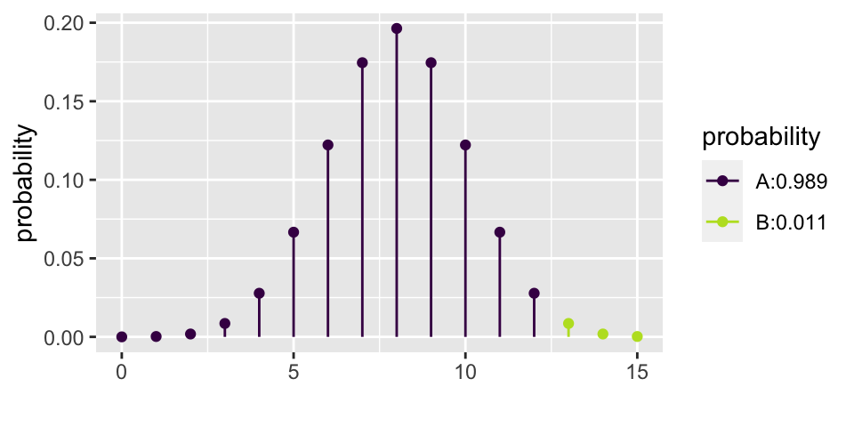
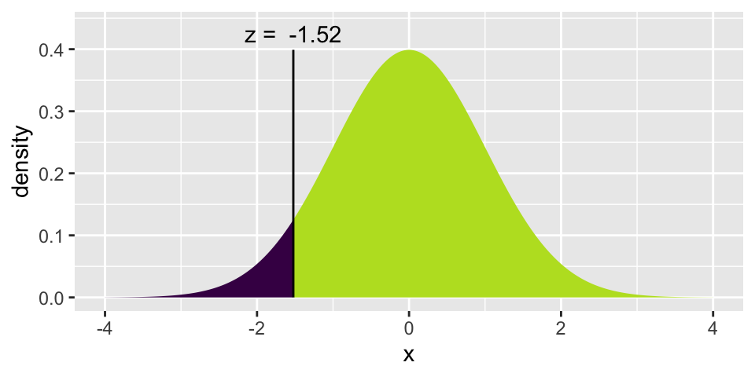
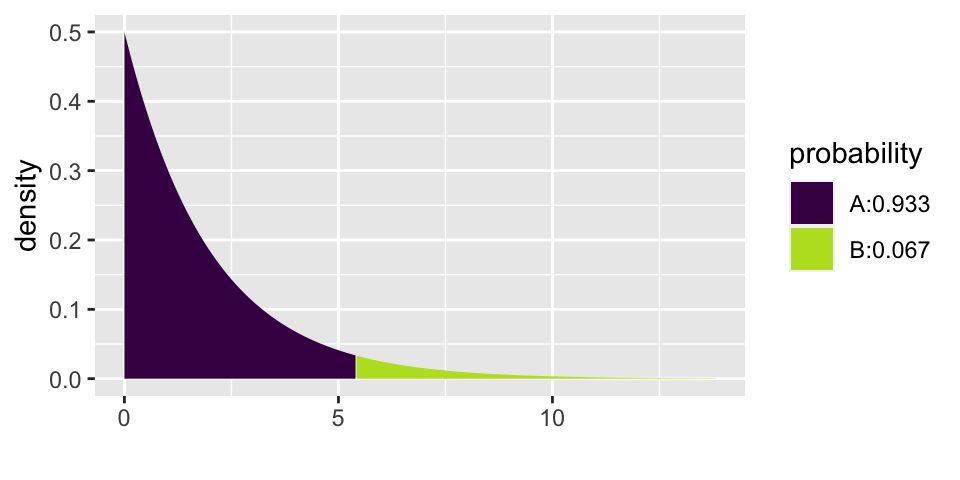

# Inference for categorical data


## Inference for a single proportion

Previously, we used the normal approximation to describe the distribution of different values for $\hat{p}$ when random samples are taken.  We learned that the central limit theorem describes the distribution of the sample average such that if:

1. the data are random, independent samples
2. and $np \geq 10$ and $n(1-p) \geq 10$

then $$\hat{p} \sim N(p, \sqrt{p(1-p)/n}).$$

If the $$\mbox{Z score} = \frac{\hat{p} - p}{\sqrt{p(1-p)/n}}$$ is bigger than the $Z^*$ value at a particular value of $\alpha$, then we know we can reject $p$ (the Null Hypothesis value) as the true population parameter.

If an interval estimate is desired, and no $p$ is hypothesized, then a confidence interval is created using:

$$\hat{p} \pm Z^* \cdot \sqrt{\hat{p}(1-\hat{p})}/n.$$

IMPORTANT: recall, the above interval is a method for capturing the **parameter**.


<!--
## 2/18/20 Math 58 Agenda {#Feb18M58}
0. Math 58 Only
1. Binomial distribution


## 2/20/20 Math 58 Agenda {#Feb20M58}
0. Math 58 Only
1. Binomial hypothesis testing
2. Power
3. Confidence Intervals
-->

## Binomial distribution

The Binomial distribution describes the exact probabilities associated with binary outcomes.  We do not typically have time to cover the Binomial distribution in Introduction to Biostatistics.

@ims do not discuss the binomial distribution.  @iscam, however, provide quite a bit of detail about the binomial concepts in chapter 1.


### Example: pop quiz 
There are 5 problems on this quiz; everyone number their papers 1. to 5.  Each of the problems is multiple choice with answers A, B, C, or D.   Go ahead.  We'll grade the papers when everyone is done. 

Solution:  1.B, 2.C, 3.B, 4.C, 5.A


* The **binomial distribution** provides the probability distribution for the number of "successes" in a fixed number of independent trials, when the probability of success is the same in each trial.

  - Outcome of each trial can be stated as a success / failure.
  - The number of trials ($n$) is fixed.
  - Separate trials are independent.
  - The probability of success ($p$) is the same in every trial.


\begin{eqnarray*}
P(X=k) &=& {n \choose k} p^k (1-p)^{n-k}\\
{n \choose k} &=& \frac{ n!}{(n-k)! k!}
\end{eqnarray*}

In our example... $n=5$.  How many ways are there to get 2 successes?
\begin{eqnarray*}
{5 \choose 2} &=& \frac{ 5!}{2! 3!} = \frac{ 5 \cdot 4 \cdot 3 \cdot 2 \cdot 1}{(3 \cdot 2 \cdot 1)(2 \cdot 1)}
\end{eqnarray*}

The numerator represents the number of possibilities for each of the 5 questions.  But we don't distinguish between successes, so we don't want to double count those.  Similarly for failures.


|  |  |  |  |  |
|:-----:|:-----:|:-----:|:-----:|:-----:|
| SSSFF | SSFFS | SSFSF | SFFSS | SFSFS |
| SFSSF | FFSSS | FSFSS | FSSFS | FSSSF |

In class: different groups work out the probability of 0, 1, 2, ... 5 correct answers.

\begin{eqnarray*}
P(X=0) = {5 \choose 0} (0.25)^0(0.75)^5  = 0.2373 && P(X=3) = {5 \choose 3} (0.25)^3(0.75)^2  = 0.0879\\
P(X=1) = {5 \choose 1} (0.25)^1(0.75)^4  = 0.3955 && P(X=4) = {5 \choose 4} (0.25)^4(0.75)^1  = 0.0146\\
P(X=2) = {5 \choose 2} (0.25)^2(0.75)^3  = 0.2637 && P(X=5) = {5 \choose 5} (0.25)^5(0.75)^0  = 0.0010\\
\end{eqnarray*}


```r
library(mosaic)
xpbinom(2, size = 5, prob = 0.25)  # P(X <= 2) vs. P(X > 2)
```


```
## [1] 0.8964844
```

```r
xpbinom(3, size = 5, prob = 0.25)  # P(X <= 3) vs. P(X > 3)
```


```
## [1] 0.984375
```

### Binomial Hypothesis Testing

Consider the example from the beginning of the semester on babies choosing the helper toy (instead of the hinderer), section \@ref(ex:helper).  Recall that 14 of the 16 babies chose the helper toy.

Does the binomial distribution apply to this setting?  Let's check:

* two choices?  Yes, helper or hinderer.
* fixed $n$?  Yes, there were 16 babies.
* $p$ same?  Presumably.  There is some inherent $p$ which represents the probability that a baby would choose a helper toy.  And we are choosing babies from a population with that $p$.
* independent?  I hope so!  These babies don't know each other or tell each other about the experiment.

If there really had been no inclination of the babies to choose the helper toy, how many babies would the researchers have needed to choose the helper in order to get published?

Let's choose $\alpha = 0.01$.  That means that if $p=0.5$, then we should make a Type I error less than 1% of the time.  From the calculations below, we see that the rejection region is $\{ X \geq 14 \}$.  That is, for the researchers to reject the null hypothesis at the $\alpha = 0.01$ significance level, they would have needed to see 14, 15, or 16 babies choose the helper (out of 16).

\begin{eqnarray*}
P(X \geq 12) &=& {16 \choose 12} (0.5)^{12}(0.5)^{4} + 0.0106 = 0.0384\\
P(X \geq 13) &=& {16 \choose 13} (0.5)^{13}(0.5)^{3} + 0.00209 = 0.0106\\
P(X \geq 14) &=& {16 \choose 14} (0.5)^{14}(0.5)^{2} + 0.000259 = 0.00209\\
P(X \geq 15) &=& {16 \choose 15} (0.5)^{15}(0.5)^{1} + 0.0000153 = 0.000259\\
P(X = 16) &=& {16 \choose 16} (0.5)^{16}(0.5)^{0} = 0.0000153\\
\end{eqnarray*}


```r
xpbinom(12, 16, 0.5)
```



```
## [1] 0.9893646
```

```r
xpbinom(13, 16, 0.5)
```


```
## [1] 0.9979095
```

### Binomial Power

Let's say that the researchers had an inkling that babies liked helpers.  But they thought that probably only about 70% of babies preferred helpers.  The researchers then needed to decide if 16 babies was enough for them to do their research.  That is, if they only measure 16 babies, will they have convincing evidence that babies actually prefer the helper?  Said differently, with 16 babies, what is the power of the test?

\begin{eqnarray*}
\mbox{power} &=& P(X \geq 14 | p = 0.7)\\
&=& P(X=14 | p=0.7) + P(X = 15 | p=0.7)  + P(X = 16 | p=0.7)\\
&=& {16 \choose 14} (0.7)^{14}(0.3)^{2} + {16 \choose 15} (0.7)^{15}(0.3)^{1} + {16 \choose 16} (0.7)^{16}(0.3)^{0}\\
&=& 0.099
\end{eqnarray*}

Yikes!  What if babies actually prefer the helper 90% of the time?

$$\mbox{power} = P(X \geq 14 | p = 0.9) = 0.789$$


```r
1 - xpbinom(13, 16, 0.7)
```


```
## [1] 0.09935968
```

```r
1 - xpbinom(13, 16, 0.9)
```


```
## [1] 0.7892493
```


### Binomial Confidence Intervals for $p$

The binomial distribution does not allow for the "plus or minus" creation of a range of plausible values for the confidence interval.  Instead, hypothesis testing is used directly to come up with plausible values for the parameter $p$.  The method outlines below is much more tedious than the z - CI , but it does produce an exact interval for $p$ with the appropriate coverage level.


Consider a confidence interval created in the following way:

* Step 1: Collect data, calculate $\hat{p}$ for that particular dataset.
* Step 2: Test a series of values for $p'$ using the observed $\hat{p}$ from the dataset at hand.
* Step 3: List all the values for $p'$ that were not rejected.  Sort them and find the smallest and biggest value:  ($p_{small}, p_{big}$).

Ask yourself whether the **true** parameter (let's call it $p$) is in the interval.  

* If a type I error was made when $p$ was tested, then $p$ is not in the interval.
* If $p$ was not rejected, then it is in the interval.

How often will a type I error be made?  5% of the time.  Therefore ($p_{small}, p_{big}$) is a 95% CI for the true population parameter $p$.

<!--
## 2/18/20 Math 58B Agenda {#Feb18M58B}
0. Math 58B Only
1. Relative Risk
2. Odds Ratios
3. Case-control studies


## 2/20/20 Math 58B Agenda {#Feb20M58B}
0. Math 58B Only
1. CI for relative risk
2. CI for odds ratios
-->

## Relative Risk {#rr}

Previously (e.g., Gender discrimination example, \@ref(ex:gend)) when working with the proportion of success in two separate groups, the proportion of success was subtracted (see also lab 4).  Next week, differences in proportions will be revisited, see section \@ref(diffprop).  First up, the new statistic of interest will be relative risk, followed by odds ratios.


In particular, interest is in the ratio of probabilities.  [Note: the decision to measure a ratio instead of a difference comes with trying to model the particular research question at hand.  There is nothing inherently better about ratios versus differences.  It is, however, often easier to think about how a small probability changes if it is done as a ratio instead of a difference.]

$$\mbox{Relative Risk (RR)} = \frac{\mbox{proportion of successes in group 1}}{\mbox{proportion of successes in group 2}}$$

\BeginKnitrBlock{definition}<div class="definition"><span class="definition" id="def:unnamed-chunk-4"><strong>(\#def:unnamed-chunk-4) </strong></span>**Relative Risk**  The relative risk (RR) is the ratio of risks for each group.  We say, "The risk of success is **RR** times higher for those in group 1 compared to those in group 2."</div>\EndKnitrBlock{definition}

### Inference on Relative Risk 

Due to some theory we won't cover, there is a fairly good mathematical approximation which describes how the natural log of the relative risk varies from sample to sample:

$$\ln(\widehat{RR})  \stackrel{\mbox{approx}}{\sim}   N\Bigg(\ln(RR), \sqrt{\frac{1}{A} - \frac{1}{A+C} + \frac{1}{B} - \frac{1}{B+D}}\Bigg)$$

|            | response 1 | response 2 |
|------------|:-------------:|:-------------:|
| explanatory 1 |       A       |       C       |
| explanatory 2 |       B       |       D       |

* **Statistic:** $$\hat{p}_1 / \hat{p}_2 = \frac{A/(A+C) }{B/ (B+D)}$$
* **Null Hypothesis:** $$H_0: p_1/p_2 = 1$$
* **Z Score:** (note the null hypothesized value is $\ln(1) = 0$) 
$$\mbox{Z score} = \frac{\ln(\widehat{RR}) - 0}{\sqrt{ \frac{1}{A} - \frac{1}{A+C} + \frac{1}{B} - \frac{1}{B+D}}}$$
* **CI:** The CI is for the true relative risk in the population, $p_1/p_2$

$$\mbox{exponentiate} \Bigg[ \ln(\hat{p}_1/\hat{p}_2) \pm z^*\sqrt{ \frac{1}{A} - \frac{1}{A+C} + \frac{1}{B} - \frac{1}{B+D}}\Bigg]$$

To remember with relative risk:

* The percent change is defined as:
\begin{eqnarray*}
(\widehat{RR} - 1)*100\% = \frac{\hat{p}_1 - \hat{p}_2}{\hat{p}_2}*100\% = \mbox{percent change from 2 to 1}
\end{eqnarray*}

* The CI for $p_1/p_2$ is typically considered significant if 1 is not in the interval.  That is because usually the null hypothesis is $H_0: p_1 = p_2$ or equivalently, $H_0: p_1/p_2 = 1$.

### Using `infer` for inference on RR

As with the difference in proportions, the `infer` syntax can be used to simulate a sampling distribution of the sample relative risk under the null hypothesis that the population proportions are identical.

**NOTE** in order to provide syntax that was comparable and correct for the RR and the OR, `smoking` has been specified as the response variable, and `lungs` has been specified as the explanatory variable.  


```r
library(infer)
WynderGraham <- data.frame(lungs = c(rep("cancer", 605), rep("healthy", 780)),
                            smoking = c(rep("light", 22), rep("heavy", 583),
                                        rep("light", 204), rep("heavy", 576)))

(obs_RR <- WynderGraham %>%
  specify(smoking ~ lungs, success = "heavy") %>%
  calculate(stat = "ratio of props", order = c("cancer", "healthy")))
```

```
## Response: smoking (factor)
## Explanatory: lungs (factor)
## # A tibble: 1 × 1
##    stat
##   <dbl>
## 1  1.30
```

```r
null_RR <- WynderGraham %>%
  specify(smoking ~ lungs, success = "heavy") %>%
  hypothesize(null = "independence") %>%
  generate(reps = 1000, type = "permute") %>%
  infer::calculate(stat = "ratio of props", order= c("cancer", "healthy"))

null_RR %>%
  visualize() +
  shade_p_value(obs_stat = obs_RR, direction = "right")
```


## Odds Ratios {#or}

Experience shows that very few introductory statistics students have seen odds or odds ratios in their prior mathematical or scientific study.  That makes odds ratios a **new** idea, but not a fundamentally hard idea.  Which is to say, it is perfectly acceptable to find relative risk a very intuitive idea that you can easily discuss and odds ratios a very strange idea which is hard to interpret.  Do not be discouraged!  Odds ratios are *not* fundamentally harder to understand than relative risk, they are simply a new idea.


@ims do not discuss relative risk and odds ratios.  @iscam, however, provide quite a bit of detail about the concepts in Investigations 3.9, 3.10, 3.11.

$$\mbox{risk} = \frac{\mbox{number of successes}}{\mbox{total number}}$$

$$\mbox{odds} = \frac{\mbox{number of successes}}{\mbox{number of failures}}$$

$$\mbox{Odds Ratio (OR)} = \frac{\mbox{odds of success in group 1}}{\mbox{odds of success in group 2}}$$


\BeginKnitrBlock{definition}<div class="definition"><span class="definition" id="def:unnamed-chunk-6"><strong>(\#def:unnamed-chunk-6) </strong></span>**Odds Ratio** A related concept to risk is odds.  It is often used in horse racing, where "success" is typically defined as losing.  So, if the odds are 3 to 1 we would expect to lose 3/4 of the time.  The odds ratio (OR) is the ratio of odds for each group.  We say, "The odds of success is **OR** times higher for those in group 1 compared to those group 2."</div>\EndKnitrBlock{definition}


### Example: Smoking and Lung Cancer^[Inv 3.10, Chance & Rossman, ISCAM] 

> After World War II, evidence began mounting that there was a link between cigarette smoking and pulmonary carcinoma (lung cancer). In the 1950s, three now classic articles were published on the topic. One of these studies was conducted in the United States by Wynder and Graham.^["Tobacco Smoking as a Possible Etiologic Factor in Bronchiogenic Cancer," 1950, Journal of the American Medical Association] They found records from a large number of patients with a specific type of lung cancer in hospitals in California, Colorado, Missouri, New Jersey, New York, Ohio, Pennsylvania, and Utah. Of those in the study, the researchers focused on 605 male patients with this form of lung cancer. Another 780 male hospital patients with similar age and economic distributions without this type of lung cancer were interviewed in St. Louis, Boston, Cleveland, and Hines, IL. Subjects (or family members) were interviewed to assess their smoking habits, occupation, education, etc. The table below classifies them as non-smoker or light smoker, or at least a moderate smoker.

The following two-way table replicates the counts for the 605 male patients with the same form of cancer and for the "control-group" of 780 males.

|          |    none   |  light  | mod heavy |   heavy   | excessive |   chain   |
|----------|:---------:|:-------:|:---------:|:---------:|:---------:|:---------:|
|          | $<$ 1/day | 1-9/day | 10-15/day | 16-20/day | 21-34/day | 35$+$/day |
| patients |     8     |    14   |     61    |    213    |    187    |    122    |
| controls |    114    |    90   |    148    |    278    |     90    |     60    |


Given the results of the study, do you think we can generalize from the sample to the population?  Explain and make it clear that you know the difference between a sample and a population.


In order to focus the research question, combine the data into two groups:  light smoking is less than 10 cigarettes per day, heavy smoking is 10 or more cigarettes per day.  The 2x2 observed data is now:


|   |  light smoking |  heavy smoking |   |
|---------|:---:|:----:|:----:|
| cancer  |  22 |  583 |  605 |
| healthy | 204 |  576 |  780 |
|         | 226 | 1159 | 1385 |

* Causation?  (Is it an experiment or are there possible confounding variables?)
* Case-control study  (605 with lung cancer, 780 without... baseline rate?)
* What is the response variable and what is the explanatory variable?  What happens if the role of the two variables is switched?

| Group A               | Group B               |
|-----------------------|-----------------------|
| expl = smoking status | expl = lung cancer    |
| resp = lung cancer    | resp = smoking status |

* If lung cancer is considered a success and light smoking is baseline:
\begin{eqnarray*}
RR &=& \frac{583/1159}{22/226} = 5.17\\
OR &=& \frac{583/576}{22/204} = 9.39\\
\end{eqnarray*}

<strike>The risk of lung cancer is 5.17 times higher for those who heavy smoke than for those who don't smoke.</strike>

The odds of lung cancer is 9.39 times higher for those who heavy smoke than for those who don't smoke.


* If heavy smoking is considered a success and healthy is baseline:
\begin{eqnarray*}
RR &=& \frac{583/605}{576/780} = 1.31\\
OR &=& \frac{583/22}{576/204} = 9.39\\
\end{eqnarray*}

The risk of heavy smoking is 1.31 times higher for those who have lung cancer than for those who don't have lung cancer.

The odds of heavy smoking is 9.39 times higher for those who have lung cancer than for those who don't have lung cancer.


* Observational study (who worked in each place?)  
* Cross sectional (only one point in time)  
* Healthy worker effect (who stayed home sick?)    
* **Explanatory variable** is one that is a potential explanation for any changes (here smoking level).  
* **Response variable** is the measured outcome of interest (here lung cancer).  


* **Case-control study:** identify observational units by the response variable
* **Cohort study:** identify observational units by the explanatory variable 

The risk of being a light smoker if the person has lung cancer can be estimated, but there is no possible way to estimate the risk of lung cancer if you are a light smoker.  Consider a *population* of 1,000,000 people:


|   |  no smoking  |  light smoking |     |
|---------|:-------:|:-------:|:---------:|
| cancer  |  1,000  |  49,000 |   50,000  |
| healthy | 899,000 |  51,000 |  950,000  |
|         | 900,000 | 100,000 | 1,000,000 |

\begin{eqnarray*}
P(\mbox{light} | \mbox{lung cancer}) &=& \frac{49,000}{50,000} = 0.98\\
P(\mbox{lung cancer} | \mbox{light}) &=& \frac{49,000}{100,000} = 0.49\\
\end{eqnarray*}


* What is the explanatory variable?
* What is the response variable?
* relative risk?
* odds ratio?
*
| Group A               | Group B               |
|-----------------------|-----------------------|
| expl = smoking status | expl = lung cancer    |
| resp = lung cancer    | resp = smoking status |


* If lung cancer is considered a success and no smoking is baseline:
\begin{eqnarray*}
RR &=& \frac{49/100}{1/900} = 441\\
OR &=& \frac{49/51}{1/899} = 863.75\\
\end{eqnarray*}

* If light smoking is considered a success and healthy is baseline:
\begin{eqnarray*}
RR &=& \frac{49/50}{51/950} = 18.25\\
OR &=& \frac{49/1}{51/899} = 863.75\\
\end{eqnarray*}

OR is the same no matter which variable you choose as explanatory versus response!  Though, in general, baseline odds or baseline risk (which we can't know with a case-control study) is still a number that can provide a lot of information about the study.


IMPORTANT:  Relative risk cannot be used with case-control studies but odds ratios can be used!

### Inference on Odds Ratios 


Due to some theory we won't cover, there is a fairly good mathematical approximation which describes how the natural log of the odds ratio varies from sample to sample:

$$\ln(\widehat{OR}) \stackrel{\mbox{approx}}{\sim}  N\Bigg(\ln(OR), \sqrt{\frac{1}{A} + \frac{1}{B} + \frac{1}{C} + \frac{1}{D}}\Bigg)$$

|            | response 1 | response 2 |
|------------|:-------------:|:-------------:|
| explanatory 1 |       A       |       C       |
| explanatory 2 |       B       |       D       |

* **Statistic:** $$\widehat{OR} = \frac{A D}{B C}$$
* **Null Hypothesis:** $$H_0: OR = 1$$
* **Z Score:** (note the hypothesized value is $\ln(1) = 0$) 
$$\mbox{Z score} = \frac{\ln(\widehat{OR}) - 0}{\sqrt{ \frac{1}{A} + \frac{1}{B} + \frac{1}{C} + \frac{1}{D}}}$$ 
* **CI:** The CI is for the true odds ratio in the population, $OR$

$$\mbox{exponentiate} \Bigg[ \ln{\widehat{OR}} \pm z^* \sqrt{ \frac{1}{A} + \frac{1}{B} + \frac{1}{C} + \frac{1}{D}}\Bigg]$$

#### OR is more extreme than RR

Without loss of generality, assume the true $RR > 1$, implying $p_1 / p_2 > 1$ and $p_1 > p_2$.

Note the following sequence of consequences:

\begin{eqnarray*}
RR = \frac{p_1}{p_2} &>& 1\\
\frac{1 - p_1}{1 - p_2} &<& 1\\
\frac{ 1 / (1 - p_1)}{1 / (1 - p_2)} &>& 1\\
\frac{p_1}{p_2} \cdot \frac{ 1 / (1 - p_1)}{1 / (1 - p_2)} &>& \frac{p_1}{p_2}\\
OR &>& RR
\end{eqnarray*}

### Confidence Interval for OR (same idea as with RR)

\begin{eqnarray*}
SE(\ln (\widehat{OR})) &\approx& \sqrt{ \frac{1}{A} + \frac{1}{B} + \frac{1}{C} + \frac{1}{D}}
\end{eqnarray*}


So, a $(1-\alpha)100\%$ CI for the $\ln(OR)$ is:
\begin{eqnarray*}
\ln(\widehat{OR}) \pm z_{1-\alpha/2} SE(\ln(\widehat{OR}))
\end{eqnarray*}

Which gives a $(1-\alpha)100\%$ CI for the $OR$:
\begin{eqnarray*}
(e^{\ln(OR) - z_{1-\alpha/2} SE(\ln(OR))}, e^{\ln(OR) + z_{1-\alpha/2} SE(\ln(OR))})
\end{eqnarray*}


$\frac{583/576}{22/204} = 9.39$
Back to the example... OR = 9.39.
\begin{eqnarray*}
SE(\ln(\widehat{OR})) &=& \sqrt{\frac{1}{583} + \frac{1}{576} + \frac{1}{22} + \frac{1}{204}}\\
&=& 0.232\\
90\% \mbox{ CI for } \ln(OR) && \ln(9.39) \pm 1.645 \cdot 0.232\\
&& 2.24 \pm 1.645 \cdot 0.232\\
&& (1.858, 2.62)\\
90\% \mbox{ CI for } OR && (e^{1.858}, e^{2.62})\\
&& (6.41, 13.75)\\
\end{eqnarray*}


```r
(SE_lnOR = sqrt( 1/583 + 1/576 + 1/22 + 1/204))
```

```
## [1] 0.2319653
```

```r
xqnorm(0.95, 0, 1, plot=FALSE)
```

```
## [1] 1.644854
```

```r
log(9.39) - 1.645*0.232
```

```
## [1] 1.858005
```

```r
log(9.39) + 1.645*0.232
```

```
## [1] 2.621285
```

```r
exp(log(9.39) - 1.645*0.232)
```

```
## [1] 6.410936
```

```r
exp(log(9.39) + 1.645*0.232)
```

```
## [1] 13.75339
```

We are 90% confident that the true $\ln(OR)$ is between 1.858 and 2.62.  We are 90% confident that the true $OR$ is between 6.41 and 13.75.  That is, the true odds of getting lung cancer if you smoke heavily are somewhere between 6.41 and 13.75 times higher than if you don't, with 90% confidence.


Note 1: we use the theory which allows us to understand the sampling distribution for the $\ln(\widehat{OR}).$  We use the *process* for creating CIs to transform back to $OR$.

<!--
Note 2: We do not use the t-distribution here because we are not estimating the population standard deviation.
-->

Note 2: There are not good general guidelines for checking whether the sample sizes are large enough for the normal approximation.  Most authorities agree that one can get away with smaller sample sizes here than for the differences of two proportions.  If the sample sizes pass the rough check discussed for $\chi^2$, they should be large enough to support inferences based on the approximate normality of the log of the estimated odds ratio, too.  [@sleuth, page 541]

From one author, for the normal approximation to hold, we need the expected counts in each cell to be at least 5. [@pagano, page 355]


Note 3: If any of the cells are zero, many people will add 0.5 to that cell's observed value.


Note 4: The OR will always be more extreme than the RR (one more reason to be careful...)

<!--
\begin{eqnarray*}
\mbox{assume } && \frac{X_1 / n_1}{X_2 / n_2} = RR > 1\\
& & \\
\frac{X_1}{n_1} &=& RR \ \ \frac{X_2}{n_2}\\
\frac{X_1}{n_1 - X_1} &=& RR \ \ \bigg( \frac{n_1}{n_2}  \frac{n_2 - X_2}{n_1 - X_1} \bigg) \frac{X_2}{n_2-X_2}\\
OR &=& RR \ \ \bigg(\frac{n_1}{n_2} \bigg) \frac{n_2 - X_2}{n_1 - X_1}\\
 &=& RR \ \ \bigg(\frac{1/n_2}{1/n_1} \bigg) \frac{n_2 - X_2}{n_1 - X_1}\\
 &=& RR  \ \ \frac{1 - X_2/n_2}{1 - X_1/n_1}\\
 & > & RR
\end{eqnarray*}
[$1 - \frac{X_2}{n_2} > 1 - \frac{X_1}{n_1} \rightarrow \frac{1 - \frac{X_2}{n_2}}{1 - \frac{X_1}{n_1}} > 1$]
-->

Note 5: $RR \approx OR$ if RR is very small (the denominator of the OR will be very similar to the denominator of the RR).


### Using `infer` for inference on OR

<!--
devtools::install_github("tidymodels/infer", ref="develop")
-->

As with the difference in proportions, the `infer` syntax can be used to simulate a sampling distribution of the sample odds ratio under the null hypothesis that the population proportions are identical.

**NOTE** in order to provide syntax that was comparable and correct for the RR and the OR, `smoking` has been specified as the response variable, and `lungs` has been specified as the explanatory variable.  


```r
library(infer)
WynderGraham <- data.frame(lungs = c(rep("cancer", 605), rep("healthy", 780)),
                            smoking = c(rep("light", 22), rep("heavy", 583),
                                        rep("light", 204), rep("heavy", 576)))

(obs_OR <- WynderGraham %>%
  specify(smoking ~ lungs, success = "heavy") %>%
  calculate(stat = "odds ratio", order = c("cancer", "healthy")))
```

```
## Response: smoking (factor)
## Explanatory: lungs (factor)
## # A tibble: 1 × 1
##    stat
##   <dbl>
## 1  9.39
```

```r
null_OR <- WynderGraham %>%
  specify(smoking ~ lungs, success = "heavy") %>%
  hypothesize(null = "independence") %>%
  generate(reps = 1000, type = "permute") %>%
  calculate(stat = "odds ratio", order= c("cancer", "healthy"))

null_OR %>%
  visualize() +
  shade_p_value(obs_stat = obs_OR, direction = "right")
```


### Example: MERS-CoV {#ex:cov}

The following study is a case-control study, so it is impossible to estimate the proportion of cases in the population.  However, you will notice that the authors don't try to do that.  They flip the explanatory and response variables so that the case status is predicting all of the other clinical variables.  In such a setting, the authors would have been able to present relative risk estimates, but they still chose to provide odds ratios (possibly because odds ratios are somewhat standard in the medical literature).

Middle East Respiratory Syndrome Coronavirus: A Case-Control Study of Hospitalized Patients^[Jaffar A. Al-Tawfiq, Kareem Hinedi, Jihad Ghandour, Hanan Khairalla, Samir Musleh, Alaa Ujayli, Ziad A. Memish, Clinical Infectious Diseases, Volume 59, Issue 2, 15 July 2014, Pages 160–165, https://doi.org/10.1093/cid/ciu226]

> Background. There is a paucity of data regarding the differentiating characteristics of patients with laboratory-confirmed and those negative for Middle East respiratory syndrome coronavirus (MERS-CoV).

> Methods. This is a hospital-based case-control study comparing MERS-CoV–positive patients (cases) with MERS-CoV–negative controls.

> Results. A total of 17 case patients and 82 controls with a mean age of 60.7 years and 57 years, respectively (P = .553), were included. No statistical differences were observed in relation to sex, the presence of a fever or cough, and the presence of a single or multilobar infiltrate on chest radiography. The case patients were more likely to be overweight than the control group (mean body mass index, 32 vs 27.8; P = .035), to have diabetes mellitus (87% vs 47%; odds ratio [OR], 7.24; P = .015), and to have end-stage renal disease (33% vs 7%; OR, 7; P = .012). At the time of admission, tachypnea (27% vs 60%; OR, 0.24; P = .031) and respiratory distress (15% vs 51%; OR, 0.15; P = .012) were less frequent among case patients. MERS-CoV patients were more likely to have a normal white blood cell count than the control group (82% vs 52%; OR, 4.33; P = .029). Admission chest radiography with interstitial infiltrates was more frequent in case patients than in controls (67% vs 20%; OR, 8.13; P = .001). Case patients were more likely to be admitted to the intensive care unit (53% vs 20%; OR, 4.65; P = .025) and to have a high mortality rate (76% vs 15%; OR, 18.96; P < .001).

> Conclusions. Few clinical predictors could enhance the ability to predict which patients with pneumonia would have MERS-CoV. However, further prospective analysis and matched case-control studies may shed light on other predictors of infection.

Consider the results above on diabetes.  Of 17 cases, 13 had diabetes; of 82 controls, 35 had diabetes.  So the data can be summarized as follows:


```r
MERSCoV <- data.frame(coronov = c(rep("case", 17), rep("control", 82)),
                      diab = c(rep("hasdiab", 13), rep("nodiab", 4), 
                               rep("hasdiab", 35), rep("nodiab", 47)))
table(MERSCoV)
```

```
##          diab
## coronov   hasdiab nodiab
##   case         13      4
##   control      35     47
```

####  CI for 95% OR {-}

As with the calculations above, we can find a CI for the true OR of diabetes for those with MRES-CoV and those without.

We are 95% confident that the true odds of diabetes are between 1.31 times and 14.5 times higher for those with CoV than those without.  Note that the results calculated here do not match with the results in the paper. 


```r
(ORhat = (13/4)/(35/47))
```

```
## [1] 4.364286
```

```r
(SE_lnOR = sqrt( 1/13 + 1/4 + 1/35 + 1/47))
```

```
## [1] 0.6138168
```

```r
xqnorm(0.975, 0, 1, plot=FALSE)
```

```
## [1] 1.959964
```

```r
log(ORhat) - 1.96 * SE_lnOR
```

```
## [1] 0.2703735
```

```r
log(ORhat) + 1.96 * SE_lnOR
```

```
## [1] 2.676536
```

```r
exp(log(ORhat) - 1.96 * SE_lnOR)
```

```
## [1] 1.310454
```

```r
exp(log(ORhat) + 1.96 * SE_lnOR)
```

```
## [1] 14.53465
```


Working backwards from their percentages, if 13 is 87% of their cases, then there are 15 cases. If 35 is 47% of their controls, then there are 74 controls. Using the revised numbers, the odds ratio would by $\widehat{OR}$ = (13/2)/(35/39) = 7.24, with a CI of (1.53, 34.37).


```r
(ORhat = (13/2)/(35/39))
```

```
## [1] 7.242857
```

```r
(SE_lnOR = sqrt( 1/13 + 1/2 + 1/35 + 1/39))
```

```
## [1] 0.7944404
```

```r
exp(log(ORhat) - 1.96 * SE_lnOR)
```

```
## [1] 1.526401
```

```r
exp(log(ORhat) + 1.96 * SE_lnOR)
```

```
## [1] 34.36776
```

<div class="figure" style="text-align: center">

<p class="caption">(\#fig:unnamed-chunk-12)Al-Tawfig et al. `Middle East Respiratory Syndrome Coronavirus: A Case-Control Study of Hospitalized Patients`</p>
</div>

<!--
## 2/25/20 Agenda {#Feb25}
1. Difference in Proportion HT
2. Difference in Proportion CI
-->

## Difference of two proportions {#diffprop}

### CLT for difference in two proportions

As before, we apply the mathematical model (i.e., normal distribution) derived from the central limit theorem to investigate the properties of the statistic of interest.  Here, the statistic of interest is the difference in two sample proportions:  $\hat{p}_1 - \hat{p}_2$.  The CLT describes how $\hat{p}_1 - \hat{p}_2$ varies as many random samples are taken from the population.  

As with the single sample proportion, the normal distribution is a good fit only under certain technical conditions:

* **Independence**  The data are independent within and between the two groups. Generally this is satisfied if the data come from two independent random samples or if the data come from a randomized experiment.  However, there may be times when the independence condition seems reasonable even if it is not precisely met.

* **Success-failure condition** (i.e., large enough sample sized).  We need at least 10 successes and 10 failures (expected) in each group.  Some authors suggest that 5 of each in each group is sufficient.

#### The Central Limit Theorem for $\hat{p}_1 - \hat{p}_2$:  {-}

The central limit theorem describes how $\hat{p}_1 - \hat{p}_2$ varies as many random samples are taken from the population. 

$$\hat{p}_1 - \hat{p}_2 \sim N\Bigg(p_1 - p_2, \sqrt{\frac{p_1(1-p_1)}{n_1} + \frac{p_2(1-p_2)}{n_2}}\Bigg)$$

### HT: difference in proportions

Note that the equation above describing the central limit theorem has a formula for the variability of $\hat{p}_1 - \hat{p}_2$.  That is, 

$$SE(\hat{p}_1 - \hat{p}_2) = \sqrt{\frac{p_1(1-p_1)}{n_1} + \frac{p_2(1-p_2)}{n_2}}$$

However, when testing a particular hypothesis, the research question does not (usually) provide values of $p_1$ and $p_2$ to use in the formula for the SE.  Instead, the research question is usually one of independence, that is, that knowing the level of the explanatory (group) variable tells you nothing about the probability of the response variable.  Indeed, typically the null hypothesis is written as:

$$H_0: p_1 = p_2$$

with the alternative hypothesis incorporating the direction of the research claim.

In order to calculate a p-value, the sampling distribution of $\hat{p}_1 - \hat{p}_2$ **under $H_0$** is needed.  The CLT is a start to understanding the distribution of $\hat{p}_1 - \hat{p}_2$, but the additional step which incorporates the null hypothesis of $p_1 = p_2$ is implemented through the SE. 
If $H_0: p_1 = p_2$ is true, then our best guess for the true value of either $p_1$ or $p_2$ is:

$$\hat{p}_{pooled} = \frac{\mbox{number of successes}}{\mbox{number of observations}} = \frac{X_1 + X_2}{n_1 + n_2} =  \frac{\hat{p}_1 n_1 + \hat{p}_2 n_2}{n_1 + n_2}$$


#### Two proportion z-test {-}

To perform a hypothesis test using the normal distribution (i.e., the central limit theorem) we use a z-score as the test statistic and then `xpnorm` to find the p-value.

$$\mbox{Z score} = \frac{(\hat{p}_1 - \hat{p}_2) - 0}{\sqrt{\frac{\hat{p}_{pooled}(1-\hat{p}_{pooled})}{n_1} + \frac{\hat{p}_{pooled}(1-\hat{p}_{pooled})}{n_2}}}$$


$$\mbox{p-value} = \mbox{probability of Z score or more extreme using N(0,1) probability}$$


### CI: difference in proportions

When creating a confidence interval for the true parameter of interest, there is no underlying research assumption about the values of $p_1$ and $p_2$.  The best we can do to calculate the SE is to use the sample values.

**population parameter:** $p_1 - p_2$:  the true difference in success proportion (or probability) between groups 1 and 2.

**CI for** $p_1 - p_2$:

$$(\hat{p}_1 - \hat{p}_2) \pm Z^* \sqrt{\frac{\hat{p}_1 (1-\hat{p}_1)}{n_1} + \frac{\hat{p}_2 (1-\hat{p}_2)}{n_2}}$$


### Example: Government Shutdown^[From @oi4, exercise 6.20.  Data taken from: Survey USA, News Poll #24568, data collected on April 21, 2019.  http://www.surveyusa.com/client/PollReport.aspx?g=d0102205-d95b-48b2-9e39-4c0284747d97]

> The United States federal government shutdown of 2018-2019 occurred from December 22, 2018 until January 25, 2019, a span of 35 days. A Survey USA poll of 608 randomly sampled Americans during this time period reported that 48% (77 of 160 people) of those who make less than $40,000 per year and 55% (247 of 448 people) of those who make $40,000 or more per year said the government shutdown has not at all affected them personally. 

0. Notice that the observational units have been selected from the entire population:  **not** by using the response or explanatory variable.  (This type of study is called a cross-classification study.)  The beauty of having been selected from the entire population is that we have a good sense of **both** the proportions of each group as well as the proportion of people for whom the shutdown has affected them.

1. Test the research claim that the proportion of people who are affected by the shutdown is different in comparing those who make more than $40,000 and less than $40,000 per year.

The p-value for the test is 0.128 indicating that there is no evidence of a difference in the proportion of people affected by the shutdown across the two income groups.  **NOTE** we cannot claim "no difference"!!  We claim "there is no evidence of a difference."  Try to explain to yourself (or your classmate) the difference in those two claims.

$$\mbox{p-value} = 2* P( Z \leq -1.522) = 0.128$$


```r
(p_pool <- (247+77)/ 614)
```

```
## [1] 0.5276873
```

```r
(z_score <- (0.48 - 0.55) / sqrt(p_pool*(1-p_pool) *(1/160 + 1/448)))
```

```
## [1] -1.522447
```

```r
2*xpnorm(z_score,0,1)
```



```
## [1] 0.1278972
```


2. A 95% confidence interval for ($p_{<40K}- p_{ \geq40K}$) ), where p is the proportion of those who said the government shutdown has not at all affected them personally, is (-0.16, 0.02).


```r
(z_star95 <- xqnorm(0.975, 0, 1))
```


```
## [1] 1.959964
```

```r
(0.48 - 0.55) - z_star95*sqrt(0.48*(1-0.48)/160 + 0.55*(1-0.55)/448)
```

```
## [1] -0.1600828
```

```r
(0.48 - 0.55) + z_star95*sqrt(0.48*(1-0.48)/160 + 0.55*(1-0.55)/448)
```

```
## [1] 0.0200828
```

Determine if the following statements are true or false, and explain your reasoning if you identify the statement as false.^[(a) FALSE (because the interval overlaps zero), (b) FALSE (We are 95% confident that 16% more to 2% fewer Americans who make \$40,000 or more per year are not at all personally affected by the government shutdown compared to those who less than \$40,000 per year.), (c) FALSE (it would be more narrow), (d) TRUE]

(a) At the 5% significance level, the data provide convincing evidence of a real difference in the proportion who are not affected personally between Americans who make less than \$40,000 annually and Americans who make \$40,000 or more annually.

(b) We are 95% confident that 16% more to 2% fewer Americans who make less than \$40,000 per year are not at all personally affected by the government shutdown compared to those who make \$40,000 or more per year.

(c) A 90% confidence interval for ($p_{<40K}- p_{ \geq40K}$) would be wider than the (-0.16, 0.02) interval.

(d) A 95% confidence interval for($p_{ \geq40K} - p_{<40K}$) is (-0.02, 0.16).

<!--
## 2/27/20 Agenda {#Feb27}
1. Observational Studies
2. Experiments
3. Causation
-->


<!--
## 3/3/20 Agenda {#Mar3}
1. More than two proportions
2. chi-squared goodness-of-fit test
-->

## Goodness-of-fit: One categorical variable ($\chi^2$ test) $\geq$ 2 levels {#chisq1}

Consider $E_k$ which is the number expected in the $k^{th}$ category.  

When testing a null hypothesis of a pre-specified set of proportions (or probabilities) across $K$ categories, the test statistics is:

$$X^2 = \sum_{k=1}^K \frac{(O_k - E_k)^2}{E_k} \sim \chi^2_{K-1}$$

which has a null sampling distribution which is well-described by a chi-squared distribution with $K-1$ degrees of freedom ...  if:

* Each case that contributes a count to the table is **independent** of all the other cases in the table.
* Each particular scenario (i.e. cell count) has at least 5 expected cases. (sample size criterion)

If the conditions don't hold, then the test statistic won't have the predicted distribution, so any p-value calculations will be meaningless.

### Example: Household Ages^[@activstats, "How Typical are Our Households' Ages"]

Suppose we had a class picnic, and all the people in everyone's household showed up.  Would their ages be representative of the ages of all Americans?  Probably not.  After all, this is not a random sample!  But how unrepresentative are the ages? 

The 2010 Census estimates^[https://www.census.gov/prod/cen2010/briefs/c2010br-03.pdf] the percent of people in the following age categories. 

| Age   | 2010 Census Percent |
|:-------:|------------------------:|
| <18  | 24.03%                  |
| 18-44 | 36.53%                  |
| 45+   | 39.43%                  |

####  Is the age distribution of the people from households in our class typical of that of all residents of the US? {-}

Let's collect some data.  Note that we would never expect the last two columns to have the exact same values, even if the class *was* a perfect random sample.  (Why not?) 

| Age   | 2010 Census Percent | Number Observed in Class | Expected  Number in Class |
|:-------:|------------------------:|:--------------------------:|:---------------------------:|
| <18  | 24.03%                  |           5               |       12.015                    |
| 18-44 | 36.54%                  |         22                 |    18.27                       |
| 45+   | 39.43%                  |          23                |    19.715                       |


Somehow we need to measure how closely the observed data match the expected values.  We have the chi-squared statistic ($\chi^2$):

$$\chi^2 = \sum_{k=1}^K \frac{(O_k - E_k)^2}{E_k}$$

Let's use the data collected from class to calculate an observed $\chi^2$ test statistic.  Is it big enough to indicate that individuals from our class's households don't follow the 2010 Census proportions?  How would we know?  We need a null hypothesis!

$H_0: p_1 = 0.2403, p_2 = 0.3653, p_3 = 0.3943$

$H_A: \mbox{ not } H_0$

The null hypothesis is as specified by the 2010 Census.  The alternative hypothesis is a deviation from that claim.

The observed test statistic is:

\begin{eqnarray*}
X^2 &=& \frac{(5 - 12.015)^2}{12.015} + \frac{(22 - 18.265)^2}{18.27} + \frac{(23-19.715)^2}{19.715}\\
&=& 5.41
\end{eqnarray*}

But how would we know if the value of the observed test statistic is "large enough" ?  We need the **distribution** of the test statistic assuming the null hypothesis is true.  Let's generate it


| Age   | Random Digits | Number Observed in Random Sample | Expected  Number in Random Sample |
|:-------:|:------------------------:|:--------------------------:|:---------------------------:|
| <18  | 0 - 25                 |         13                 |      $50 \cdot 0.2403 = 12.015$                     |
| 18-44 | 26 - 60                  |        18                  |     $50 \cdot 0.3654 = 18.27$                      |
| 45+   | 61 - 99                 |         19                 |     $50 \cdot 0.3943 = 19.715$                      |


\begin{eqnarray*}
X^2 &=& \frac{(13 - 12.015)^2}{12.015} + \frac{(18 - 18.265)^2}{18.27} + \frac{(19-19.715)^2}{19.715}\\
&=& 0.1105
\end{eqnarray*}

In class, we used random numbers (on pieces of paper) to generate the null sampling distribution of $X^2$.  It turns out, there is also a mathematical model which describes the variability of $X^2$:  the chi-squared distribution with $K-1$ degrees of freedom.  The p-value below says that we can't reject $H_0$, we don't know that our household ages come from a distribution other than the census percentages.  (To be clear:  the conclusion is that we know nothing.  We don't have evidence to reject $H_0$.  But that also doesn't mean we know $H_0$ is true.  Unfortunately, we can't conclude anything.)


```r
1 - xpchisq(5.41, 2)
```



```
## [1] 0.06687032
```


### Example: Flax Seed

Researchers studied a mutant type of flax seed that they hoped would produce oil for use in margarine and shortening.  The amount of palmitic acid in the flax seed was an important factor in this research; a related factor was whether the seed was brown or was variegated.  The seeds were classified into six combinations or palmitic acid and color.  According to a hypothesized genetic model, the six combinations should occur in a 3:6:3:1:2:1 ratio.

| Color      | Acid Level   | Observed | Expected |
|------------|--------------|:--------:|:--------:|
| Brown      | Low          |    15    |   13.5   |
| Brown      | Intermediate |    26    |    27    |
| Brown      | High         |    15    |   13.5   |
| Variegated | Low          |     0    |    4.5   |
| Variegated | Intermediate |     8    |     9    |
| Variegated | High         |     8    |    4.5   |
| Total      |              |    72    |    72    |

\begin{eqnarray*}
H_0: && p_1 = 3/16, p_2=6/16, p_3 = 3/16, p_4 = 1/16, p_5=2/16, p_6 = 1/16\\
H_A: && \mbox{ not the distribution in } H_0
\end{eqnarray*}


\begin{eqnarray*}
\chi^2 &=& \frac{(15-13.5)^2}{13.5} + \frac{(26-27)^2}{27} + \frac{(15-13.5)^2}{13.5} + \frac{(0-4.5)^2}{4.5} + \frac{(8-9)^2}{9} + \frac{(8-4.5)^2}{4.5}\\
&=& 7.71\\
\mbox{p-value} &=& P(\chi^2_5 \geq 7.71)\\
&=& 0.173\\
\end{eqnarray*}


```r
1 - xpchisq(7.71, 5)
```


```
## [1] 0.172959
```

#### How could we simulate power? {-}

Consider the flax seed example,  As with the household ages example, use random digits.

1. Come up with an alternative hypothesis that specified the probabilities of each type of seed.
2. Allocate digits appropriately given the alternative model.
3. Randomly generate 72 random digits (from 00 to 99) and collect *observed* data based on the **alternative** model.
4. Calculate the test statistic from the randomly generated observed data (as compared to the expected counts under $H_0$), and indicate whether it is above 11.07 (see below for the $\chi^2_5$ cutoff).
5. Repeat 3 & 4 many many times.  The power will be estimated by the proportion of times you reject the null hypothesis when the alternative is true.


```r
xqchisq(.95, 5)
```


```
## [1] 11.0705
```

<!--
## 3/5/20 Agenda {#Mar5}
1. More than two levels (two variables)
2. chi-squared test of independence
-->

## Independence: Two categorical variables  ($\chi^2$ test) $\geq$ 2 levels each  {#chisq2}

As when we were working with binary variables, most research questions have to do with two variables.  Our main question now will be whether there is an association between two categorical variables of interest. 

$H_0$:the two variables are independent

$H_A$: the two variables are not independent

How do we know if our test statistic is a big number or not?  Well, it turns out that the test statistic will have an approximate $\chi^2$ distribution with degrees of freedom = $(r- 1)\cdot (c-1)$ when $H_0$ is true.  As long as:

* We have a random sample from the population.
* We expect at least 1 observation in every cell ($E_i \geq 1 \forall i$)
* We expect at least 5 observations in 80\% of the cells ($E_i \geq 5$ for 80\% of $i$)

$$X^2 = \sum_{\mbox{all cells}} \frac{(Obs - Exp)^2}{Exp} \sim \chi^2_{(r-1)(c-1)}$$

Consider the following (silly?) example data on CA vs. notCA and soda preference:

|       | CA | no CA | total |
|:-------|:----:|:-------:|:-----:|
| Coke  |  72  |    8   |   80  |
| Pepsi |  18  |    22   |   40  |
| total | 90 | 30    |  120  |


What if we had those same number of people in each group and category, but we wanted absolutely no association between the two variables of soda preference and location:


|       | CA | no CA | total |
|:-------|:----:|:-------:|:-----:|
| Coke  |    |       |   80  |
| Pepsi |    |       |   40  |
| total | 90 | 30    |  120  |

If the distribution of Coke and Pepsi preference were the same in CA vs not CA, how many Californians would prefer Coke?  60! 

$$\mbox{# CA who prefer Coke} = 90 \cdot \frac{80}{120} = 60$$
The rest of the table can be filled out in a similar manner:

|       | CA | no CA | total |
|:-------|:----:|:-------:|:-----:|
| Coke  |  60  |    20   |   80  |
| Pepsi | 30   |  10     |   40  |
| total | 90 | 30    |  120  |

The Coke & Pepsi example motivates the idea of how many observations we expect to see in each cell if there is no association between the variables.  Note that the expected number is almost always a decimal value.

$$\mbox{Exp} = \frac{(\mbox{row total})(\mbox{col total})}{\mbox{table total}}$$


### Example: Nightlights^[@iscam, Inv 5.3]

> Myopia, or near-sightedness, typically develops during the childhood years. Recent studies have explored whether there is an association between development of myopia and the use of night-lights with infants. Quinn, Shin, Maguire, and Stone (1999) examined the type of light children aged 2-16 were exposed to. Between January and June 1998, the parents of 479 children who were seen as outpatients in a university pediatric ophthalmology clinic completed a questionnaire (children who had already developed serious eye conditions were excluded). One of the questions asked was "Under which lighting condition did/does your child sleep at night?" before the age of 2 years. The following two-way table classifies the children's eye condition and whether or not they slept with some kind of light (e.g., a night light or full room light) or in darkness.

The data are given by the following R code:


```r
lights <- data.frame(eyesight = c(rep("far", 40), rep("neither", 114), rep("near", 18),
                           rep("far", 39), rep("neither", 115), rep("near", 78),
                           rep("far", 12), rep("neither", 22), rep("near", 41)),
                     lighting = c(rep("dark", 172), rep("nightlight", 232), rep("roomlight", 75)))

table(lights)
```

```
##          lighting
## eyesight  dark nightlight roomlight
##   far       40         39        12
##   near      18         78        41
##   neither  114        115        22
```

```r
lights %>%
  ggplot() +
  geom_bar(aes(x = lighting, fill = eyesight), position = "fill")
```


$H_0$: There is no association between lighting condition and eye condition

$H_A$: There is an association between lighting condition and eye condition

* What are the observational units?

* What are the explanatory and response variables?

* Let's say that we conclude there is an association (we reject $H_0$).  Can we also conclude that lighting causes particular eye conditions?

* Try to come up with as many confounding variables as possible.

The chi-squared test can be applied to the table of counts.  The test statistic is 56.513 with a very small p-value.  Note that the observed and expected tables can be pulled out of the `chisq.test()` output.


```r
(chi.lights <- lights %>%
  select(eyesight, lighting) %>%
  table() %>%
  chisq.test())
```

```
## 
## 	Pearson's Chi-squared test
## 
## data:  .
## X-squared = 56.513, df = 4, p-value = 1.565e-11
```

```r
chi.lights$observed
```

```
##          lighting
## eyesight  dark nightlight roomlight
##   far       40         39        12
##   near      18         78        41
##   neither  114        115        22
```

```r
chi.lights$expected
```

```
##          lighting
## eyesight      dark nightlight roomlight
##   far     32.67641   44.07516  14.24843
##   near    49.19415   66.35491  21.45094
##   neither 90.12944  121.56994  39.30063
```


The conclusion from Inv 5.3 in @iscam is excellent:

> The segmented bar graph reveals that for the children in this sample the incidence of near-sightedness increases as the level of lighting increases. When we have a random sample with two categorical variables, we can perform a chi-squared test of association. Because the expected counts are large (smallest is 14.25 > 5), we can apply the chi-squared test to these data. The p-value of this chi-squared test is essentially zero, which says that if there were no association between eye condition and lighting in the population, then it's virtually impossible for chance alone to produce a table in which the conditional distributions would differ by as much as they did in the actual study. Thus, the sample data provide overwhelming evidence that there is indeed an association between eye condition and
lighting in the population of children like those in this study. A closer analysis of the table and the chi-squared calculation reveals that there are many fewer children with near-sightedness than would be expected in the "darkness" group and many more children with near-sightedness than would be expected in the "room light" group. But remember, we cannot draw a cause-and-effect conclusion between lighting and eye condition because this is an observational study. Several confounding variables could explain the observed association. For example, perhaps near-sighted children tend to have near-sighted parents who prefer to leave a light on because of their own vision difficulties, while also passing this genetic predisposition on to their children. We also have to be careful in generalizing from this sample to a larger population because the children were making voluntary visits to an eye doctor and were not selected at random from a larger population.

<!--
## 3/10/20 & 3/12/20 Agenda 
1. Review for exam
2. Exam 1

## 3/17/20 & 3/19/20 Agenda 
Spring Break 1 !
-->


## <i class="fas fa-lightbulb" target="_blank"></i> Reflection Questions


### (no IMS) Relative Risk & Odds Ratios

1. What is the differences between cross-classification, cohort, and case-control studies?
2. When is it not appropriate to calculate differences or ratios of proportions?  Why isn't it appropriate?
3. How are odds calculated?  How is OR calculated?
4. What do we do when we we can't calculate statistics based on proportions?  Why does this ``fix" work?
5. What is the statistic of interest?  What is the parameter of interest?
6. Why do we look at the natural log of the RR and the natural log of the OR when finding confidence intervals for the respective parameters?
7. How do you calculate the SE for the $\ln(\widehat{RR})$ and $\ln(\widehat{OR})$?
8. Once you have the CI for $\ln(RR)$ or for $\ln(OR)$, what do you do?  Why does that process work?


### 2 binary variables: IMS Section 6.2

1. What is the statistic of interest?  What is the parameter of interest?
2. How does the inference *change* now that there is binary (response) data taken from two populations?
3. How does the inference *stay the same* now that there is binary (response) data taken from two populations?
4. What does the Central Limit Theorem say about *two* sample proportions?
5. When is it appropriate to apply a hypothesis test to the data?  And when is it appropriate to apply a confidence interval to the data?
6. How do we calculate SE($\hat{p}_1 - \hat{p}_2$)?
7. What technical conditions must hold for the Central Limit Theorem to apply?

###  2 categorical variables: IMS Section 6.3

1. How would you describe the data seen in $r \times c$ tables?
2. Describe the simulation mechanism that creates a sampling distribution under the assumption that the null hypothesis is true (like the cards in the first week of class using the gender discrimination example).
3. What is the test statistic (for both the `infer` simulation and the chi-squared test with the mathematical model!!)?  Why do we need a complicated test statistic here and we didn't need one with $2 \times 2$ tables?
4. How do you compute the expected count?  What is the intuition behind the computation?
5. What is one benefit that the two sample z-test of proportions has?  That is, what is one thing we can do if we have a $2\times 2$ table instead of an $r \times c$ table?
6. Describe the directionality of the test statistic.  That is, what values of $X^2$ make you reject $H_0$?
7. What are the technical assumptions for the chi-squared test?  Why do you need the technical assumptions?
8. What are the null and alternative hypotheses?

### (no IMS) Binomial probabilities (not covered)

1. How can the binomial distribution be used to calculate probabilities?  
2. What are the technical conditions of the binomial distribution?
3. How is the normal distribution different from the binomial distribution?  (one answer is that the normal describes a continuous variable and the binomial describes a discrete variable.  what does that mean?  what is another distinction?)
4. What are the technical conditions allowing the normal distribution to approximate the binomial distribution?
5. What is one reason to choose to use the normal distribution?
6. What is one reason to choose to use the binomial distribution?


## <i class="fas fa-balance-scale"></i> Ethics Considerations

