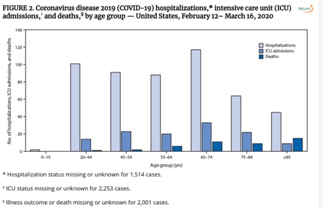

# Interlude in Spring 2020

## 3/24/20 Agenda 
1. Census

## Census {#census}

I recently filled out my census form.  Here is the full list of questions that I was asked:

* address
* name (of all residents at my address); including how many people live at the address
* the ownership status of the residence where I live
* my sex (only binary options provided, asked for all residents)
* birthday (asked for all residents)
* Hispanic, Latino, or Spanish origin (asked for all residents)
* race (with ethnicity options, asked for all residents)
* relationship status of each of the residents to me.  flexibility given for marital status, family status, etc. but no flexibility for sex (e.g., I could choose whether my spouse and I were married or not, but I was required to choose whether they were the same sex as me or the opposite sex as me)

### What about College students?

The Census provides great information at their website (particularly with respect to the changes due to COVID-19).  

https://2020census.gov/en/who-to-count.html

https://2020census.gov/en/news-events/press-releases/modifying-2020-operations.html

> College students who live away from home should be counted at the on- or off-campus residence where they live and sleep most of the time, even if they are at home on April 1, 2020. If they live in housing designed for college students (such as dorms and apartments with “by-the-bed” leases), they will be counted as part of the Group Quarters Operation. If they live off campus in housing that is not designed for college students (such as a private house or apartment), they should count themselves at that address.

>During our recent 2020 Census Group Quarters Advance Contact operation we contacted college/university student housing administrators to get their input on the enumeration methods that will allow students to participate in the 2020 Census. The majority, about 47 percent, have chosen the eResponse methodology and about 7 percent chose paper listings... About 35 percent, however, chose drop-off/pick-up which allows students to self-respond using an Individual Census Questionnaire (or ICQ). We are contacting those schools to ask whether they would like to change that preference in light of the emerging situation. 

>In general, students in colleges and universities temporarily closed due to the COVID-19 virus will still be counted as part of this process.  Even if they are home on census day, April 1, they should be counted according to the residence criteria which states they should be counted where they live and sleep most of the time.

## 3/26/20 Agenda
1. COVID-19

## COVID-19 {#covid19}
Thursday's optional class meeting is about COVID-19 and how it connects to the ideas in introductory statistics.
 
A good starting place for solid information about COVID-19:
https://www.sciencemuseumgroup.org.uk/coronavirus-science-what-we-know-and-dont-know-about-the-virus/

### Dashboard for Predicting

* Statistician Create COVID-19 Dashboard to Predict Infection: https://magazine.amstat.org/blog/2020/06/01/dashboard-to-predict-infection/

* Dashboard is here: https://covid19.stat.iastate.edu/
 
 
 
###  Visualizing the data

I find these two dashboards to be among the best out there.  Good display, constantly being updated, reliable data.  

* Coronavirus COVID-19 Global Cases by the Center for Systems Science and Engineering (CSSE) at Johns Hopkins University (JHU): https://www.arcgis.com/apps/opsdashboard/index.html#/bda7594740fd40299423467b48e9ecf6

* COVID-19 Global Pandemic Real-time Report: https://ncov.dxy.cn/ncovh5/view/en_pneumonia?link=&share=&source=

* COVIDcast: Real-time COVID-19 Indicators (including doctor visits, symptoms, Google search trends): https://covidcast.cmu.edu/

That said, it is also worth thinking about how to visualize the data and to do so responsibly.

* Visualizing COVID-19 data (responsibly):  https://medium.com/nightingale/ten-considerations-before-you-create-another-chart-about-covid-19-27d3bd691be8
 
 
### Current medical studies on treatment of COVID-19

* French study investigating azithromycin – chloroquine on COVID-19.
 
https://www.sciencedirect.com/science/article/pii/S0924857920300996
 
> French Confirmed COVID-19 patients were included in a single arm protocol from early March to March 16th, to receive 600mg of hydroxychloroquine daily and their viral load in nasopharyngeal swabs was tested daily in a hospital setting. Depending on their clinical presentation, azithromycin was added to the treatment. Untreated patients from another center and cases refusing the protocol were included as negative controls. Presence and absence of virus at Day6-post inclusion was considered the end point.
 
> Assuming a 50% efficacy of hydroxychloroquine in reducing the viral load at day 7, a 85% power, a type I error rate of 5% and 10% loss to follow-up, we calculated that a total of 48 COVID-19 patients (i.e., 24 cases in the hydroxychloroquine group and 24 in the control group) would be required for the analysis (Fleiss with CC). Statistical differences were evaluated by Pearson's chi-square or Fisher's exact tests as categorical variables, as appropriate. Means of quantitative data were compared using Student's t-test.
 

(\#fig:unnamed-chunk-1)Gautret et al. Hydroxychloroquine and azithromycin as a treatment of COVID-19: results of an open-label non-randomized clinical trial

 
 
* In late March, WHO launches global megatrial of the four most promising coronavirus treatments (not any antibiotics).  The study, which could include many thousands of patients in dozens of countries, has been designed to be as simple as possible so that even hospitals overwhelmed by an onslaught of COVID-19 patients can participate.
 
https://www.sciencemag.org/news/2020/03/who-launches-global-megatrial-four-most-promising-coronavirus-treatments#
 
> Enrolling subjects in SOLIDARITY will be easy. When a person with a confirmed case of COVID-19 is deemed eligible, the physician can enter the patient’s data into a WHO website, including any underlying condition that could change the course of the disease, such as diabetes or HIV infection. The participant has to sign an informed consent form that is scanned and sent to WHO electronically. After the physician states which drugs are available at his or her hospital, the website will randomize the patient to one of the drugs available or to the local standard care for COVID-19.
 
> “After that, no more measurements or documentation are required,” says Ana Maria Henao Restrepo, a medical officer at WHO’s Department of Immunization Vaccines and Biologicals. Physicians will record the day the patient left the hospital or died, the duration of the hospital stay, and whether the patient required oxygen or ventilation, she says. “That’s all.”
 
> The design is not double-blind, the gold standard in medical research, so there could be placebo effects from patients knowing they received a candidate drug. But WHO says it had to balance scientific rigor against speed. 
 

* Teaching resources for introducing COVID-19 in class by Laura Le, Kari Lock Morgan, and Lucy D’Agostino McGowan: https://coronavirus-teaching-resources.netlify.app/
 
###  Studies related to COVID-19

* Medical studies discussing side effects of azithromycin – chloroquine treatment. https://threadreaderapp.com/thread/1242119303811514369.html
 
* Studies on cloth masks vs medical masks for healthcare workers. https://bmjopen.bmj.com/content/5/4/e006577
 
* Different blood types and COVID-19
 
https://www.medrxiv.org/content/10.1101/2020.03.11.20031096v1 (not yet peer-reviewed)
 
> The authors write of a "significantly higher risk" for blood group A but, as one reader pointed out in the comments section, this does not mean that the risk is greatly higher; it means that a p-value was small. Notice that the CI for the odds ratio is above 1, but it comes close to 1 and is centered a 1.20 and not, say, 2.5.
> "Meta-analyses on the pooled data showed that blood group A had a significantly higher risk for COVID-19 (odds ratio-OR, 1.20; 95% confidence interval-CI [1.02,1.43], P = 0.02) compared with non-A blood groups."

The language might lead the reader to think "blood group A has a much higher risk for COVID-19" which is markedly untrue!  That is, significance is a completely different concept as compared to "a lot".

###  Being careful with your analysis 

* Late summer 2020, and there continues to be **no reliable data** in the US.  [How to Understand COVID-19 Numbers](https://www.propublica.org/article/how-to-understand-covid-19-numbers) by the ProPublica team walks through why it is so hard to have a sense of the disease at this point:
   - Case counts won't give you the full picture.
   - Don't want to be wrong? Wait a beat.
   - There are some things we can't know for certain.
   - Take a deep breath and try to look at the big picture.
   - Find trusted sources.
   - What the numbers show us today.
   - Bottom line: we don't have the pandemic under control.
   

* There is no evidence that the racial disparities in COVID-19 disease are due to biology.  The evidence points to differences in health care access and other socio-economic factors.
    - "Racial Health Disparities and Covid-19 — Caution and Context" by Chowkwanyun and Reed, *New England Journal of Medicine*, https://www.nejm.org/doi/full/10.1056/NEJMp2012910

* CDC report: "Severe Outcomes Among Patients with Coronavirus Disease 2019 (COVID-19) — United States, February 12–March 16, 2020"   https://www.cdc.gov/mmwr/volumes/69/wr/mm6912e2.htm
 
Pay attention to counts per group.  20-44 is 24 years.  65-74 is 9 years.
 

(\#fig:unnamed-chunk-2)CDC report: Severe Outcomes Among Patients with Coronavirus Disease 2019 (COVID-19) — United States, February 12–March 16, 2020

 
 
* There has been some talk about a 2% fatality rate, but fatality is incredibly difficult to measure so early in the disease.
    - If the number of reported confirmed cases of COVID-19 continues to slow down, the 2% fatality rate people have been quoting may appear to rise because of two main factors: under-reporting of the number of cases and the delay from symptoms first appearing to death.  It is possible that the errors will cancel each other out and end up being correct for the wrong reasons!
    - Also, the "fatality rate" is an incredibly misleading number because it varies so much based on age.  Averaging over all ages will give different numbers based on the age distribution of the country at hand.
    - And maybe just as important & harder to measure:  what is the fatality rate for the pandemic?  The pandemic will cause deaths directly due to the coronavirus and also due to: cardiac arrest (or other emergency condition) without adequate space in ERs; lack of food / heat for people who are unable to work; lack of access to medical supplies / dialysis / pharmaceuticals; etc.

* What is the trade-off between putting a cap on the disease and resisting tracking our personal data?

   - Can smart thermometers help track the coronavirus? (March 18, 2020) https://www.nytimes.com/2020/03/18/health/coronavirus-fever-thermometers.html
   
   - Follow-up:  Restrictions are Slowing Coronavirus Infections, New Data Suggests (March 30, 2020) https://www.nytimes.com/2020/03/30/health/coronavirus-restrictions-fevers.html?searchResultPosition=1

   - Social distancing scoreboard based on movement of mobile phones: https://www.unacast.com/covid19/social-distancing-scoreboard (info about their work: https://www.unacast.com/post/the-unacast-social-distancing-scoreboard)
 
 

 
