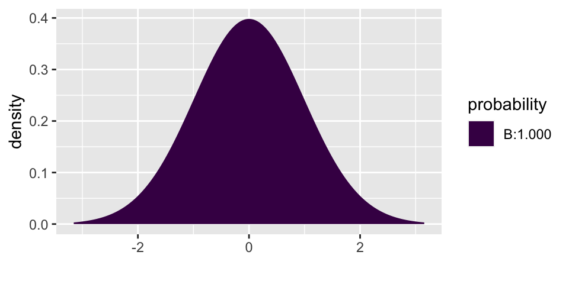
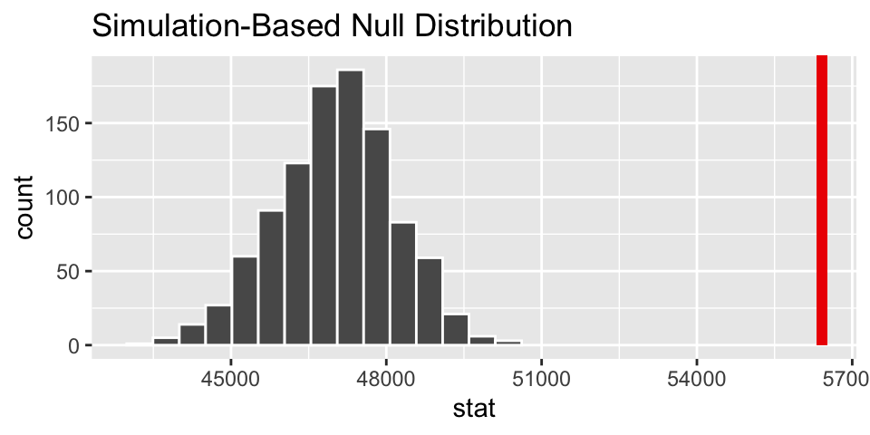
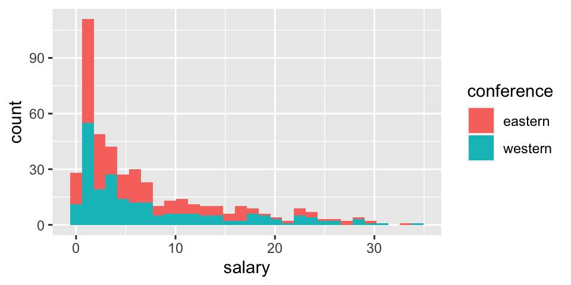

# Inference for numerical data


<!--
## 3/31/20 Agenda {#Mar31}
1. New statistics: mean, standard deviation, standard error of the mean
2. Sampling distribution of the sample mean
-->

## Important measures related to quantitative (numeric) variables

### Quantitative Descriptives 

What measures can we look at to get a first sense of whether  two groups are different (let alone substantially different enough for us to conclude a difference in a related population).  We might look at what is called the **Five Number Summary**.  

* **Five Number Summary**: Min, Q1, Median, Q3, Max
  - Q1 = median of the values *below* the median
  - Q3 = median of the values *above* the median
  - IQR = Interquartile range (measure of spread/variability) = Q3 - Q1
  - 1.5 x IQR rule for possible outliers: If an observation falls more than 1.5IQR outside of Q1 or Q3, flag the observation as a possible outlier.

* Boxplot 
  - Box spans Q1 to Q3
  - Line in box marks median (M)
  - Perpendicular line extends from box to smallest and largest observations *within* 1.5IQR of Q1 and Q3.
  - Dots for observations outside of 1.5IQR

* Summaries often used when variable has a bell-shaped distribution

$$
\begin{align*}
\mbox{sample mean} &= \overline{X} = \frac{1}{n} \sum_{i=1}^n X_i\\
\mbox{sample standard deviation} &= s = \sqrt{\frac{1}{n-1} \sum_{i=1}^n (X_i - \overline{X})^2}\\
\mbox{sample variance} &= s^2 = \frac{1}{n-1} \sum_{i=1}^n (X_i - \overline{X})^2
\end{align*}
$$

Loosely, the standard deviation is the size of the typical deviation from the mean of the data set.  Note that we divide by $n-1$ instead of by $n$ because the true deviation is defined as the average of the observations from the true mean $\mu$, and, in fact, they will always be closer to $\overline{X}$ than to $\mu$.


### Sampling distribution of a sample mean {#mean1dist}


As before, the **Central Limit Theorem** tells us that averages are normally distributed if the sample size is large enough.  Here, that means:
$$\overline{X} \sim N(\mu, \sigma/\sqrt{n})$$
where $SD(\overline{X}) = \sigma/\sqrt{n}$ and $SE(\overline{X}) = s/\sqrt{n}$.  $\mu$ is the center of the *population* of observations from which the sample data were taken.  $\sigma$ is the variability of the *population* of observations from which the sample data were taken.

As before, we won't spend much time worried about the difference between $SD(\overline{X})$ and $SE(\overline{X})$.  Generally, we'll only know / use $SE(\overline{X}) = s/\sqrt{n}$.  Typically, with quantitative variables, "large enough" is at least 30 or so observations.


Spend some time clicking through different datasets in the ICAM applet: http://www.rossmanchance.com/applets/OneSample.html?showBoth=1

You should notice:

* If the population (or sample of data) is skewed, the sampling distribution of the sample mean is normal (bell-shaped) when the sample size is large.
* The larger the sample size, the less variable the sampling distribution.
* The sample size does *not* change the distribution of the dataset (the middle graph).  The middle graph will always be a representation of the population graph (left side); although with small sample sizes, the middle graph is somewhat sparse.
* In an actual data analysis, we **only** see the middle graph.  We do not see the population graph (left side) or the sampling distribution (right side).

<!--
## 4/2/20 Agenda {#Apr2}
1. The t-distribution
2. Standardized t-score 
3. Hypothesis Testing & Confidence Intervals for one mean


## 4/7/20 Agenda {#Apr7}
1. Review of confidence interval for one mean
2. Prediction Interval for a future observation
-->

## Inference for a single mean, $\mu$ {#mean1inf}

###  Mathematical model for distribution of the sample mean

Before coming up with the mathematical model appropriate for this section, it is important to notice that we almost never know the true variability of the data (i.e., $\sigma$).  Instead, we almost always have to estimate $\sigma$ using $s$, the sample standard deviation.  It turns out that when the estimate of the variability is used in the denominator, the sampling distribution becomes more variability (longer tails).  Recall that it is the tails of the distribution in which we are the most interested, so we don't want to get those wrong!!

If $\sigma$ is somehow known:  $$\frac{\overline{X} - \mu}{\sigma/\sqrt{n}} \sim N(0,1)$$

But in the more typical situation where $\sigma$ is estimated using $s$: $$\frac{\overline{X} - \mu}{s/\sqrt{n}} \sim t_{df = n-1}$$

#### Hypothesis Testing (ISRS 4.1)

If $H_0: \mu = \mu_0$ is true, then we know that: $$\frac{\overline{X} - \mu}{s/\sqrt{n}} \sim t_{df = n-1}$$

That is, we can use the $t_{df = n-1}$ distribution to find the p-value for the test.  Note, in R we we use the function `xpt` in the `mosaic` package.

####  Confidence Intervals (ISRS 4.1.4)

In the setting where there is no null hypothesis statement and an interval estimate is needed, the interval is created in the exact same way as was done with proportions using:  $$\overline{X} \pm t_{n-1}^* \cdot SE(\overline{X})$$

Which is the same thing as: $$\overline{X} \pm t_{n-1}^* \cdot s/ \sqrt{n}$$

#### Prediction Intervals (ISCAM 2.6, not in ISRS) {#predint}

A prediction interval is **different** from a confidence interval!!!  Remember that a confidence interval is a range of values that try to capture a **parameter**.   A prediction interval is meant to capture 95% of future observations (see below for the example on healthy body temperatures).  Note that in order to capture the variability in the observations, we combine the variability of the center of the interval ($s/\sqrt{n}$) with the variability of the observations themselves ($s$).

A $(1-\alpha)100%$ prediction interval has a $(1-\alpha)$ probability of capturing a new observation from the population.

$$\overline{X} \pm t_{n-1}^* \cdot s \sqrt{1 + \frac{1}{n}}$$


### Example: healthy body temperature^[Inv 2.5, Chance & Rossman, ISCAM] 

The study at hand is meant to determine whether the average healthy body temperature is actually 98.6 F.^[Conventional wisdom says that the reason 98.6 has hung around is because it translates to 35 C. Indeed, it it agreed that, to the nearest integer, the average healthy human body temperature is 37 C.  But there is also some consensus that it is slightly lower than 37 C (if we are willing to use more significant digits).  The idea is that we have hung on to 98.6 because the decimal *feels* like a precise measurement.  In reality, it is just the conversion from 37 C to F.]

> Body temperatures (oral temperatures using a digital thermometer) were recorded for healthy men and women, aged 18-40 years, who were volunteers in Shigella vaccine trials at the University of Maryland Center for Vaccine Development, Baltimore. For these adults, the mean body temperature was found to be 98.249 F with a standard deviation of 0.733 F.^[Mackowiak, Wasserman, & Levine, *Journal of the American Medical Association*, 1992]

In order to work through the analysis it is imperative that we understand the data that was collected as part of the research.  


|          center                                  |             variability of data                                      |                                variability of sample means                   |  sample size    |
|:--------------------------------------------|:---------------------------------------------------|:---------------------------------------------------|:------|
| $\overline{X} = 98.249$ F                    | $s = 0.733$ F                                       | $SE(\overline{X}) = \frac{s}{\sqrt{n}} = \frac{0.733}{\sqrt{130}} = 0.0643$ | $n=130$ |
| $\mu$ = true ave healthy body temp (unknown!) | $\sigma$ = true sd of healthy body temps (unknown!) | $SD(\overline{X}) = \frac{\sigma}{\sqrt{n}}$ = unknown!     |      |


####  Hypothesis test on true average healthy body temperature

The first research question we want to ask is:  how surprising would it be to select a group of 130 participants who have an average healthy body temperature of 98.249 F ?

The questions is set up perfectly for a hypothesis test!

$H_0: \mu = 98.6$

$H_A: \mu \ne 98.6$

We use the t-distribution to investigate the claim.

$$t-score = \frac{98.249 - 98.6}{0.733/\sqrt{130}} = -5.46$$

How likely is the standardized version of our test statistic to happen if the null hypothesis is true?  Well, if $H_0$ is true, then the t-statistics should have a t-distribution.  So we can use the t-distribution to find the p-value (recall that the p-value is the probability of the data or more extreme if $H_0$ is true.)

The test statistic is -5.46, and even a two-sided p-value (the area doubled) is way less than 0.001.


```r
2*mosaic::xpt(-5.46, df = 129)
```



```
## [1] 2.354246e-07
```

Conclusion: We definitely reject $H_0$.  There is no way this sample of 130 people came from a population with a true average healthy body temperature of 98.6. 

####  Confidence interval for true average healthy body temperature

Possibly more interesting is the confidence interval which would tell us a range of plausible values for healthy body temperatures.

The confidence interval is given by the following formula:  $$\overline{X} \pm t_{n-1}^* \cdot s/ \sqrt{n}$$

and is calculated to be (98.121, 98.376).  That is, we are 95% confident that the true average healthy body temperature is somewhere between 98.121 F and 98.376 F.  Note that 98.6 F is not in the interval!!!  Wow.


```r
mosaic::xqt(.975, df = 129)
```


```
## [1] 1.978524
```

```r
98.249 - 1.9785 * 0.733 / sqrt(130)
```

```
## [1] 98.12181
```

```r
98.249 + 1.9785 * 0.733 / sqrt(130)
```

```
## [1] 98.37619
```

#### Prediction interval for individual healthy body temperatures^[Inv 2.6, Chance & Rossman, ISCAM] 

Note the fundamental difference between the **goal** of the confidence interval above and the **goal** of the prediction interval calculated in this section.  A confidence interval is an interval of plausible values for a population parameter.  A prediction interval is for a future *individual* observations.

A $(1-\alpha)100%$ prediction interval has a $(1-\alpha)$ probability of capturing a new observation from the population.

Here, a 95% prediction interval for healthy body temperatures can be calculated using:

$$\overline{X} \pm t_{n-1}^* \cdot s \cdot \sqrt{1 + \frac{1}{n}}$$

$$98.249 \pm t_{129}^* \cdot 0.733 \cdot \sqrt{1 + \frac{1}{130}}$$

Which gives a 95% prediction interval of (96.79 F, 99.70 F). There is a 0.95 probability that if I reach into the population, the person selected will have a healthy body temperature between 96.79 F and 99.70 F.  Said differently,  95% of the individuals in the population will have a healthy body temperature between 96.79 F and 99.70 F  (a **much** wider range of values than the confidence interval!)


```r
mosaic::xqt(.975, df = 129)
```


```
## [1] 1.978524
```

```r
98.249 - 1.9785*0.733*sqrt(1 + 1/130)
```

```
## [1] 96.79319
```

```r
98.249 + 1.9785*0.733*sqrt(1 + 1/130)
```

```
## [1] 99.70481
```

<!--
## 4/9/20 Agenda {#Apr9}
under the random sample model:

1. Sampling distribution of $\overline{X}_1 - \overline{X}_2$
2. Hypothesis testing (and CI) of $\mu_1 - \mu_2$

## 4/14/20 Agenda {#Apr14}
under the random allocation model:

1. Sampling distribution of $\overline{X}_1 - \overline{X}_2$
2. Confidence interval (and HT) for $\mu_1 - \mu_2$
-->

## Comparing two independent means {#mean2inf}

It turns out that in *both* the setting where random samples are taken (e.g., NBA salaries) and the setting where random allocation is done (e.g., sleep deprivation), the t-distribution describes the distribution of the test statistic quite well.  Note that the variability associated with the difference in means uses the variability of both the samples (and their individual sample sizes!).

\begin{eqnarray*}
\mbox{parameter} &=& \mu_1 - \mu_2\\
\mbox{statistic} &=& \overline{X}_1 - \overline{X}_2\\
SE_{\overline{X}_1 - \overline{X}_2} &=& ?????
\end{eqnarray*}

In general, the math is done on the variance (which is just the squared standard deviations).
\begin{eqnarray*}
var(A - B) &=& var(A) + var(B)\\
var(\overline{X}_1 - \overline{X}_2) &=& var(\overline{X}_1) + var(\overline{X}_2)\\
&=& \sigma^2_1 / n_1 + \sigma^2_2 / n_2\\
SE(\overline{X}_1 - \overline{X}_2) &=& \sqrt{s^2_1 / n_1 + s^2_2 / n_2}\\
\end{eqnarray*}

The above methods can be used when the samples are of different sizes and when the variability in the two samples is quite different ($s_1 \ne s_2$).  If we use the above procedures, the exact degrees of freedom are not straightforward to calculate:

\begin{eqnarray*}
df &=& \frac{ \bigg(\frac{s^2_1}{n_1} + \frac{s^2_2}{n_2} \bigg)^2}{ \bigg[ \frac{(s^2_1/n_1)^2}{n_1 - 1} + \frac{(s^2_2/n_2)^2}{n_2 - 1} \bigg] }\ \ \ \ \ \ \ \mbox{Yikes!!!!}\\
df &\approx& \min \{ n_1 - 1, n_2 -1 \} \\
\end{eqnarray*}

With the SE appropriately defined, the hypothesis test and confidence interval follow the methods from earlier in the semester.

$H_0: \mu_1 - \mu_2 = 0$  
$H_A: \mu_1 - \mu_2 \ne 0$

**When $H_0$ is true**:

\begin{eqnarray*}
t &=& \frac{(\overline{X}_1 - \overline{X}_2) - (\mu_1 - \mu_2)_0}{\sqrt{s_1^2 / n_1 + s_2^2 / n_2}}\\
&=& \frac{(\overline{X}_1 - \overline{X}_2) - 0}{\sqrt{s_1^2 / n_1 + s_2^2 / n_2}}\\
&\sim& t_{\min \{ n_1 - 1, n_2 -1 \} }
\end{eqnarray*}

Which means that the $t_{\min \{ n_1 - 1, n_2 -1 \} }$-distribution can be used to find a p-value associated with the t-score:
$$\mbox{t-score} = \frac{(\overline{X}_1 - \overline{X}_2) - 0}{\sqrt{s_1^2 / n_1 + s_2^2 / n_2}}.$$

Additionally, a $(1-\alpha)100$% confidence interval for $(\mu_1 - \mu_2)$ can be found by computing:

$$(\overline{X}_1 - \overline{X}_2) \pm t_{\min \{ n_1 - 1, n_2 -1 \} }^* \cdot \sqrt{s_1^2 / n_1 + s_2^2 / n_2}.$$

<!--
$$(\overline{X}_1 - \overline{X}_2) ~ \sim N\bigg( (\mu_1 - \mu_2), \sqrt{\sigma_1^2 / n_1 + \sigma_2^2 / n_2} \bigg)$$

$$\mbox{t-score} = \frac{(\overline{X}_1 - \overline{X}_2) - 0}{\sqrt{s_1^2 / n_1 + s_2^2 / n_2}} \sim t_{\min \{ n_1 - 1, n_2 -1 \} }$$


Unfortunately, however Welch's t-test is not used as often as other t-tests (though there is research to show that Welch's t-test should be the default).  \\

\medskip
\noindent
In particular, if the standard errors are reasonably similar ($\sigma_1 \approx \sigma_2$), a more powerful test is given by:
\begin{eqnarray*}
SE(\overline{X}_1 - \overline{X}_2) &=& \sqrt{s^2_p (1/ n_1 + 1 / n_2)}\\
s^2_p &=& \frac{(n_1-1) s_1^2 + (n_2-1)s_2^2}{n_1 + n_2 -2}\\4
df &=& n_1 + n_2 - 2
\end{eqnarray*}
-->

## Comparing two paired means {#mean2infpair}

We won't cover paired means in Spring 2021

## ANOVA {#ANOVA}

It might seem like a misnomer at first, an **AN**alysis **O**f **VA**riance (ANOVA) test is actually a test of equality of means.  That is, we extend the two sample t-test to more than two samples.  The ANOVA hypotheses will always be of the form:

\begin{eqnarray*}
H_0:&& \mu_1 = \mu_2 = \cdots = \mu_k\\
H_A:&& \mbox{not } H_0
\end{eqnarray*}

If we reject the null hypothesis, we are claiming that at least one of the population means is different from the others.  We do **not** know that all the means are simultaneously different.  Be very careful with your conclusions!!  Additionally, if we do not reject the null hypothesis, we are not guaranteed that the population means are all identical (which is the same idea that we've had before when we were unable to reject $H_0$).


The ANOVA assumptions are he same as the assumptions we made for the two sample t-test with equal variance:

* Response variable is distributed normally within each population.
* The variances for each population are the same.
* The samples are independent within populations and across groups.

::: {.example}
Cuckoo Egg Lengths:  L.H.C. Tippett (1902-1985) was one of the pioneers in the field of statistical quality control, This data on the lengths of cuckoo eggs found in the nests of other birds (drawn from the work of O.M. Latter in 1902) is used by Tippett in his fundamental text. Cuckoos are knows to lay their eggs in the nests of other (host) birds. The eggs are then adopted and hatched by the host birds.


```r
library(Stat2Data)
data(Cuckoo)
Cuckoo %>%
  ggplot() + 
  geom_boxplot(aes(x = Bird, y = Length))
```


:::

The key to understanding ANOVA is to breaking down the variability into two different pieces.  The first is the variability within each separate group.  Sometimes it is referred to as the variability of the residuals (left over after the groups are formed).  The second is the variability across the different groups.

**mean square error**
The mean square error (MSE) of ANOVA is the pooled sample variance, a measure of the variability within groups.
$$
\begin{align*}
MST &= \frac{\sum_{i=1}^I n_i (\overline{x}_i - \overline{x})^2}{I-1}\\
\overline{x} &= \frac{\sum_{i=1}^I n_i \overline{x}_i}{N}\\
\end{align*}
$$

**mean square treatment**
The mean square treatment of ANOVA represents variation among the means of the treatment groups as compared to the overall mean.  It should be similar to error mean square if the population means are equal.


$$
\begin{align*}
MSE&= \frac{\sum_{i=1}^I s_i^2(n_i -1)}{N-I}\\
\overline{x} &= \frac{\sum_{i=1}^I n_i \overline{x}_i}{N}\\
\end{align*}
$$

### ANOVA F-test

Under the null hypothesis that the population means of all the groups are the same, the value for $MS_{groups}$ should be similar to the value for $MS_{error}$.  Regardless of the null hypothesis, $MS_{error}$ will always be a good measure of the within group variability.  If the groups are really different, $MS_{groups}$ will overestimate the within group variability.  Under $H_0$:

$$F^* = \frac{MST}{MSE} \sim F_{I-1, N-I}$$

If, in fact, the population means are different, $F^*$ will be much larger than expected from the  null sampling distribution.

$$p-value = P(F_{I-1, N-I} \geq F^*)$$

Rejecting the null hypothesis says that at least one of the population means is different from the others.  Not rejecting the null hypothesis says that the data are consistent with the null hypothesis (not that we are sure the null hypothesis is true).


### ANOVA table
An ANOVA table summarizes the F-test (and more: see Math 158) above.


| Source    | SS                                                   | df    | MS    | F                 | p                          |
|-----------|------------------------------------------------------|-------|-------|-------------------|----------------------------|
| treatment | $\sum_{i=1}^I n_i (\overline{x}_i - \overline{x})^2$ | $I-1$ | $MST$ | $\frac{MST}{MSE}$ | $P(F_{I-1, N-I} \geq F^*)$ |
| error | $\sum_{i=1}^I s_i^2(n_i -1)$  | $n-I$ | $MSE$ |  | |
| Total | $\sum_{i=1}^I \sum_{j=1}^{n_i} (x_{ij} - \overline{x})^2$| $n-1$ | | |  |

### Technical Conditions
There are several technical conditions required for this randomization distribution to be well modeled by
the F distribution.  Research into the ANOVA test has been done to identify which of the technical conditions are most important and when.  Independence is always important to an ANOVA analysis.  The normality condition is most important when the sample sizes for each group are relatively small.  The constant variance condition is especially important when the sample sizes differ between groups.  If the technical conditions are not met, then the resulting p-value will be meaningless.  (See the section on ``Graphical diagnostics for an ANOVA analysis" in the OpenIntro textbook for a more complete discussion.)


* The distribution for each group comes from a normal population.
* The population standard deviation is the same for all the groups.
* The observations are independent.

When using this ANOVA F-test to compare several population means, we will check each condition as
follows:

* The normal probability plot (or dotplot or histogram) for each sample?s responses is reasonably
well-behaved.
* The ratio of the largest standard deviation to the smallest standard deviation is at most 2.
* The samples are independent random samples from each population.

For simplicity, we will apply the same checks for a randomized experiment as well (with the last
condition being met if the treatments are randomly assigned). If the first two conditions are not met,
then suitable transformations may be useful.

### Thought experiment

As with many of the other tests we've covered, the ANOVA setting can be evaluated mathematically (as seen in these notes) *and* computationally, using a randomization test.  How would you set up a simulation to create a null sampling distribution for the question at hand?  The important pieces of the simulation will include:


* What statistic do you plan to use? 
* For what values of the statistics will you reject $H_0$?  (Big or small?)
* How will you shuffle the observed data values to force the null hypothesis to be true?
* How many shuffles do you need to accurately describe the null sampling distribution?


#### $R^2$

We won't show it, but $SSTO = SST + SSE$.

\begin{eqnarray*}
R^2 = \frac{SST}{SSTO} = 1 - \frac{SSE}{SSTO}
\end{eqnarray*}

Notice that $MSTO$ is simply the variability in x completely regardless of the model (groups, etc.)  It is the same value we would have calculated for the variance of x if we hadn't known anything about the groups of interest.  $SST$ is the proportion of that variability that we attribute ({\em explain}) by breaking the response down by groups.

For the egg length data:
\begin{eqnarray*}
SSTO &=& 42.94 + 94.248 = 137.188\\
R^2 &=& 42.94 / 137.188 = 0.313
\end{eqnarray*}
31.3\% of the variability in egg lengths can be explained by the differences in host birds (that is, can be explained by where the cuckoo decides to lay the egg).


#### Post-hoc comparison of means

If, in fact, the research question addresses a prespecified comparison of means, the two independent sample t-test applies directly.  Note that the two differences have to do with the estimated SE.  We now estimate the SE using *all* of the data (even though our primary interest is in only 2 of the groups).


$$\hat{\sigma}^2 = s_p^2 = \frac{(n_1-1)s_1^2 + (n_2 - 1) s_2^2 + \cdots + (n_k -1)s_k^2}{n_1 + n_2 + \cdots + n_k -k}$$

Additionally, because $k$ means are estimated in in order to calculate the variability, there are $n-k$ degrees of freedom.  Therefore, a $(1-\alpha)100\%$ confidence interval for $\mu_i - \mu_j$ is
$$\overline{X}_i - \overline{X}_j \pm t_{(\alpha/2,N-k)} s_p \sqrt{1/n_i + 1/n_j}$$

Let's say we were originally interested in whether the eggs hatched in meadow pipit and tree pipit nests were significantly different sizes, on average.  

$$
\begin{align*}
s_p^2 &=  MS_{resid} = 0.827\\
(22.99 - 23.09) &\pm  t_{(.05, 120-6)} \sqrt{0.827} \sqrt{1/45 + 1/15}\\
& (-0.55, 0.35)\\
\verb;xqt;(0.05, 114) &= -1.658
\end{align*}
$$

We're 90% confident that the true difference in average cuckoo egg length for meadow pipits minus tree pipits is between -0.55 mm and 0.35mm.  Because zero is contained in the interval, we cannot tell which type of bird hosts larger eggs.


#### Multiple Comparisons

As you might expect, if you have 10 groups, **all of which come from the same population**, you might wrongly conclude that some of the means are *significantly* different.  If you try pairwise comparisons on all 10 groups, you'll have ${10 \choose 2} = 45$ comparisons.  Out of the 45 CI, you'd expect 2.25 of them to not contain the true difference (of zero); equivalently, you'd expect 2.25 tests to reject the true $H_0$.  In an overall test of comparing all 10 groups simultaneously, you can't use size as a performance measure anymore.

**FWER**
The Familywise Error Rate (FWER) is the probability of making one or more type I errors in a series of multiple tests.  In the example above (with 10 comparisons), you would almost always make at least one type I error if you used a size of $\alpha = 0.05$.  So, your FWER would be close to 1.  Methods exist for controlling the FWER instead of the size ($\alpha$).

We can use Bonferroni or the Tukey-Kramer method to adjust the FWER.  Other possibilities for determining significance (like the false discover rate (FDR) or q-values) also exist.


##  R code for inference on 1 or 2 means.

Above, R is used primarily as a calculator and a way to find the appropriate values from the t-distribution (using `mosaic::xpt` and `mosaic::xqt`  $\rightarrow$ note that along with the first argument (either a probability or a place on the x-axis) it is important to add the degrees of freedom `df`).

Consider the teacher salary data available in the OpenIntro textbook.  

>This data set contains teacher salaries from 2009-2010 for 71 teachers employed by the St. Louis Public School in Michigan, as well as several covariates.
>Posted on opendata.socrata.com by Jeff Kowalski. Original source: http://stlouis.edzone.net


```r
teachers <- read_delim("https://www.openintro.org/data/tab-delimited/teacher.txt", 
                       delim= "\t")
```


###  `t.test()`

The function which is typically used to do t-tests is the function `t.test()`.  Note that the `t.test()` function requires a complete dataset, not just the summary statistics.  However, the `t.test()` can be used to do any of the variety of tests we've seen (and the ones we haven't seen!):  one sample t-test, two independent samples t-test (with or without equal variances), paired t-test.

#### One sample t-test  

For example, we might be interested in testing whether the average salary (of all teachers in St Louis) is above $47,000 a year.  The p-value is extremely small. We reject $H_0$.  That is, we can claim that the true average base salary is above $47,000. (Note, to calculate a CI, use `alternative = "two.sided"`.)

$H_0: \mu = 47,000$

$H_A: \mu > 47,000$


```r
teachers %>%
  select(base) %>%
t.test(mu = 47000, alternative = "greater")
```

```
## 
## 	One Sample t-test
## 
## data:  .
## t = 7.9466, df = 70, p-value = 1.146e-11
## alternative hypothesis: true mean is greater than 47000
## 95 percent confidence interval:
##  54440.82      Inf
## sample estimates:
## mean of x 
##  56415.96
```


#### Two independent samples t-test

Or, maybe interest is in knowing whether the base salary for teachers with a BA degree is less than those with an MA degree, on average.  Note, $\mu$ denotes the average salary in the population group denoted by the subscript.  The p-value is 0.442, so we would not reject the null hypothesis.  (Note, to calculate a CI, use `alternative = "two.sided"`.)

$H_0: \mu_{BA} = \mu_{MA}$

$H_A: \mu_{BA} < \mu_{MA}$


```r
teachers %>%
  t.test(base ~ degree, alternative = "less", data = .)
```

```
## 
## 	Welch Two Sample t-test
## 
## data:  base by degree
## t = -0.14639, df = 65.238, p-value = 0.442
## alternative hypothesis: true difference in means is less than 0
## 95 percent confidence interval:
##      -Inf 3664.912
## sample estimates:
## mean in group BA mean in group MA 
##         56257.10         56609.56
```


### Bootstrapping in R

Notice that the simulation syntax is almost identical to that which we covered when we were working with proportions.  Also, notice that the computational approach gives almost identical answers to the mathematical model (t-distribution) from above.

#### One sample bootstrapping on mean


```r
library(infer)
set.seed(47)
# calculate the observed test statistic
# note that we could use `stat = "median"` or `stat = "t"`
( x_bar_base <- teachers %>%
  specify(response = base) %>%
  calculate(stat = "mean") )
```

```
## # A tibble: 1 x 1
##     stat
##    <dbl>
## 1 56416.
```

```r
# create the null sampling distribution
null_dist <- teachers %>%
  specify(response = base) %>%
  hypothesize(null = "point", mu = 47000) %>%
  generate(reps = 1000, type = "bootstrap") %>%
  calculate(stat = "mean")

# visualize the null sampling distribution
visualize(null_dist) +
  shade_p_value(obs_stat = x_bar_base, direction = "greater")
```


```r
# calculate the p-value
null_dist %>%
  get_p_value(obs_stat = x_bar_base, direction = "greater")
```

```
## # A tibble: 1 x 1
##   p_value
##     <dbl>
## 1       0
```


#### Two independent samples comparing two means

p-value is now 0.464  (very close to 0.442 given by the smooth t-distribution curve).


```r
set.seed(47)
# calculate the observed test statistic
( diff_x_bar_base <- teachers %>%
  specify(base ~ degree) %>%
  calculate(stat = "diff in means", order = c("MA", "BA")) )
```

```
## # A tibble: 1 x 1
##    stat
##   <dbl>
## 1  352.
```

```r
# create the null sampling distribution
null_dist <- teachers %>%
  specify(base ~ degree) %>%
  hypothesize(null = "independence") %>%
  generate(reps = 1000, type ="permute") %>%
  calculate(stat = "diff in means", order = c("MA", "BA")) 

# visualize the null sampling distribution
visualize(null_dist) +
  shade_p_value(obs_stat = diff_x_bar_base, direction = "greater")
```


```r
# calculate the p-value
null_dist %>%
  get_p_value(obs_stat = diff_x_bar_base, direction = "greater")
```

```
## # A tibble: 1 x 1
##   p_value
##     <dbl>
## 1   0.454
```


### NBA Salaries example from ISCAM Inv 4.2 


There is R code in the ISCAM book.  I've written the series of steps in a slightly different way with the same results.

####  EDA

Before thinking about inference, let's look at the population (for 2017-18).  The information for today is the population because it includes the salaries of all NBA players in 2017.  We can see that in this particular year, the average salary in the Western conference is slightly higher.  


```r
NBAsalary <- read_delim("http://www.rossmanchance.com/iscam3/data/NBASalaries2017.txt", delim = "\t", escape_double = FALSE, trim_ws = TRUE)


ggplot(NBAsalary) +
  geom_boxplot(aes(x=conference, y = salary))
```



```r
ggplot(NBAsalary) +
  geom_histogram(aes(fill = conference, x = salary))
```


```r
ggplot(NBAsalary) +
  geom_histogram(aes(x = salary)) + 
  facet_wrap(~ conference)
```


```r
NBAsalary %>%
  group_by(conference) %>%
  summarize(mu = mean(salary), sigma = sd(salary), N = n(), min(salary), max(salary), median(salary))
```

```
## # A tibble: 2 x 7
##   conference    mu sigma     N `min(salary)` `max(salary)` `median(salary)`
##   <chr>      <dbl> <dbl> <int>         <dbl>         <dbl>            <dbl>
## 1 eastern     6.61  7.01   227        0.0577          33.3             3.81
## 2 western     7.42  7.76   221        0.0320          34.4             4
```


####  Sampling distribution for one mean

Before considering how the sample means vary, let's visualize samples from each conference.


```r
NBAsalary %>%
  filter(conference == "eastern") %>%
  sample_n(size = 20, replace = FALSE) %>%
  ggplot() + 
  geom_histogram(aes(x = salary)) + xlab("eastern salary")

NBAsalary %>%
  filter(conference == "western") %>%
  sample_n(size = 20, replace = FALSE) %>%
  ggplot() + 
  geom_histogram(aes(x = salary)) + xlab("western salary")
```


One way to think about how the difference in means varies is to first visualize the variability in the distribution for a single mean (i.e., from one conference).  Let's look at the variability in the Eastern conference as well as the variability in the Western conference.

Note that from the population analysis above (full set of observations), we see that $\sigma \approx 7$.  So the histograms below should have a standard deviation of close to $\sigma / \sqrt{20} = 1.5$.  Do they?

Are the two histograms centered at the same place?  Should they be?


```r
NBAsalary %>%
  filter(conference == "eastern") %>%
  rep_sample_n(size = 20, replace = FALSE, reps = 500) %>%
  summarize(mean_sal = mean(salary)) %>%
  ggplot() +
  geom_histogram(aes(x=mean_sal))
```


```r
NBAsalary %>%
  filter(conference == "western") %>%
  rep_sample_n(size = 20, replace = FALSE, reps = 500) %>%
  summarize(mean_sal = mean(salary)) %>%
  ggplot() +
  geom_histogram(aes(x=mean_sal))
```




#### Sampling distribution for two means

Note:  the code selects 20 random salaries from the Eastern NBA conference and 20 random salaries from the Western NBA conference.  Using those two different samples, a t-statistic is selected.  The whole process is repeated 1000 times.


```r
set.seed(4747)

t_salaries <- data.frame(meandiff = double(), tstat = double())
for(i in 1:1000){
  
  one_t<- NBAsalary %>%
    group_by(conference) %>%
    sample_n(size = 20, replace = FALSE) %>% 
    summarize(mn = mean(salary), sd = sd(salary), n = n()) %>%
    pivot_wider(names_from = conference, values_from = 2:4) %>%
    summarize(meandiff = (mn_eastern - mn_western), 
              tstat = (mn_eastern - mn_western) / 
                sqrt(sd_eastern^2 / n_eastern + sd_western^2 / n_western)) 

  t_salaries[i,] <- one_t
}


t_salaries %>%
  ggplot() +
  geom_histogram(aes(x=meandiff)) +
  geom_vline(xintercept = 0)
```


```r
t_salaries %>%
  ggplot() +
  geom_histogram(aes(x=tstat)) +
  geom_vline(xintercept = 0)
```


## Reflection Questions


The reflection questions below that we will not cover are marked with an asterisk *.

### 1 quantitative variable: IMS Section 7.1

1. What changed about the studies (data structure) from Chapters 2 & 3?
2. What is the statistic of interest now?  What is the parameter of interest?
3. What is the difference between the distribution of the data and the distribution of the statistic?  There is a theoretical difference as well as a computational difference.
4. What is the limiting sampling distribution of the statistic?  (Note, the answer here is for big samples, that is the Central **Limit** Theorem works only where there is a limit... i.e., the sample size is big.)
5. If interest is in a statistics other than the sample mean, what is a tool we can use for finding the alternative statistic's sampling distribution?
6. * Explain the intuition behind bootstrapping.
7. * Explain how the SE for the statistic is calculated using bootstrapping.
8. What is the difference between a normal distribution and a t distribution?
9. When do we use a z and when do we use a t?
10. When would you use a confidence interval and when would you use a hypothesis test?
11. What different information does a boxplot give versus a histogram?


###  2 means (1 quantitative variable, 1 binary variable): IMS Section 7.2

1. What changed about the studies (data structure) from section 4.1?
2. What is the statistic of interest now?  What is the parameter of interest?
3. What is the sampling distribution for the statistic of interest?
4. How is the t-distribution become relevant?
5. What are degrees of freedom in general?  What are the actual degrees of freedom for the test in section 4.3?
6. * How is the null mechanism different across the three analysis methods in section 3.2:  randomization test, two-sample t-test, random sampling test (n.b. this is also called the parametric bootstrap)?
7. How do you create a CI?  How do you interpret the CI?
8. What if your data are NOT normal?  What strategies can you try out?

####  (won't cover spring 2021) Paired sample, difference in means: IMS Section 7.3

1. What changed about the studies (data structure) in section 4.2 as compared with 4.1 or 4.3?
2. What is the statistic of interest now?  What is the parameter of interest?
3. What is the sampling distribution for the statistic of interest?
4. What benefit does pairing have on the analysis?
5. What happens if a paired study is analyzed as if it were an independent two sample study?  (What happens to the p-value?  What happens to the CI?)
6. What is the easiest way to think of / analyze paired data?


#### ANOVA: IMS Section 7.5

1. Why are these tests called ANalysis Of VAriance (ANOVA)?
2. Describe the variability in the numerator and the variability in the denominator.  What does each measure?
3. What are the null and alternative hypotheses for ANOVA?
4. What features of the data affect the power of the test?  What does power mean here?
5. What are the technical conditions?  Why do we need equal variances here?


