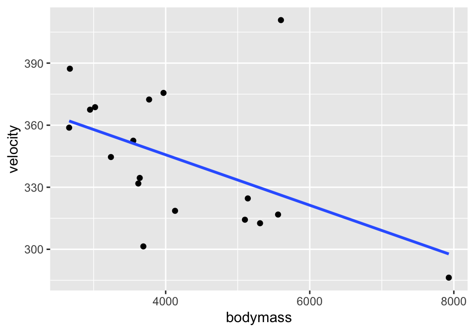
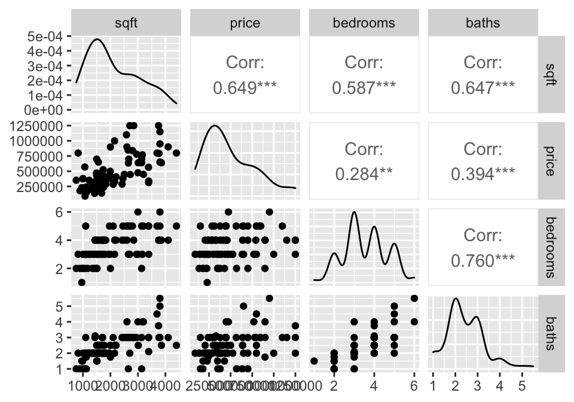

# Correlation & Regression as Models {#regdesc}


<!--
## 4/16/20 Agenda {#Apr16}
1. Definition of correlation (r)
2. Interpretation of correlation (r)  
3. (Probably not: Inference on $\rho$)
-->

The next topic will focus on modeling using two quantitative variables.  That is, both the explanatory and the response variables are measured on a numeric scale.   

To get started, consider a handful of crop types taken from [Our World in Data](https://ourworldindata.org/crop-yields) as part of [Tidy Tuesday](https://github.com/rfordatascience/tidytuesday/tree/master/data/2020/2020-09-01).  Each point in each plot represents a different country.  The x and y variables represent the proportion of total yield in the last 50 years which is due to that crop type. 


<div class="figure" style="text-align: center">

<p class="caption">(\#fig:plots6)The % of total yield for different crops (across the last 50 years).  Each point represents a country.</p>
</div>


Order the six scatterplots from strongest negative to strongest positive linear relationship.  Some questions to ask yourself:

* What would the correlation be if there was a perfect positive relationship?
* What would the correlation be if there was a perfect negative relationship?
* What would the correlation be if there was no relationship?

## Correlation {#cor}

Correlation measures the **linear** association between two numerical variables.  [Note, that when describing how two categorical (or one numerical & one categorical) variables vary together, they are said to be *associated* instead of *correlated*.]  

> The *correlation coefficient* measures the strength and direction of the linear association between two numerical variables.

### Estimating Correlation

The value of the correlation is defined as:

\begin{eqnarray*}
r &=& \frac{ \sum_i (x_i  - \overline{x})(y_i - \overline{y})}{\sqrt{\sum_i(x_i - \overline{x})^2} \sqrt{ \sum_i(y_i - \overline{y})^2}}\\
r &=& \frac{1}{n-1} \sum_{i=1}^n \bigg(\frac{x_i - \overline{x}}{s_x} \bigg) \bigg(\frac{y_i - \overline{y}}{s_y} \bigg)
\end{eqnarray*}


<div class="figure" style="text-align: center">

<p class="caption">(\#fig:plots6ave)The % of total yield for different crops (across the last 50 years).  Each point represents a country.  Now lines at the average x and average y values have been superimposed onto the plots.</p>
</div>


For each red dot (on each plot), consider the distance the observation is from the $\overline{X}$ line and the $\overline{Y}$ line.  Is the observation (red dot) above both?  below both?  above one and below the other?  

How does the particular red dot (observation) contribute to the correlation?  In a positive way (to make $r$ bigger)?  In a negative way (to make $r$ smaller)?

Some ideas worth thinking about:

* quadratic plots can have zero correlation yet a perfect functional relationship
* $-1 \leq r \leq 1$
* correlation does not imply causation (ice cream & boating accidents!)
* for inference with $\rho$ as well as $\beta_1$, the data should come from a bivariate normal distribution.  That is, histograms of $X$ and $Y$ should both be normal, and the scatterplot should be a cloud.
* correlation will go down when only a narrow range of X values is represented (see denominator of r).
* measurement error biases the estimate of a correlation coefficient toward zero.

We can calculate the correlation value for each of the crop plots and order them from strongest negative to strongest positive linear relationship: $A \rightarrow D \rightarrow B \rightarrow C \rightarrow E \rightarrow F$

<table class="table" style="margin-left: auto; margin-right: auto;">
<caption>(\#tab:unnamed-chunk-2)Correlation of percentage of total yield across different crops.</caption>
 <thead>
  <tr>
   <th style="text-align:left;"> Graph </th>
   <th style="text-align:left;"> x-variable </th>
   <th style="text-align:left;"> y-variable </th>
   <th style="text-align:right;"> correlation </th>
  </tr>
 </thead>
<tbody>
  <tr>
   <td style="text-align:left;"> A </td>
   <td style="text-align:left;"> potatoes </td>
   <td style="text-align:left;"> bananas </td>
   <td style="text-align:right;"> -0.54 </td>
  </tr>
  <tr>
   <td style="text-align:left;"> B </td>
   <td style="text-align:left;"> soybeans </td>
   <td style="text-align:left;"> cassava </td>
   <td style="text-align:right;"> 0.16 </td>
  </tr>
  <tr>
   <td style="text-align:left;"> C </td>
   <td style="text-align:left;"> maize </td>
   <td style="text-align:left;"> cassava </td>
   <td style="text-align:right;"> 0.46 </td>
  </tr>
  <tr>
   <td style="text-align:left;"> D </td>
   <td style="text-align:left;"> cocoa </td>
   <td style="text-align:left;"> bananas </td>
   <td style="text-align:right;"> -0.44 </td>
  </tr>
  <tr>
   <td style="text-align:left;"> E </td>
   <td style="text-align:left;"> peas </td>
   <td style="text-align:left;"> barley </td>
   <td style="text-align:right;"> 0.69 </td>
  </tr>
  <tr>
   <td style="text-align:left;"> F </td>
   <td style="text-align:left;"> wheat </td>
   <td style="text-align:left;"> barley </td>
   <td style="text-align:right;"> 0.85 </td>
  </tr>
</tbody>
</table>


### Coefficient of Determination: $R^2$

The coefficient of determination ($R^2$) is the square of the correlation (given above).  However, it also has an additional interpretation that will be useful for us.  It can measure how much of the original variability in Y is given by the regression line.  Both SSE and least-squares will be defined below when we fit a line to the scatter plot of observations.

SSE is "sum of squared errors" (think about how $s^2$ is defined).  So, $SSE(\overline{y})$ is the amount the response variable varies on its own.  $SSE(\mbox{least-squares})$ is the amount the response variable varies around the regression line (see Section \@ref(slr)).

\begin{eqnarray*}
R^2 &=& \frac{SSE(\overline{y}) - SSE(\mbox{least-squares})}{SSE(\overline{y})} \\
 &=& \frac{Var(y_i) - Var(e_i)}{Var(y_i)} \\
 &=& 1 - \frac{Var(e_i)}{Var(y_i)}\\
\end{eqnarray*}

The value $e_i$ is discussed in detail below, but it is the distance from the observed response variable to the prediction on the line:  \begin{align}e_i=y_i-\hat{y}_i\end{align}

$R^2$ can be used even in models with many explanatory variables.  As such, the way to think about $R^2$ is in terms of how much of the variability in the response variable was removed (when we learned the values of the explanatory variables).  $R^2$ **is the proportion reduction in the variability of the response variable which is explained by the explanatory variable.**


<!--
## 4/21/20 Agenda {#Apr21}
1. Least Squares estimation of the line
2. Distribution of the least squares line from sample to sample

## 4/23/20 Agenda {#Apr23}
1. Inferential technical conditions
2. Residual Plots
3. Transformations
4. Prediction Intervals
-->

## Simple Linear Regression {#slr}

*Regression* is a method that predicts the value of one numerical variable from that of another.  That is, as an extension to describing the degree of linearity of the relationship (correlation), the goal is now to create the best linear model -- often for prediction.  Note that many of the characteristics explored with correlation are applicable for regression.  However, correlation treats $X$ and $Y$ as interchangeable, whereas regression treats $X$ as fixed and known and $Y$ as random and unknown.  As we have previously, we call $X$ the explanatory variable, and $Y$ the response variable.  Again, we do not assume that there is any causal mechanism between $X$ and $Y$ even if they have a strong linear (or otherwise) relationship.


#### Predicted Values {-}

The predicted values of Y from a regression line estimate the *mean value* of $Y$ for all individuals that have a given value of $X$.  Notice the Roman letters (English letters) representing statistics:

\begin{eqnarray*}
\hat{y} &=& b_0 + b_1 x\\
\hat{y}_i &=& b_0 + b_1 x_i\\
y_i &=& b_0 + b_1 x_i + e_i\\
e_i &=& y_i - \hat{y}_i = y_i -  (b_0 + b_1 x_i)\\
\end{eqnarray*}

Notice, that we are predicting the **mean** value of the response variable at a given value of the explanatory variable!  

###  Least Squares estimation of the regression line {#ls}


To find the values of the regression statistics, the sum of squared errors is minimized.

**SSE:** Sum of squared errors (or residuals) is a measure of how closely the line fits to the points.  SSE is the value of the squared deviations calculated at the "best" possible values of $\beta_0$ and $\beta_1$ for a given dataset.

\begin{eqnarray*}
SSE = \sum_i (y_i - \hat{y}_i)^2 = \sum_i (y_i - (b_0 + b_1 x_i) )^2
\end{eqnarray*}
is minimized by the values:
\begin{eqnarray*}
b_0 = \overline{y} - b_1 \overline{x} & \ \ \ \ \ \ \ & b_1 = r \frac{s_y}{s_x}
\end{eqnarray*}

To find the "best" fitting line, we searched for the line that has the smallest residuals (SSE) in some sense.  In particular, the goal is to try to find the line that minimizes the following quantity: $$Q=\sum e_i^2 = \sum (y_i-(b_0+b_1x_i))^2.$$


Finding $b_0$ and $b_1$ that minimize Q is a calculus problem.
$$\frac{dQ}{db_0}=-2\sum (y_i-(b_0+b_1x_i)),\qquad \frac{dQ}{db_1}=-2\sum
x_i(y_i-(b_0+b_1x_i))$$ 
Setting both derivatives equal to 0 and solving for $b_0$ and $b_1$ yields the optimal values, denoted as $b_0$ and $b_1$

One aspect of the optimization problem that is worth pointing out has to do with the role of the two variables of interest $X$ and $Y$.   If we switch the roles of $X$ and $Y$, the best fitting line will be different.  If the relationship was invariant to which variable we choose as a response, then switching the roles of $X$ and $Y$ should give a slope of $1/b_1$, which is not the case.  [Note that the role of $X$ and $Y$ **is** invariant when calculating the correlation but not when calculating the least squares regression line.]

#### Residuals {-}

Residuals measure the scatter of points above and below the least squares regression line.  We use the residuals in many of the calculations and interpretations of the model.  Indeed, the goal of the linear regression is to find a model that has small residuals.  That is, ideally, the known variable $X$ will tell us all there is to know about the unknown variable $Y$.

\begin{eqnarray*}
e_i &=& (y_i - \hat{y}_i)\\
MSE&=& \frac{\sum_i (y_i - \hat{y}_i)^2}{n-2} = \frac{\sum_i (e_i)^2}{n-2} = s^2\\
SSE &=& \sum_i (y_i - \hat{y}_i)^2 = \sum_i (e_i)^2\\
R^2 &=& 1 - \frac{Var(e_i)}{Var(y_i)}
\end{eqnarray*}


## R code for regression 


### Example: Cat Jumping^[@iscam, Inv 5.6 & 5.13] (Correlation & SLR) {#ex:cat}


Consider the cat data given in Investigations 5.6 and 5.13.  The idea is to understand cat jumping velocity as a function of body characteristics. Note that the correlation $r=-0.496$  between bodymass and velocity.


```r
cats <- read_table2("http://www.rossmanchance.com/iscam2/data/CatJumping.txt")

ggplot(cats, aes(x=bodymass, y = velocity)) +
  geom_point() +
  geom_smooth(method = "lm", se=FALSE)
```




####  Correlation {-}

```r
cats %>%
  select(bodymass, velocity) %>%
  cor()
```

```
##            bodymass   velocity
## bodymass  1.0000000 -0.4964022
## velocity -0.4964022  1.0000000
```


#### Simple Linear Regression {-}


```r
library(broom)

cats %>%
  lm(velocity ~ bodymass, data = .) %>%
  tidy()
```

```
## # A tibble: 2 x 5
##   term        estimate std.error statistic  p.value
##   <chr>          <dbl>     <dbl>     <dbl>    <dbl>
## 1 (Intercept) 394.      23.4         16.8  1.35e-11
## 2 bodymass     -0.0122   0.00533     -2.29 3.61e- 2
```


#### Residual Plot {-}

And to work with the residuals, use `augment()`.


```r
cats %>%
lm(velocity ~ bodymass, data = .) %>% augment()
```

```
## # A tibble: 18 x 8
##    velocity bodymass .fitted .resid   .hat .sigma   .cooksd .std.resid
##       <dbl>    <dbl>   <dbl>  <dbl>  <dbl>  <dbl>     <dbl>      <dbl>
##  1     334.     3640    350. -15.6  0.0656   30.3 0.0104       -0.545 
##  2     387.     2670    362.  25.4  0.131    29.7 0.0640        0.920 
##  3     411.     5600    326.  84.6  0.119    19.8 0.629         3.05  
##  4     319.     4130    344. -25.5  0.0557   29.8 0.0232       -0.887 
##  5     369.     3020    358.  11.1  0.101    30.4 0.00867       0.394 
##  6     359.     2660    362.  -3.23 0.132    30.6 0.00105      -0.117 
##  7     345.     3240    355. -10.4  0.0853   30.4 0.00624      -0.366 
##  8     325.     5140    332.  -7.19 0.0844   30.5 0.00297      -0.254 
##  9     301.     3690    349. -48.1  0.0639   27.7 0.0962       -1.68  
## 10     332.     3620    350. -18.5  0.0664   30.2 0.0149       -0.648 
## 11     313.     5310    330. -17.1  0.0957   30.2 0.0196       -0.608 
## 12     317.     5560    327.  -9.86 0.116    30.4 0.00823      -0.354 
## 13     376.     3970    346.  29.5  0.0572   29.5 0.0321        1.03  
## 14     372.     3770    348.  23.9  0.0615   29.9 0.0228        0.834 
## 15     314.     5100    332. -18.0  0.0820   30.2 0.0179       -0.634 
## 16     368.     2950    358.   9.01 0.106    30.5 0.00614       0.322 
## 17     286.     7930    298. -11.5  0.508    30.3 0.157        -0.552 
## 18     352.     3550    351.   1.32 0.0692   30.6 0.0000797     0.0463
```

```r
cats %>%
lm(velocity ~ bodymass, data = .) %>% augment() %>%
  ggplot(aes(x = .fitted, y = .resid)) + 
  geom_point() +
  geom_hline(yintercept = 0)
```


### Example: Housing Prices^[@iscam, Inv 5.14]  (SLR & MLR & Prediction) {#ex:houses}


```r
library(GGally)
house = read.table("http://www.rossmanchance.com/iscam2/data/housing.txt", 
                   header=TRUE, sep="\t")
names(house)
```

```
## [1] "sqft"     "price"    "City"     "bedrooms" "baths"
```

#### Descriptive Statistics {-}

A good first step is to investigate how all the variables relate to one another.  The `ggpairs` function come from the R package `GGally`.


```r
ggpairs(house, columns = c(1,2,4,5))
```




## Reflection Questions

### Correlation & Simple Linear Regression: Chapter 3

* Describe the linear model with multiple variables.
* Describe the error / residual term and how it is calculated with multiple variables.
* What are the (three-ish) statistics of interest in this chapter?  What are the parameters of interest?
* What does correlation measure?
* How do we find the values of $b_0$ and $b_1$ for estimating the least squares line?
* Why is it dangerous to extrapolate?
* How do we interpret $R^2$?  Why is that? 
* Is linear regression always appropriate when comparing two continuous variables?


