# Inference on Correlation & Regression {#reginf}


<!--
## 4/16/20 Agenda {#Apr16}
1. Definition of correlation (r)
2. Interpretation of correlation (r)  
3. (Probably not: Inference on $\rho$)
-->

The last topic of the semester will focus on inference in the setting with two quantitative variables.  That is, both the explanatory and the response variables are measured on a numeric scale, we model them using correlation and least square regression, and then we ask whether the lines could have come from a population with no relationship (i.e., the null hypothesis).   

### Inference for correlation

Correlation measures the association between two numerical variables.  [Note, that when describing how two categorical (or one numerical & one categorical) variables vary together, they are said to be *associated* instead of *correlated*.]  

> The *correlation coefficient* measures the strength and direction of the linear association between two numerical variables.

Note:  we won't actually cover inference for correlation in class, but the notes on inference for correlation are included so that you can see that the process is very similar to all of the other statistics seen in the course to this point.

Parameter: $\rho$  
Statistic: $r$  
SE$_r: \sqrt{\frac{1-r^2}{n-2}}$   
**BUT**, $r$ is only normally distributed when $\rho$ = 0!  Otherwise, the distribution of $r$ from sample to sample is skewed (think about the scenario when $\rho = 0.9$).


#### Hypothesis Testing

\begin{eqnarray*}
H_0:&& \rho = 0\\
H_A:&& \rho \ne 0\\
t^* &=& \frac{r}{SE_r} = \frac{r}{\sqrt{(1-r^2)/(n-2)}}\\
t^* &\sim& t_{n-2}  \mbox{ when } H_0 \mbox{ is true}
\end{eqnarray*}

#### Confidence Interval

If $\rho \ne 0$, then the SE might be okay, but the sampling distribution of $r$ will not be normal (and thus will not be a $t$ when we use the SE).


Let:

\begin{eqnarray*}
z &=& 0.5 \ln \bigg( \frac{1+r}{1-r} \bigg)\\
\xi &=& 0.5 \ln \bigg( \frac{1+\rho}{1-\rho} \bigg)\\
var(z) &=& \sqrt{\frac{1}{n-3}}\\
95\% \mbox{ CI for } \xi : &&\\
z &\pm& 1.96 \cdot \sqrt{\frac{1}{n-3}}\\
\mbox{we're 95% confident that } && \\
&&z - 1.96 \cdot  \sqrt{\frac{1}{n-3}} \leq \xi \leq z + 1.96 \cdot \sqrt{\frac{1}{n-3}}\\
&& a \leq \xi \leq b\\
&& a \leq 0.5 \ln \bigg(\frac{1+\rho}{1-\rho} \bigg) \leq b\\
&& \frac{e^{2a} - 1}{e^{2a} + 1} \leq \rho \leq \frac{e^{2b} - 1}{e^{2b} + 1}
\end{eqnarray*}


See the Cat Jumping^[@iscam, Inv 5.6 & 5.13] example below in section \@ref(ex:cat).


**HT:**  
\begin{eqnarray*}
H_0:&& \rho = 0\\
H_a:&& \rho \ne 0\\
t^* &=& \frac{r}{\sqrt{(1-r^2)/(n-2)}} = \frac{-0.496}{\sqrt{(1-0.496^2) / (18-2)}}= -2.2849\\
p-value &=& 2 \cdot P(t_{18-2} \leq -2.2849) = 2\cdot(pt(-2.2849,16)) = 0.036 \mbox{  (borderline significant)}
\end{eqnarray*}

**CI:**  
\begin{eqnarray*}
95\% \mbox{CI for } \xi :&& \\
z \pm 1.96 \cdot \sqrt{\frac{1}{n-3}}&& \\
\mbox{we're } 95\% \mbox{ confident that}&&\\
 0.5 \ln\bigg(\frac{1+r}{1-r}\bigg) - 1.96 \cdot  \sqrt{\frac{1}{n-3}} &\leq \xi \leq& 0.5 \ln\bigg(\frac{1+r}{1-r}\bigg) + 1.96 \cdot \sqrt{\frac{1}{n-3}}\\
 0.5 \ln\bigg(\frac{1 - 0.496}{1+0.496}\bigg) - 1.96 \cdot  \sqrt{\frac{1}{18-3}} &\leq \xi \leq &0.5 \ln\bigg(\frac{1-0.496}{1+0.496}\bigg) + 1.96 \cdot \sqrt{\frac{1}{18-3}}\\
 -1.05 &\leq \xi \leq &-0.04\\
 \frac{e^{2\cdot -1.05} - 1}{e^{2\cdot -1.05} + 1} &\leq \rho \leq& \frac{e^{2\cdot -0.04} - 1}{e^{2\cdot -0.04} + 1}\\
&& (-0.781, -0.04)
\end{eqnarray*}


<!--
## 4/21/20 Agenda {#Apr21}
1. Least Squares estimation of the line
2. Distribution of the least squares line from sample to sample

## 4/23/20 Agenda {#Apr23}
1. Inferential technical conditions
2. Residual Plots
3. Transformations
4. Prediction Intervals
-->

## Simple Linear Regression

*Regression* is a method that predicts the value of one numerical variable from that of another.  That is, as an extension to describing the degree of linearity of the relationship (correlation), the goal is now to create the best linear model -- often for prediction.  Note that many of the characteristics explored with correlation are applicable for regression.  However, correlation treats $X$ and $Y$ as interchangeable, whereas regression treats $X$ as fixed and known and $Y$ as random and unknown.  As we have previously, we call $X$ the explanatory variable, and $Y$ the response variable.  Again, we do not assume that there is any causal mechanism between $X$ and $Y$ even if they have a strong linear (or otherwise) relationship.


#### Population Model {-}

Notice the Greek letters representing parameters:

\begin{eqnarray*}
E[y|x] &=& \beta_0 + \beta_1 x \\
y_i &=& \beta_0 + \beta_1 x_i + \epsilon_i\\
\epsilon_i &=& y_i -  (\beta_0 + \beta_1 x_i)\\
\end{eqnarray*}

#### Predicted Values {-}

The predicted values of Y from a regression line estimate the *mean value* of $Y$ for all individuals that have a given value of $X$.  Notice the Roman letters (English letters) representing statistics:

\begin{eqnarray*}
\hat{y} &=& b_0 + b_1 x\\
\hat{y}_i &=& b_0 + b_1 x_i\\
y_i &=& b_0 + b_1 x_i + e_i\\
e_i &=& y_i - \hat{y}_i = y_i -  (b_0 + b_1 x_i)\\
\end{eqnarray*}

Notice, that we are predicting the **mean** value of the response variable at a given value of the explanatory variable!  


### Inference on the slope, $\beta_1$ {#infbeta1}

As in section \@ref(ls), the slope is calculated by using least squares.

#### SE of the slope {-}

\begin{eqnarray*}
SE(b_1) &=& \sqrt{\frac{MSE}{\sum_i (x_i - \overline{x})^2}} = \sqrt{\frac{MSE}{(n-1)s_x^2}} = = \sqrt{\frac{\frac{\sum_i (y_i - \hat{y}_i)^2}{n-2}}{(n-1)s_x^2}}\\
\end{eqnarray*}

Just like any other statistic, the value of $b_1$ can be calculated for every sample.  The manner in which $b_1$ varies from sample to sample becomes the sampling distribution of the sample slope.  The SE of the slope will be the standard deviation associated with the sampling distribution of the slope.  The resulting inference theory is very similar to that which we saw with the mean.  The CLT describes $b_1$ to have a normal distribution, and estimating the $SE(b_1)$ induces extra variability which leads to a t-score test statistic with a t-distribution with df = $n-2$.

\begin{eqnarray*}
\mbox{t-score} = \frac{b_1 - \beta_1}{SE(b_1)} \sim t_{n-2}
\end{eqnarray*}

#### CI for the slope {-}

\begin{eqnarray*}
b_1- t^*_{\alpha/2, n-2} SE(b_1) \leq \beta_1 \leq b_1 + t^*_{\alpha/2, n-2} SE(b_1)
\end{eqnarray*}


See the Housing Prices^[@iscam, Inv 5.14] example below in section \@ref(ex:houses).

\begin{eqnarray*}
t_{\alpha/2,n-2} &=& qt(.975, 18-2) = 2.1199\\
SE(b_1) &=& 26.4\\
b_1 &=& 202\\
b_1 &\pm& t_{\alpha/2, n-2} SE(b_1): 202 \pm 2.1199 \cdot 26.4\\
&& (146.03, 257.97)\\
\end{eqnarray*}

That is, we are 95\% confident that the true average change in price associated with an additional square foot of house is between \$146.03 and \$257.97.


#### HT for the slope {-}

As mentioned previously,
\begin{eqnarray*}
\mbox{t-score} = \frac{b_1 - \beta_1}{SE(b_1)} \sim t_{n-2}
\end{eqnarray*}

Typically, interested is in testing whether or not the slope is zero.  The null hypothesis of $H_0: \beta_1 = 0$ addresses whether there is a non-zero linear relationship between $X$ and $Y$:

\begin{eqnarray*}
H_0:&& \mbox{ the slope of the regression line is zero}, \beta_1=0\\
H_A:&& \mbox{ the slope of the regression line is not zero}, \beta_1 \ne 0\\
\end{eqnarray*}

As with previous tests, the alternative can be one- or two-sided (depending on the research question).


Again, back to the housing data... (consider a two sided test)
\begin{eqnarray*}
t^* &=& 7.67\\
p-value &=& 2 \cdot P(t_{16} \geq 7.67) = 2 \cdot (1-pt(7.67, 16)) \approx 0
\end{eqnarray*}


#### Regression Technical Conditions {-}

* **L:** At each value of X, there is a population of possible Y-values whose mean lies on the "true" regression line (**linearity**)
* **I:** At each value of X, the Y-measurements represent a random sample from the population of possible Y-values (**independence**)  [Consider this example of lack of independence.  The researcher is trying to determine whether the number of pieces in a puzzle is linearly associated with the time to complete the puzzle.  At first we choose 2 people and let them do 10 puzzles each.  Then we let 20 independent people do the puzzles.  The first experiment will create a slope which is particular to the two people sampled (it may or may not be close to the parameter).  The second one will create a slope close to the 20 people sampled.  Note that the effective variability of the first model is based on n=2, but we *think* it is based on n=20 (if we don't notice the lack of independence).  The second slope is based on n=20, and so it will have the correct associated variability.]
* **N:** At each value of X, the distribution of possible Y-values is normal (**normality**)
* **E:** The variance of Y-values is the same at all values of X (**equal variance**)

#### Residual Plots {-}


Within a residual plot, you should be looking for the same types of things you want in a scatter plot.  [See the residual plots provided in section \@ref(ex:cat).]

* a roughly symmetric cloud of points above and below the horizontal line at zero, with a higher density of points close to the line than far from the line,   
* little noticeable curvature as we move from left to right along the X-axis, and    
* approximately equal variance of points above and below the line at all values of X.   


<!--
## 4/28/20 Agenda {#Apr28}
1. Multiple Linear Regression

## 4/30/20 Agenda {#Apr30}
1. Choosing model
2. Residual Plots
3. Prediction Intervals (harder to plot!)
-->

## Multiple Linear Regression {#MLR}

As with simple linear regression, consider $n$ observations.  The response variable for the $i^{th}$ individual is denoted by $Y_i$, as before. The variation remaining in $Y_i$ that isn't explained by our predictors will also remain the same, denoted by $\epsilon_i$ and called the random error.  Since we now have more than one explanatory variable, we will need to add an additional subscript on $X$, denoting the value of the $k^{th}$ predictor variable for the $i^{th}$ individual by $X_{ik}$.  Thus our model is now 

\begin{eqnarray*}
Y_i&=&\beta_0+\beta_1X_{i1}+\beta_2X_{i2}+ \cdots + \beta_{p-1}X_{i,p-1} + \epsilon_i\\
E[Y]&=&\beta_0+\beta_1X_{1}+\beta_2X_{2}+ \cdots + \beta_{p-1}X_{p-1}\\
Y_i&=&b_0+b_1X_{i1}+b_2X_{i2}+ \cdots + b_{p-1}X_{i,p-1} + e_i\\
\widehat{Y}&=&b_0+b_1X_{1}+b_2X_{2}+ \cdots + b_{p-1}X_{p-1}\\
\end{eqnarray*}

#### Fitting the Model {-}
To estimate the coefficients, use the same principle as before, that of least squares.  That is, minimize
$$\sum_{i=1}^n(Y_i-(b_0+b_1X_{i1}+b_2X_{i2} + \cdots + b_{p-1}X_{i,p-1}))^2$$
We are interested in finding the least squares estimates ($b_i$) of the parameters of the model $\beta_i$.  


### Model selection {#MLRmod}

While there are many aspects of a linear model to consider (we offer an entire course!  Math 158: Linear models), here we will focus on interpreting and testing single coefficients in the model.

Consider the following model (based on R housing example below).  We are predicting the price of a home (in $\ln$ units).  

$$\widehat{Y} = 12.2 + 0.000468 \cdot \mbox{sqft} - 0.0603 \cdot \mbox{# bedrooms}$$


Now, let's compare two houses.  The two houses have the exact same square feet (note, it doesn't matter what the square feet is!!).  House 1 (H1) has 4 bedrooms, house 2 (H2) has 3 bedrooms.

The coefficient associated with the number of bedrooms indicates the change in price (in $\ln$ units) **keeping all other variables constant**.  That is, if comparing the prediction of the average price of a home for two homes that have the same square feet but a one unit difference in bedrooms, the price of the home is predicted to be -0.0603 $\ln$ units less for the home with more bedrooms.  (Does that seem to make sense?  Same square feet, more bedrooms chop up the house and make it less desirable maybe?)

\begin{eqnarray*}
\widehat{Y}_{H1} &=& 12.2 + 0.000468 \cdot \mbox{sqft} - 0.0603 \cdot 4\\
\widehat{Y}_{H2} &=& 12.2 + 0.000468 \cdot \mbox{sqft} - 0.0603 \cdot 3\\
\widehat{Y}_{H1} - \widehat{Y}_{H2} &=& (-0.0603 \cdot 4) - (-0.0603 \cdot 3) =  -0.0603\\
\end{eqnarray*}


```r
house = read.table("http://www.rossmanchance.com/iscam2/data/housing.txt", 
                   header=TRUE, sep="\t")
lm(log(price) ~ sqft + bedrooms, data=house) %>% tidy()
```

```
## # A tibble: 3 x 5
##   term         estimate std.error statistic  p.value
##   <chr>           <dbl>     <dbl>     <dbl>    <dbl>
## 1 (Intercept) 12.2      0.174         70.1  1.39e-73
## 2 sqft         0.000468 0.0000660      7.09 4.73e-10
## 3 bedrooms    -0.0603   0.0572        -1.05 2.95e- 1
```


#### Inference about Regression Parameters {-}

However, the coefficient on `bedrooms` isn't significant (that is, the associated p-value is larger than any reasonable level of significance, like $\alpha = 0.05$).  But wait, how is the p-value even calculated?

The least squares coefficient estimate and the SE create a test statistic that will have a t distribution when the null hypothesis is true (note that we are now estimating $p$ parameters, so our degrees of freedom is $n-p$).

\begin{eqnarray*}
\frac{b_k - \beta_k}{s\{b_k\}} \sim t_{(n-p)}
\end{eqnarray*}
A $(1-\alpha)100\%$ CI for $\beta_k$ is given by$$b_k \pm t_{(1-\alpha/2, n-p)} s\{b_k\}$$


The t-test is done separately for EACH $\beta$ coefficient.   The test addresses the effect of removing only the variable at hand.  Both testing and interpretation of the regression coefficients are done **with all other variables in the model**.

The coefficient on `bedrooms` is not significant **given `sqft` is in the model**.  Note that if we don't have `sqft`, then bedrooms acts as a surrogate for `sqft` and it *is* important (and significant!).  In this case, however, `sqft` is a better predictor than `bedrooms`.


```r
lm(log(price) ~  bedrooms, data=house) %>% tidy()
```

```
## # A tibble: 2 x 5
##   term        estimate std.error statistic  p.value
##   <chr>          <dbl>     <dbl>     <dbl>    <dbl>
## 1 (Intercept)   12.3      0.219      56.3  1.03e-66
## 2 bedrooms       0.178    0.0587      3.03 3.31e- 3
```

#### Which variables to choose? {-}

Again, there are numerous ways to build a model.  Some important principles to keep in mind:

* ideally the variables in the model are significant (remove variables with high p-values)
* the LINE model conditions should hold (you may need to transform the response or explanatory variables)
* the variables should be consistent with the data context (be sure that your analysis is done with experts in the field)


### Checking model assumptions

As before, the LINE model conditions are checked by using residual plots.  Note that in the housing example, the residual plot after log transformation on the response variable is improved.


```r
library(tidyverse)
library(broom)
house = read.table("http://www.rossmanchance.com/iscam2/data/housing.txt", 
                   header=TRUE, sep="\t")

lm(price ~  sqft, data=house)  %>% augment () %>%
  ggplot(aes(x = .fitted, y = .resid)) + 
  geom_point() + 
  geom_hline(yintercept=0) +
  ggtitle("Residual plot for price as a function of sqft")
```

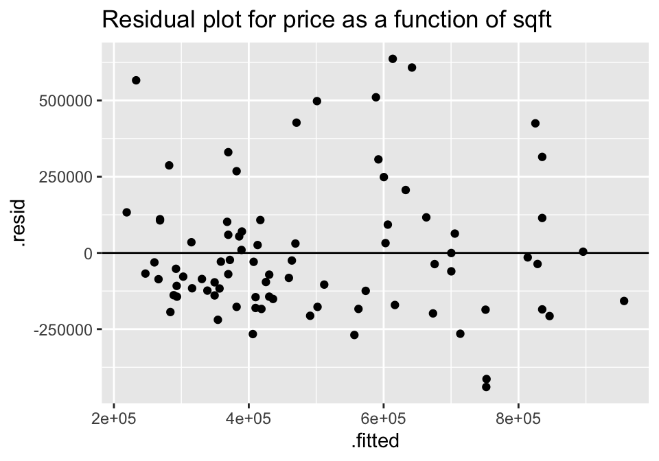


```r
lm(log(price) ~  sqft, data=house)  %>% augment () %>%
  ggplot(aes(x = .fitted, y = .resid))+ 
  geom_point() + 
  geom_hline(yintercept=0) +
  ggtitle("Residual plot for ln price as a function of sqft")
```

## R code for regression 


### Example: Cat Jumping^[@iscam, Inv 5.6 & 5.13] (Correlation & SLR) {#ex:cat}


Consider the cat data given in Investigations 5.6 and 5.13.  The idea is to understand cat jumping velocity as a function of body characteristics. Note that the correlation $r=-0.496$  between bodymass and velocity.


```r
cats <- read_table2("http://www.rossmanchance.com/iscam2/data/CatJumping.txt")

ggplot(cats, aes(x=bodymass, y = velocity)) +
  geom_point() +
  geom_smooth(method = "lm", se=FALSE)
```

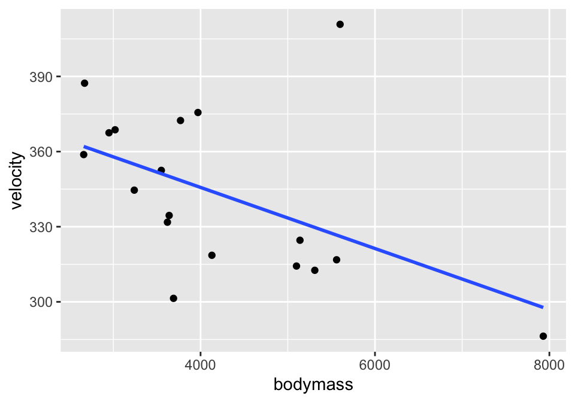


####  Correlation {-}

```r
cats %>%
  select(bodymass, velocity) %>%
  cor()
```

```
##            bodymass   velocity
## bodymass  1.0000000 -0.4964022
## velocity -0.4964022  1.0000000
```


#### Simple Linear Regression {-}


```r
summary(lm(velocity ~ bodymass, data = cats))
```

```
## 
## Call:
## lm(formula = velocity ~ bodymass, data = cats)
## 
## Residuals:
##     Min      1Q  Median      3Q     Max 
## -48.069 -16.729  -8.524  10.546  84.625 
## 
## Coefficients:
##               Estimate Std. Error t value Pr(>|t|)    
## (Intercept) 394.473238  23.441939  16.828 1.35e-11 ***
## bodymass     -0.012196   0.005332  -2.287   0.0361 *  
## ---
## Signif. codes:  0 '***' 0.001 '**' 0.01 '*' 0.05 '.' 0.1 ' ' 1
## 
## Residual standard error: 29.6 on 16 degrees of freedom
## Multiple R-squared:  0.2464,	Adjusted R-squared:  0.1993 
## F-statistic: 5.232 on 1 and 16 DF,  p-value: 0.03613
```


An alternative way to work with the output is in specific pieces (instead of the entire summary output).


```r
library(broom)

lm(velocity ~ bodymass, data = cats) %>% tidy(conf.int = TRUE)
```

```
## # A tibble: 2 x 7
##   term        estimate std.error statistic  p.value conf.low  conf.high
##   <chr>          <dbl>     <dbl>     <dbl>    <dbl>    <dbl>      <dbl>
## 1 (Intercept) 394.      23.4         16.8  1.35e-11 345.     444.      
## 2 bodymass     -0.0122   0.00533     -2.29 3.61e- 2  -0.0235  -0.000893
```


#### Residual Plot {-}

And to work with the residuals, use `augment()`.


```r
lm(velocity ~ bodymass, data = cats) %>% augment()
```

```
## # A tibble: 18 x 8
##    velocity bodymass .fitted .resid .std.resid   .hat .sigma   .cooksd
##       <dbl>    <dbl>   <dbl>  <dbl>      <dbl>  <dbl>  <dbl>     <dbl>
##  1     334.     3640    350. -15.6     -0.545  0.0656   30.3 0.0104   
##  2     387.     2670    362.  25.4      0.920  0.131    29.7 0.0640   
##  3     411.     5600    326.  84.6      3.05   0.119    19.8 0.629    
##  4     319.     4130    344. -25.5     -0.887  0.0557   29.8 0.0232   
##  5     369.     3020    358.  11.1      0.394  0.101    30.4 0.00867  
##  6     359.     2660    362.  -3.23    -0.117  0.132    30.6 0.00105  
##  7     345.     3240    355. -10.4     -0.366  0.0853   30.4 0.00624  
##  8     325.     5140    332.  -7.19    -0.254  0.0844   30.5 0.00297  
##  9     301.     3690    349. -48.1     -1.68   0.0639   27.7 0.0962   
## 10     332.     3620    350. -18.5     -0.648  0.0664   30.2 0.0149   
## 11     313.     5310    330. -17.1     -0.608  0.0957   30.2 0.0196   
## 12     317.     5560    327.  -9.86    -0.354  0.116    30.4 0.00823  
## 13     376.     3970    346.  29.5      1.03   0.0572   29.5 0.0321   
## 14     372.     3770    348.  23.9      0.834  0.0615   29.9 0.0228   
## 15     314.     5100    332. -18.0     -0.634  0.0820   30.2 0.0179   
## 16     368.     2950    358.   9.01     0.322  0.106    30.5 0.00614  
## 17     286.     7930    298. -11.5     -0.552  0.508    30.3 0.157    
## 18     352.     3550    351.   1.32     0.0463 0.0692   30.6 0.0000797
```

```r
lm(velocity ~ bodymass, data = cats) %>% augment() %>%
  ggplot(aes(x = .fitted, y = .resid)) + 
  geom_point() +
  geom_hline(yintercept = 0)
```


#### Confidence & Prediction Intervals {-}


```r
m_cats <- lm(velocity ~ bodymass, data = cats)

predict(m_cats, newdata=data.frame(bodymass=4700), interval="confidence")
```

```
##        fit      lwr      upr
## 1 337.1514 321.3081 352.9947
```

```r
predict(m_cats, newdata=data.frame(bodymass=4700), interval="prediction")
```

```
##        fit      lwr     upr
## 1 337.1514 272.4378 401.865
```


##### Plotting!  {-}


```r
catConf <- m_cats %>% augment() %>%
  cbind(predict(m_cats, interval="confidence") )  # cbind binds the columns together

catConf %>% head()
```

```
##   velocity bodymass  .fitted     .resid .std.resid       .hat   .sigma
## 1    334.5     3640 350.0793 -15.579293 -0.5445423 0.06563257 30.28374
## 2    387.3     2670 361.9095  25.390452  0.9203785 0.13125270 29.74812
## 3    410.8     5600 326.1749  84.625139  3.0468951 0.11941906 19.80527
## 4    318.6     4130 344.1032 -25.503185 -0.8867122 0.05570221 29.80778
## 5    368.7     3020 357.6409  11.059101  0.3939761 0.10053270 30.41969
## 6    358.8     2660 362.0315  -3.231509 -0.1172061 0.13224725 30.55520
##       .cooksd      fit      lwr      upr
## 1 0.010414418 350.0793 334.0049 366.1536
## 2 0.063990821 361.9095 339.1781 384.6410
## 3 0.629490813 326.1749 304.4923 347.8574
## 4 0.023189898 344.1032 329.2947 358.9116
## 5 0.008674247 357.6409 337.7467 377.5351
## 6 0.001046793 362.0315 339.2141 384.8490
```

```r
ggplot(catConf, aes(x=bodymass)) + 
  geom_point(aes(y=velocity)) + 
  geom_line(aes(y=.fitted)) +
  geom_ribbon(aes(ymin=lwr, ymax=upr), fill="blue", alpha=0.2)
```

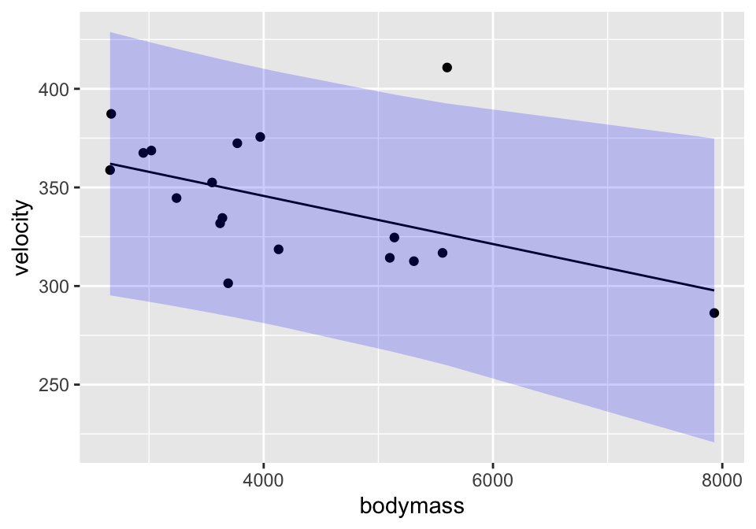


```r
catPred <- m_cats %>% augment() %>%
  cbind(predict(m_cats, interval="prediction") )  # cbind binds the columns together

catPred %>% head()
```

```
##   velocity bodymass  .fitted     .resid .std.resid       .hat   .sigma
## 1    334.5     3640 350.0793 -15.579293 -0.5445423 0.06563257 30.28374
## 2    387.3     2670 361.9095  25.390452  0.9203785 0.13125270 29.74812
## 3    410.8     5600 326.1749  84.625139  3.0468951 0.11941906 19.80527
## 4    318.6     4130 344.1032 -25.503185 -0.8867122 0.05570221 29.80778
## 5    368.7     3020 357.6409  11.059101  0.3939761 0.10053270 30.41969
## 6    358.8     2660 362.0315  -3.231509 -0.1172061 0.13224725 30.55520
##       .cooksd      fit      lwr      upr
## 1 0.010414418 350.0793 285.3088 414.8498
## 2 0.063990821 361.9095 295.1746 428.6445
## 3 0.629490813 326.1749 259.7898 392.5599
## 4 0.023189898 344.1032 279.6352 408.5712
## 5 0.008674247 357.6409 291.8183 423.4635
## 6 0.001046793 362.0315 295.2672 428.7958
```

```r
ggplot(catPred, aes(x=bodymass)) + 
  geom_point(aes(y=velocity)) + 
  geom_line(aes(y=.fitted)) +
  geom_ribbon(aes(ymin=lwr, ymax=upr), fill="blue", alpha=0.2)
```


### Example: Housing Prices^[@iscam, Inv 5.14]  (SLR & MLR & Prediction) {#ex:houses}


```r
library(GGally)
house = read.table("http://www.rossmanchance.com/iscam2/data/housing.txt", 
                   header=TRUE, sep="\t")
names(house)
```

```
## [1] "sqft"     "price"    "City"     "bedrooms" "baths"
```

#### Descriptive Statistics {-}

A good first step is to investigate how all the variables relate to one another.  The `ggpairs` function come from the R package `GGally`.


```r
ggpairs(house, columns = c(1,2,4,5))
```

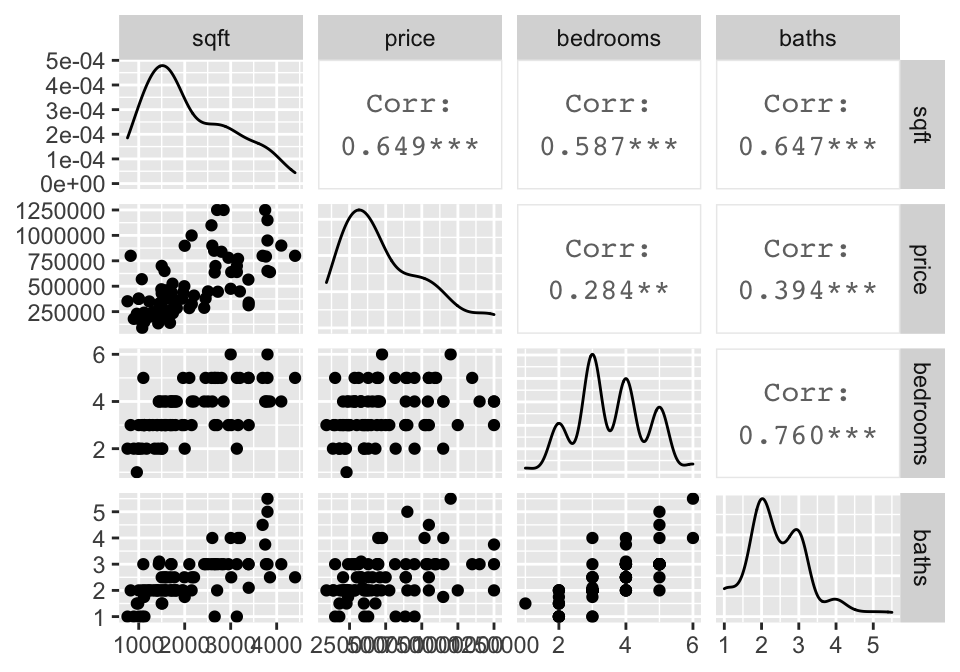

#### Simple Linear Regression {-}


```r
mod.sqft <- lm(price~sqft, data = house)
mod.sqft %>% tidy()
```

```
## # A tibble: 2 x 5
##   term        estimate std.error statistic  p.value
##   <chr>          <dbl>     <dbl>     <dbl>    <dbl>
## 1 (Intercept)   65930.   60994.       1.08 2.83e- 1
## 2 sqft            202.      26.4      7.67 3.35e-11
```

```r
mod.bed <- lm(price ~ bedrooms, data=house)
mod.bed %>% tidy()
```

```
## # A tibble: 2 x 5
##   term        estimate std.error statistic p.value
##   <chr>          <dbl>     <dbl>     <dbl>   <dbl>
## 1 (Intercept)  220612.   107208.      2.06 0.0428 
## 2 bedrooms      76865.    28802.      2.67 0.00919
```

The p-values for both explanatory variables (sqft and bedrooms) are significant.  Sqft seems more significant, and indeed, the first model has a higher $R^2$ - that is, a higher proportion of the variability in price is explained by sqft (42.07%) than by number of bedrooms (8.08%).  


```r
mod.sqft %>% glance()
```

```
## # A tibble: 1 x 12
##   r.squared adj.r.squared  sigma statistic  p.value    df logLik   AIC   BIC
##       <dbl>         <dbl>  <dbl>     <dbl>    <dbl> <dbl>  <dbl> <dbl> <dbl>
## 1     0.421         0.414 2.22e5      58.8 3.35e-11     1 -1139. 2283. 2290.
## # … with 3 more variables: deviance <dbl>, df.residual <int>, nobs <int>
```

```r
mod.bed %>% glance()
```

```
## # A tibble: 1 x 12
##   r.squared adj.r.squared  sigma statistic p.value    df logLik   AIC   BIC
##       <dbl>         <dbl>  <dbl>     <dbl>   <dbl> <dbl>  <dbl> <dbl> <dbl>
## 1    0.0808        0.0695 2.80e5      7.12 0.00919     1 -1158. 2321. 2329.
## # … with 3 more variables: deviance <dbl>, df.residual <int>, nobs <int>
```


However, it is important for us to ask whether either of the relationships actually fit the technical conditions of the linear regression model.  We can see from the pairs plots that the relationships look **L**inear, we'll assume the variables were collected **I**ndependently, but the **N**ormality and the **E**quality of the error structure we can check using residual plots.


```r
mod.sqft %>% augment () %>%
  ggplot(aes(x = .fitted, y = .resid))+ 
  geom_point() + 
  geom_hline(yintercept=0) +
  ggtitle("Residual plot for price as a function of sqft")

mod.bed %>% augment () %>%
  ggplot(aes(x = .fitted, y = .resid))+ 
  geom_point() + 
  geom_hline(yintercept=0) +
  ggtitle("Residual plot for price as a function of bedrooms")
```

For both of the plots, it seems like the residuals have higher variability for positive residuals.  Additionally, it seems that the variability of the residuals increases for larger fitted observations. 

A natural log transformation should fix both of these problems.


```r
mod.lnsqft <- lm(log(price)~sqft, data = house)
mod.lnbed <- lm(log(price) ~ bedrooms, data=house)
```


```r
mod.lnsqft %>% augment () %>%
  ggplot(aes(x = .fitted, y = .resid))+ 
  geom_point() + 
  geom_hline(yintercept=0) +
  ggtitle("Residual plot for ln(price) as a function of sqft")

mod.lnbed %>% augment () %>%
  ggplot(aes(x = .fitted, y = .resid))+ 
  geom_point() + 
  geom_hline(yintercept=0) +
  ggtitle("Residual plot for ln(price) as a function of bedrooms")
```


Though no residual plot will ever look perfect, these residual plots seem to fit the technical conditions of the model better than the untransformed data.


#### Multiple Linear Regression {-}

Because the price variable had a large skew (and the `ln()` transformation helped the residuals), the following models will all use `ln(price)` as the response variable.   What happens when we try to predict `price` (actually `ln(price)`, here) using BOTH `sqft` and `bedrooms`?

Note:  the natural log function in R is `log()`.


```r
lm(log(price) ~ sqft + bedrooms, data=house) %>% tidy()
```

```
## # A tibble: 3 x 5
##   term         estimate std.error statistic  p.value
##   <chr>           <dbl>     <dbl>     <dbl>    <dbl>
## 1 (Intercept) 12.2      0.174         70.1  1.39e-73
## 2 sqft         0.000468 0.0000660      7.09 4.73e-10
## 3 bedrooms    -0.0603   0.0572        -1.05 2.95e- 1
```

```r
lm(log(price) ~ sqft + bedrooms, data=house) %>% glance()
```

```
## # A tibble: 1 x 12
##   r.squared adj.r.squared sigma statistic  p.value    df logLik   AIC   BIC
##       <dbl>         <dbl> <dbl>     <dbl>    <dbl> <dbl>  <dbl> <dbl> <dbl>
## 1     0.448         0.435 0.450      32.5 4.62e-11     2  -50.0  108.  118.
## # … with 3 more variables: deviance <dbl>, df.residual <int>, nobs <int>
```


```r
lm(log(price) ~ sqft + baths, data=house) %>% tidy()
```

```
## # A tibble: 3 x 5
##   term         estimate std.error statistic  p.value
##   <chr>           <dbl>     <dbl>     <dbl>    <dbl>
## 1 (Intercept) 12.1      0.151        80.0   4.07e-78
## 2 sqft         0.000450 0.0000705     6.39  1.02e- 8
## 3 baths       -0.0377   0.0746       -0.505 6.15e- 1
```

```r
lm(log(price) ~ sqft + baths, data=house) %>% glance()
```

```
## # A tibble: 1 x 12
##   r.squared adj.r.squared sigma statistic  p.value    df logLik   AIC   BIC
##       <dbl>         <dbl> <dbl>     <dbl>    <dbl> <dbl>  <dbl> <dbl> <dbl>
## 1     0.443         0.429 0.452      31.8 7.07e-11     2  -50.4  109.  118.
## # … with 3 more variables: deviance <dbl>, df.residual <int>, nobs <int>
```


```r
lm(log(price) ~ sqft + bedrooms + baths, data=house) %>% tidy()
```

```
## # A tibble: 4 x 5
##   term         estimate std.error statistic  p.value
##   <chr>           <dbl>     <dbl>     <dbl>    <dbl>
## 1 (Intercept) 12.2      0.175        69.5   1.38e-72
## 2 sqft         0.000463 0.0000719     6.45  8.32e- 9
## 3 bedrooms    -0.0683   0.0730       -0.935 3.53e- 1
## 4 baths        0.0168   0.0947        0.177 8.60e- 1
```

```r
lm(log(price) ~ sqft + bedrooms + baths, data=house) %>% glance()
```

```
## # A tibble: 1 x 12
##   r.squared adj.r.squared sigma statistic  p.value    df logLik   AIC   BIC
##       <dbl>         <dbl> <dbl>     <dbl>    <dbl> <dbl>  <dbl> <dbl> <dbl>
## 1     0.449         0.428 0.453      21.4 2.98e-10     3  -49.9  110.  122.
## # … with 3 more variables: deviance <dbl>, df.residual <int>, nobs <int>
```


**Sqft & bedrooms**

Although the $R^2$ value went up (44.84% of variability in log price is explained by sqft and bedrooms), the p-value on bedrooms isn't significant.  The p-value here can be interpreted as a hypothesis test on the slope coefficient given the other variables in the model.

0.353 = P(a slope of -.06827 or more extreme *if sqft is in the model* and there is no relationship between bedrooms and price)

Our output says that once we have sqft in the model, we don't actually need to know anything about the number of bedrooms (even though bedrooms was a significant predictor on its own).

**Sqft & bathrooms**

Seems like we *really* don't need bathrooms!  The information about `sqft` is sufficient for predicting the price, and information about bathrooms doesn't help much at all.

**Final model**

The final model will be run on log(price) using only sqft. Note that the coefficients and the $R^2$ values change slightly (from the original analysis) because the response variable is logged.


```r
summary(mod.lnsqft)
```

```
## 
## Call:
## lm(formula = log(price) ~ sqft, data = house)
## 
## Residuals:
##      Min       1Q   Median       3Q      Max 
## -1.08988 -0.29591 -0.05899  0.28717  1.20206 
## 
## Coefficients:
##              Estimate Std. Error t value Pr(>|t|)    
## (Intercept) 1.204e+01  1.236e-01   97.36  < 2e-16 ***
## sqft        4.274e-04  5.349e-05    7.99 7.87e-12 ***
## ---
## Signif. codes:  0 '***' 0.001 '**' 0.01 '*' 0.05 '.' 0.1 ' ' 1
## 
## Residual standard error: 0.4502 on 81 degrees of freedom
## Multiple R-squared:  0.4407,	Adjusted R-squared:  0.4338 
## F-statistic: 63.83 on 1 and 81 DF,  p-value: 7.874e-12
```


#### Prediction {-}

As with the prediction intervals we had when we had a single sample, we can now create intervals for either an average (a confidence interval) of an individual (a prediction interval).  

##### Confidence interval: {-}


```r
predict(mod.lnsqft, newdata=data.frame(sqft=2000), interval="confidence")
```

```
##        fit      lwr      upr
## 1 12.89125 12.79211 12.99038
```

I am 95% confident that the true average log price for a 2000 sqft home is between 12.79 ln\$ and 12.99 ln\$.  (The predicted value is in natural-log-dollars ... which is hard to interpret , but back-transforming can be a little tricky and beyond the scope of this semester).

##### Prediction interval: {-}


```r
predict(mod.lnsqft, newdata=data.frame(sqft=2000), interval="prediction")
```

```
##        fit      lwr      upr
## 1 12.89125 11.98994 13.79255
```

I am 95% of homes with 2000 sqft are between 11.99 ln\$ and 13.79 ln\$.  Now back-transforming is easy (because there are no averages), so 95% of homes with 2000 sqft are between $161,126 and $977,301 (which are just $e^{11.98994}$ and $e^{13.79255}$).

##### Plotting confidence bounds: {-}


A **confidence** interval around the line gives bounds on the parameter represented by the line.  So we are 95% confident that the true population line lies within the bounds.  Note that the interval is wider at the endpoints (because the variability is higher at the ends).


```r
houseConf <- mod.lnsqft %>% augment() %>%
  cbind(predict(mod.lnsqft, interval="confidence") )  # cbind binds the columns together

houseConf %>% head()
```

```
##   log(price) sqft  .fitted       .hat    .sigma      .cooksd  .std.resid
## 1   12.73376 3392 13.48618 0.03494894 0.4448768 5.240194e-02 -1.70116646
## 2   13.71004 4100 13.78878 0.06748451 0.4529518 1.186788e-03 -0.18110383
## 3   13.01398 3200 13.40412 0.02856505 0.4508768 1.136429e-02 -0.87917543
## 4   12.38839 1436 12.65019 0.01862011 0.4520790 3.268479e-03 -0.58696923
## 5   12.84133 1944 12.86731 0.01247712 0.4530341 2.130978e-05 -0.05807924
## 6   12.61120 1500 12.67755 0.01744506 0.4529817 1.961713e-04 -0.14865344
##        fit      lwr      upr
## 1 13.48618 13.31871 13.65366
## 2 13.78878 13.55606 14.02150
## 3 13.40412 13.25272 13.55553
## 4 12.65019 12.52795 12.77244
## 5 12.86731 12.76725 12.96738
## 6 12.67755 12.55923 12.79587
```

```r
ggplot(houseConf, aes(x=sqft)) + 
  geom_point(aes(y=`log(price)`)) + 
  geom_line(aes(y=.fitted)) +
  geom_ribbon(aes(ymin=lwr, ymax=upr), fill="blue", alpha=0.2)
```

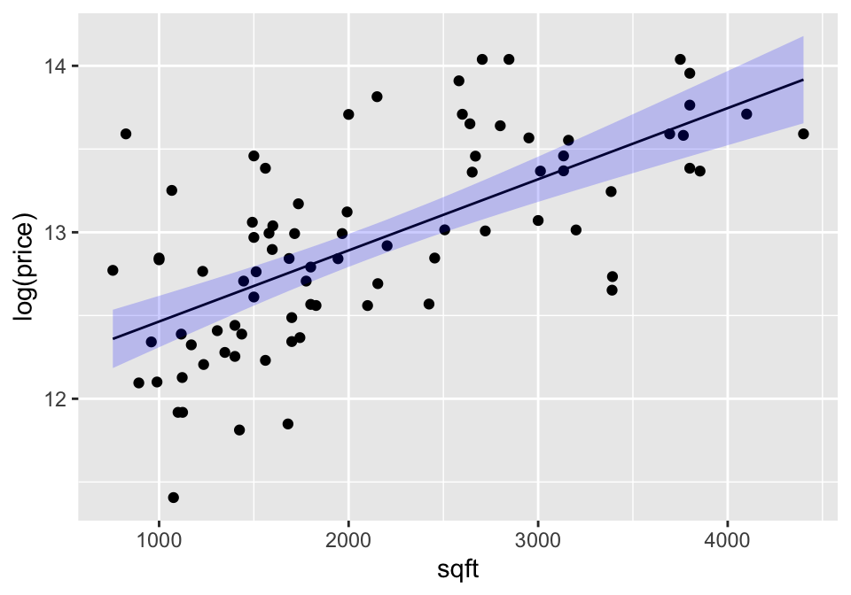

A **prediction** interval around the line bounds the individual points.  That is, 95% of the observations are captured inside the interval.  As with the confidence interval, the prediction interval is also wider at the ends, but it is harder to see in prediction intervals than confidence intervals


```r
housePred <- mod.lnsqft %>% augment() %>%
  cbind(predict(mod.lnsqft, interval="prediction") )  # cbind binds the columns together

housePred %>% head()
```

```
##   log(price) sqft  .fitted       .hat    .sigma      .cooksd  .std.resid
## 1   12.73376 3392 13.48618 0.03494894 0.4448768 5.240194e-02 -1.70116646
## 2   13.71004 4100 13.78878 0.06748451 0.4529518 1.186788e-03 -0.18110383
## 3   13.01398 3200 13.40412 0.02856505 0.4508768 1.136429e-02 -0.87917543
## 4   12.38839 1436 12.65019 0.01862011 0.4520790 3.268479e-03 -0.58696923
## 5   12.84133 1944 12.86731 0.01247712 0.4530341 2.130978e-05 -0.05807924
## 6   12.61120 1500 12.67755 0.01744506 0.4529817 1.961713e-04 -0.14865344
##        fit      lwr      upr
## 1 13.48618 12.57483 14.39754
## 2 13.78878 12.86321 14.71435
## 3 13.40412 12.49558 14.31266
## 4 12.65019 11.74606 13.55433
## 5 12.86731 11.96591 13.76872
## 6 12.67755 11.77393 13.58116
```

```r
ggplot(housePred, aes(x=sqft)) + 
  geom_point(aes(y=`log(price)`)) + 
  geom_line(aes(y=.fitted)) +
  geom_ribbon(aes(ymin=lwr, ymax=upr), fill="blue", alpha=0.2)
```

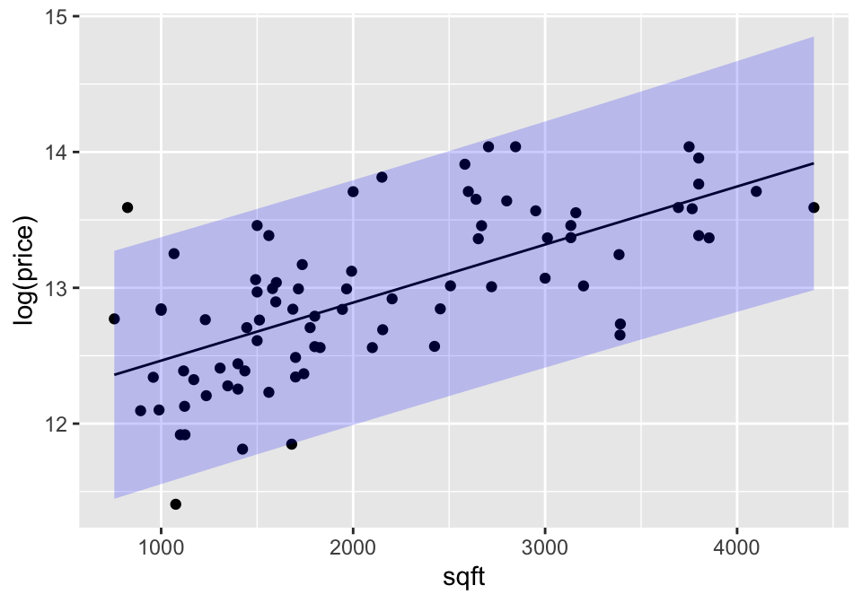


##### Predicting with more than one explanatory variable: {-}

The predict function still works to give estimates of the average value and the predicted individual values, but the plot is now much harder to draw because with three explanatory variables, we would need a 4-d plot to visualize the model and the predictions.


```r
sqftbedbathlm = lm(log(price)~sqft + bedrooms + baths, data=house)

predict(sqftbedbathlm, 
        newdata=data.frame(sqft=2000, bedrooms=3, baths=2), 
        interval="confidence", level=.95)
```

```
##        fit      lwr      upr
## 1 12.91816 12.80085 13.03548
```

```r
predict(sqftbedbathlm, 
        newdata=data.frame(sqft=2000, bedrooms=3, baths=2), 
        interval="prediction", level=.95)
```

```
##        fit      lwr     upr
## 1 12.91816 12.00953 13.8268
```

Again, it is hard to back-transform the prediction for the **average** (we end up thinking about it as a median), but we can back-transform the interval of individual prices.  95% of homes with 2000sqft, 3 bedrooms, and 2 baths cost between $164,312 and $1,011,356.


### Example: 1918-19 Flu and Excess Deaths^[thanks to Laura Ring Kapitula at Grand Valley State University] {#ex:1819flu}

As we are coming to know, measuring the impact of COVID-19 is difficult.  A recent NYTimes article compares total deaths in 2020 as compared with 2015-2019 for 8 different regions.

<div class="figure" style="text-align: center">

<p class="caption">(\#fig:unnamed-chunk-29)US Death Toll 2020, NY Times, April 28, 2020, https://www.nytimes.com/interactive/2020/04/28/us/coronavirus-death-toll-total.html</p>
</div>

While it is still too early to model COVID-19 well, we do have information from the 1918-19 Flu pandemic that was similar in many ways to the current COVID-19 pandemic.  In 2007, Markel et al. published research in the *Journal of the American Medical Association* detailing the results from different social distancing practices across the US, "Nonpharmaceutical Interventions Implemented by US Cities During the 1918-1919 Influenza Pandemic" [JAMA, Aug 8, 2007, Vol 298, No 6].


<div class="figure" style="text-align: center">

<p class="caption">(\#fig:unnamed-chunk-30)Nonpharmaceutical Interventions Implemented by US Cities During the 1918-1919 Influenza Pandemic, https://jamanetwork.com/journals/jama/fullarticle/208354</p>
</div>

Their conclusions are worth restating:

> **Conclusions** These findings demonstrate a strong association between early, sustained, and layered application of nonpharmaceutical interventions and mitigating the consequences of the 1918-1919 influenza pandemic in the United States. In planning for future severe influenza pandemics, nonpharmaceutical interventions should be considered for inclusion as companion measures to developing effective vaccines and medications for prophylaxis and treatment.

While the entire paper is fascinating and does a great job describing different interventions and related outcomes, we will focus on the regression analysis done to model the excess death rate.  The data used below come directly from page 647 of the manuscript.

<div class="figure" style="text-align: center">
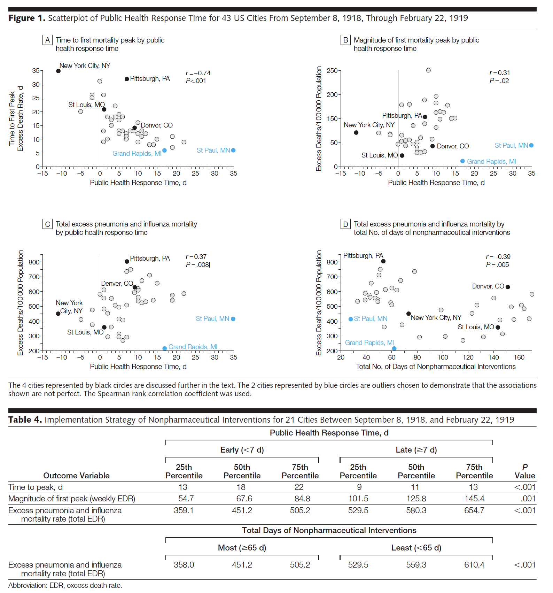
<p class="caption">(\#fig:unnamed-chunk-31)Note that figure 1b seems to have the y-axis mis-labelled (it should be magnitude of first mortality peak).  Table 4 uses a test other than linear regression (Wilcoxon rank sum test -- a two sample test of means done on ranked data rather than raw data) to compare the outcome variables broken into two groups:  below the median response time and above the median response time.</p>
</div>


```r
flu_1819 <- read_csv("1918_1919flu.csv", 
                     col_types = cols(`Date of peak Excess death rate` = col_date(format = "%m/%d/%y")))

names(flu_1819) <- c("place", "responseTime", "daysNonpharm", "datePeak", 
                     "timePeak", "magPeak", "excessDeaths")

head(flu_1819)
```

```
## # A tibble: 6 x 7
##   place       responseTime daysNonpharm datePeak   timePeak magPeak excessDeaths
##   <chr>              <dbl>        <dbl> <date>        <dbl>   <dbl>        <dbl>
## 1 Albany, NY             3           47 2018-10-24       15   162.          553.
## 2 Baltimore,…           10           43 2018-10-18        9   182.          559.
## 3 Birmingham…            9           48 2018-10-22       13    70.9         592.
## 4 Boston, MA            13           50 2018-10-03        8   160.          710 
## 5 Buffalo, NY           12           49 2018-10-22       12   141.          530.
## 6 Cambridge,…           14           49 2018-10-03        8   126.          541
```


#### Correlation between variables {-}

To be consistent with the manuscript, Spearman correlation is used instead of Pearson.  Spearman is the Pearson correlation applied to the ranks of the observations (instead of the raw values of the observations).  Calculating Spearman has the impact of lessening the influence of outlying observations.

The correlations calculated below match the values in the manuscript, but we repeat the analysis without St Paul, MN and Grand Rapids, MI to see their impact on the analysis.  I would not remove the two cities without a justifiable reason (something that makes them fundamentally different from the other cities, worth not including in the model); however, it is worth re-calculations just to investigate the impact of individual observations.  Here it seems that there is some impact (e.g., excessDeaths and responseTime) but possibly the impact is only moderate.


```r
flu_1819 %>%
  select(excessDeaths, magPeak, responseTime, daysNonpharm, timePeak) %>%
  cor(method="spearman")
```

```
##              excessDeaths    magPeak responseTime daysNonpharm   timePeak
## excessDeaths    1.0000000  0.7639686    0.3658238   -0.3925996 -0.1619664
## magPeak         0.7639686  1.0000000    0.3090137   -0.5739853 -0.2541940
## responseTime    0.3658238  0.3090137    1.0000000   -0.6808529 -0.7346764
## daysNonpharm   -0.3925996 -0.5739853   -0.6808529    1.0000000  0.6135956
## timePeak       -0.1619664 -0.2541940   -0.7346764    0.6135956  1.0000000
```

```r
flu_1819 %>%
  filter(place != "St Paul, MN" & place !=  "Grand Rapids, MI") %>%
  select(excessDeaths, magPeak, responseTime, daysNonpharm, timePeak) %>%
  cor(method="spearman")
```

```
##              excessDeaths    magPeak responseTime daysNonpharm   timePeak
## excessDeaths    1.0000000  0.7402439    0.5093635   -0.4663501 -0.2989616
## magPeak         0.7402439  1.0000000    0.4603040   -0.6752625 -0.4170257
## responseTime    0.5093635  0.4603040    1.0000000   -0.6638306 -0.6969834
## daysNonpharm   -0.4663501 -0.6752625   -0.6638306    1.0000000  0.6007545
## timePeak       -0.2989616 -0.4170257   -0.6969834    0.6007545  1.0000000
```

#### Model building {-}

Below, both St Paul and Grand Rapids have been removed from the model.  Again, in reporting the analysis (as the JAMA authors did correctly),  the two cities would not be removed without a justifiable reason (something that makes them fundamentally different from the other cities, worth not including in the model); however, it is worth re-calculations just to investigate the impact of individual observations.

Note that in predicting both `excessDeaths` and `magPeak` the most significant variable is `daysNonpharm`.  No other variable adds significantly to the model


```r
# excessDeaths as the response variable:
flu_1819 %>%
  filter(place != "St Paul, MN" & place != "Grand Rapids, MI") %>%
  lm(excessDeaths ~ responseTime + daysNonpharm, data = .) %>%
  tidy()
```

```
## # A tibble: 3 x 5
##   term         estimate std.error statistic  p.value
##   <chr>           <dbl>     <dbl>     <dbl>    <dbl>
## 1 (Intercept)   552.       67.0        8.24 5.50e-10
## 2 responseTime    5.57      3.90       1.43 1.62e- 1
## 3 daysNonpharm   -0.828     0.503     -1.65 1.08e- 1
```

```r
flu_1819 %>%
  filter(place != "St Paul, MN" & place != "Grand Rapids, MI") %>%
  lm(excessDeaths ~  daysNonpharm, data = .) %>%
  tidy()
```

```
## # A tibble: 2 x 5
##   term         estimate std.error statistic  p.value
##   <chr>           <dbl>     <dbl>     <dbl>    <dbl>
## 1 (Intercept)    628.      41.7       15.0  7.92e-18
## 2 daysNonpharm    -1.25     0.412     -3.03 4.28e- 3
```

```r
flu_1819 %>%
  filter(place != "St Paul, MN" & place != "Grand Rapids, MI") %>%
  lm(excessDeaths ~  responseTime, data = .) %>%
  tidy()
```

```
## # A tibble: 2 x 5
##   term         estimate std.error statistic  p.value
##   <chr>           <dbl>     <dbl>     <dbl>    <dbl>
## 1 (Intercept)    452.       28.8      15.7  1.90e-18
## 2 responseTime     9.35      3.23      2.90 6.14e- 3
```

```r
# magPeak as the response variable:
flu_1819 %>%
  filter(place != "St Paul, MN" & place != "Grand Rapids, MI") %>%
  lm(magPeak ~ responseTime + daysNonpharm, data = .) %>%
  tidy()
```

```
## # A tibble: 3 x 5
##   term         estimate std.error statistic       p.value
##   <chr>           <dbl>     <dbl>     <dbl>         <dbl>
## 1 (Intercept)  167.        21.0      7.95   0.00000000132
## 2 responseTime  -0.0555     1.22    -0.0455 0.964        
## 3 daysNonpharm  -0.715      0.157   -4.55   0.0000541
```

```r
flu_1819 %>%
  filter(place != "St Paul, MN" & place != "Grand Rapids, MI") %>%
  lm(log(magPeak) ~ responseTime + daysNonpharm, data = .) %>%
  tidy()
```

```
## # A tibble: 3 x 5
##   term          estimate std.error statistic  p.value
##   <chr>            <dbl>     <dbl>     <dbl>    <dbl>
## 1 (Intercept)   5.20       0.211     24.6    5.69e-25
## 2 responseTime -0.000741   0.0123    -0.0603 9.52e- 1
## 3 daysNonpharm -0.00769    0.00158   -4.86   2.05e- 5
```

#### Checking Residuals {-}

Turns out the residuals for these models aren't great (maybe that is why the authors used ranked based methods like Spearman correlation and Wilcoxon rank sum test??? -- those tests have different technical conditions, not based in normal theory!)


```r
# excessDeaths as the response variable:
flu_1819 %>%
  filter(place != "St Paul, MN" & place != "Grand Rapids, MI") %>%
  lm(excessDeaths ~  daysNonpharm, data = .) %>%
  augment() %>%
  ggplot() +
  geom_point(aes(x=.fitted, y = .resid)) + 
  geom_hline(yintercept = 0) +
  ggtitle("St Paul & Grand Rapids removed, excessDeath vs days Nonparm")
```

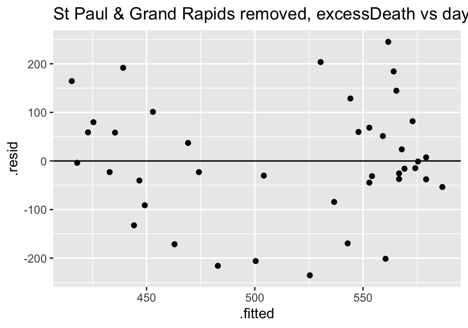

```r
flu_1819 %>%
  lm(excessDeaths ~  daysNonpharm, data = .) %>%
  augment() %>%
  ggplot() +
  geom_point(aes(x=.fitted, y = .resid)) + 
  geom_hline(yintercept = 0) +
  ggtitle("St Paul & Grand Rapids NOT removed, excessDeath vs days Nonparm")
```

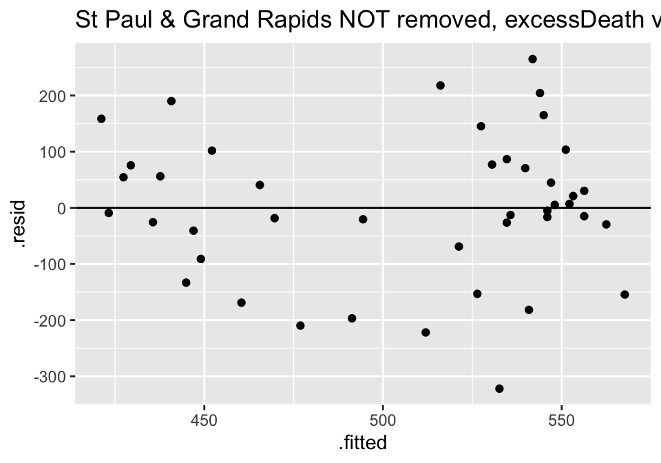

```r
# magPeak as the response variable:
flu_1819 %>%
  filter(place != "St Paul, MN" & place != "Grand Rapids, MI") %>%
  lm(magPeak ~ responseTime + daysNonpharm, data = .) %>%
  augment() %>%
  ggplot() +
  geom_point(aes(x=.fitted, y = .resid)) + 
  geom_hline(yintercept = 0) +
  ggtitle("St Paul & Grand Rapids removed, magPeak vs days responseTime")
```

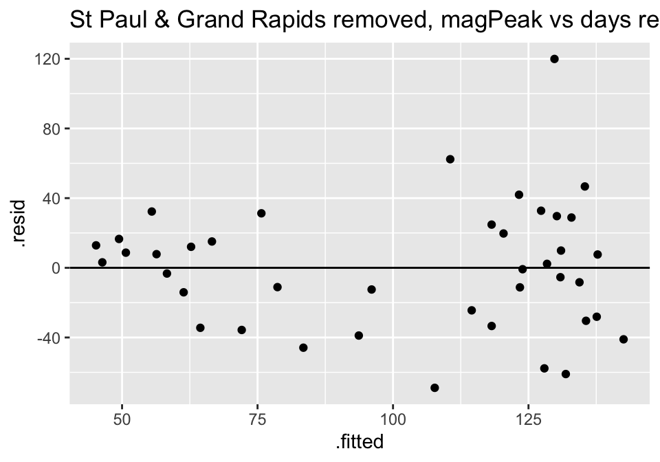

```r
flu_1819 %>%
  lm(magPeak ~ responseTime + daysNonpharm, data = .) %>%
  augment() %>%
  ggplot() +
  geom_point(aes(x=.fitted, y = .resid)) + 
  geom_hline(yintercept = 0) +
  ggtitle("St Paul & Grand Rapids NOT removed, magPeak vs days responseTime")
```

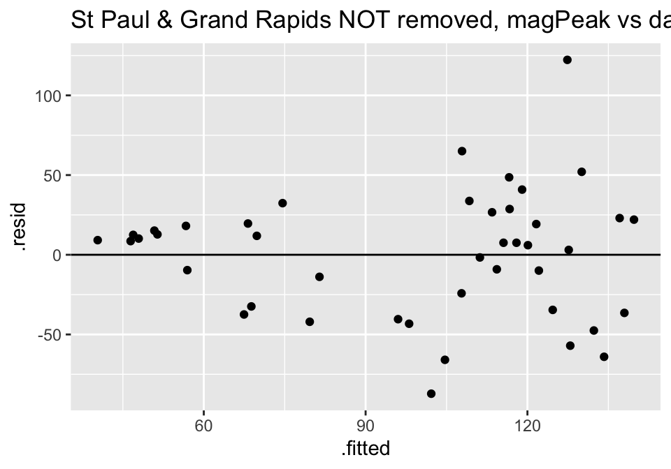


```r
flu_1819 %>%
  filter(place != "St Paul, MN" & place != "Grand Rapids, MI") %>%
  lm(log(magPeak) ~ responseTime + daysNonpharm, data = .) %>%
  augment() %>%
  ggplot() +
  geom_point(aes(x=.fitted, y = .resid)) + 
  geom_hline(yintercept = 0) +
  ggtitle("St Paul & Grand Rapids removed, log(magPeak) vs days responseTime")
```

#### What else do we know about COVID-19 right now?  {-}

Clinical trials are starting to show up assessing know anti-viral pharmaceutical interventions on patients with COVID-19.  


##### Study 1: {-}


<div class="figure" style="text-align: center">

<p class="caption">(\#fig:unnamed-chunk-37)Remdesivir in adults with severe COVID-19: a randomised, double-blind, placebo-controlled, multicentre trial, https://www.thelancet.com/journals/lancet/article/PIIS0140-6736(20)31022-9/fulltext</p>
</div>

> **Findings** Between Feb 6, 2020, and March 12, 2020, 237 patients were enrolled and randomly assigned to a treatment group (158 to remdesivir and 79 to placebo); one patient in the placebo group who withdrew after randomisation was not included in the ITT population. Remdesivir use was not associated with a difference in time to clinical improvement (hazard ratio 1·23 [95% CI 0·87–1·75]). Although not statistically significant, patients receiving remdesivir had a numerically faster time to clinical improvement than those receiving placebo among patients with symptom duration of 10 days or less (hazard ratio 1·52 [0·95–2·43]). Adverse events were reported in 102 (66%) of 155 remdesivir recipients versus 50 (64%) of 78 placebo recipients. Remdesivir was stopped early because of adverse events in 18 (12%) patients versus four (5%) patients who stopped placebo early.

* animal studies have shown remdesivir inhibits SARS-CoV-2 replication
* study was randomized, double-blind, placebo-controlled, multi-center
* adults with laboratory-confirmed SARS-CoV-2 infection, low oxygen, pneumonia
* randomly assigned in a 2:1 ratio to remdesivir vs placebo
* **not statistically significant** !
* patients on remdesivir had a numerically faster time to clinical improvement
* trial was stopped before enrolling the expected number of patients because the outbreak of COVID-19 was brought under control


##### Study 2: {-}

Gilead, a large pharmaceutical company, issued a press release describing results from a clinical trial involving remdesivir.  They were mostly seeking to understand how long the treatment should continue and what are the adverse effects of the drug.

<div class="figure" style="text-align: center">

<p class="caption">(\#fig:unnamed-chunk-38)Gilead press release (no peer reviewed publication yet), https://www.gilead.com/news-and-press/press-room/press-releases/2020/4/gilead-announces-results-from-phase-3-trial-of-investigational-antiviral-remdesivir-in-patients-with-severe-covid-19https://www.thelancet.com/journals/lancet/article/PIIS0140-6736(20)31022-9/fulltext</p>
</div>

> In this study, the time to clinical improvement for 50 percent of patients was 10 days in the 5-day treatment group and 11 days in the 10-day treatment group. More than half of patients in both treatment groups were discharged from the hospital by Day 14 (5-day: 60.0%, n=120/200 vs.10-day: 52.3% n=103/197; p=0.14). At Day 14, 64.5 percent (n=129/200) of patients in the 5-day treatment group and 53.8 percent (n=106/197) of patients in the 10-day treatment group achieved clinical recovery.

* two patient groups are 5-day and 10-day treatment courses (no placebo), randomized
* patients on ventilators were not enrolled

*The NY Times* covered the Gilead announement.  Indeed, the outcome of the trials have important political ramifications as well.

<div class="figure" style="text-align: center">

<p class="caption">(\#fig:unnamed-chunk-39)Gilead remdesivir trial covered in the NYT, https://www.nytimes.com/2020/04/29/health/gilead-remdesivir-coronavirus.html</p>
</div>

## Reflection Questions

### Correlation & Simple Linear Regression: IMS Sections 8.1 & 8.2

* Describe the linear model with multiple variables.
* Describe the error / residual term and how it is calculated with multiple variables.
* What are the (three-ish) statistics of interest in this chapter?  What are the parameters of interest?
* What does correlation measure?
* How do we find the values of $b_0$ and $b_1$ for estimating the least squares line?
* Why is it dangerous to extrapolate?
* How do we interpret $R^2$?  Why is that? 
* What does it mean to say that $b_1$ has a sampling distribution?  Why is it that we would never talk about the sampling distribution of $\beta_1$?
* Why do we need the LINE technical conditions for the inference parts of the analysis but not for the estimation parts of the analysis?
* Is linear regression always appropriate when comparing two continuous variables?
* What are the LINE technical conditions?  How are the conditions assessed?
* What are the three factors that influence the $SE(b_1)$?  (Note:  when something influences $SE(b_1)$, that means the inference is also effected.  If you have a huge $SE(b_1)$, it will be hard to tell if the slope is significant because the t value will be small.)
* What does it mean to do a randomization test for the slope?  That is, explain the process of doing a randomization test here. (See shuffle options in the Analyzing Two Quantitative Variables applet.)
* Why would someone transform either of the variables?
* What is the difference between a confidence interval and a prediction interval?  Which is bigger?  Why does that make sense?  How do the centers of the intervals differ?  (They don't.  Why not?)


### Multiple Linear Regression: IMS Chapter 4 & Section 8.4

* Describe the linear model with multiple variables.
* Describe the error / residual term and how it is calculated with multiple variables.
* How does the model change when multiple variables are included?
* How are p-values interpreted now that there are multiple variables?
* How is $R^2$ interpreted?  What is the difference between $R^2$ and $R^2_{adj}$?
* How are variables chosen for the final model?
* How are the model conditions assessed?


