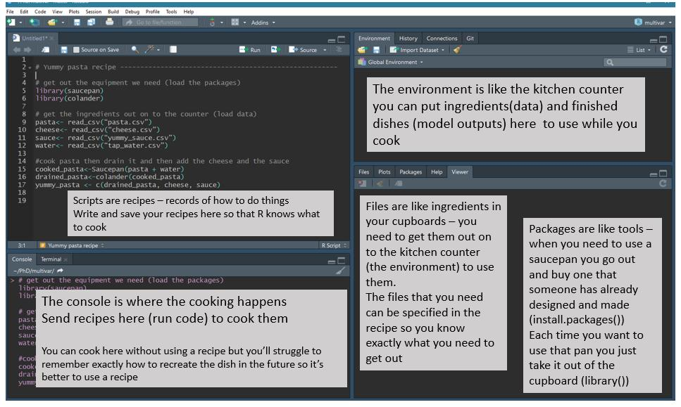

# Introduction {#intro}


  
## Getting started

These tutorials will be done in R using RStudio as a front end.  You will need to either download R and RStudio (both are free) onto your own computer or use them on Pomona's server. 


* You may use R on the Pomona server:  https://rstudio.pomona.edu/  (All Pomona students will be able to log in immediately.  Non-Pomona students need to go to ITS at Pomona to get Pomona login credentials.)
* If you want to use R on your own machine, you may.  Please make sure all components are updated:
R is freely available at http://www.r-project.org/ and is already installed on college computers. Additionally, installing R Studio is required http://rstudio.org/.
* http://swirlstats.com/ is one way to walk through learning the basics of R.
* All assignments should be turned in using R Markdown compiled to pdf.

## Reproducibility

### The reproducible data analysis process

* Scriptability $\rightarrow$ R
* Literate programming $\rightarrow$ R Markdown
* Version control $\rightarrow$ Git / GitHub

 
#### Scripting and literate programming {-}

Donald Knuth "Literate Programming" (1983) 

> Let us change our traditional attitude to the construction of programs: Instead of imagining that our main task is to instruct a computer- what to do, let us concentrate rather on explaining to human beings- what we want a computer to do.

* The ideas of literate programming have been around for many years!
* and tools for putting them to practice have also been around
* but they have never been as accessible as the current tools

#### Reproducibility checklist {-}

* Are the tables and figures reproducible from the code and data?
* Does the code actually do what you think it does?
* In addition to what was done, is it clear why it was done? (e.g., how were parameter settings chosen?)
* Can the code be used for other data?
* Can you extend the code to do other things?

#### Tools: R & R Studio {-}

See this great video (less than 2 min) on a reproducible workflow: https://www.youtube.com/watch?v=s3JldKoA0zw&feature=youtu.be

* You must use both R and RStudio software programs
* R does the programming
* R Studio brings everything together
* You may use Pomona's server: https://rstudio.pomona.edu/


```{r fig.cap = "Taken from [Modern Drive: An introduction to statistical and data sciences via R](https://ismayc.github.io/moderndiver-book/), by Ismay and Kim", fig.width = 7, fig.align='center', echo=FALSE}
knitr::include_graphics("figs/RRstudio.jpg")
```

```{r fig.cap = "[Jessica Ward](https://jkrward.github.io/), PhD student at Newcastle University", fig.width = 8, fig.align='center', echo=FALSE}

```


## `reprex`

> Help me help you

In order to create a `repr`oducible `ex`ample ...

Step 1.  Copy code onto the clipboard

Step 2.  Type `reprex()` into the Console

Step 3.  Look at the Viewer to the right.  Copy the Viewer output into GitHub, Piazza, an email, stackexchange, etc.


Some places to learn more about `reprex` include

* A blog about it: https://teachdatascience.com/reprex/
* The `reprex` vignette: https://reprex.tidyverse.org/index.html
* `reprex` dos and donts: https://reprex.tidyverse.org/articles/reprex-dos-and-donts.html
* Jenny Bryan webinar on `reprex`: "Help me help you. Creating reproducible examples" https://resources.rstudio.com/webinars/help-me-help-you-creating-reproducible-examples-jenny-bryan


####  `reprex` demo

```
reprex(
  jan31 + months(0:11) + days(31)
)
```
multiple lines of code:

```
reprex({
  jan31 <- ymd("2013-01-31")
  jan31 + months(0:11) + days(31)
})
```

```
reprex({
  library(lubridate)
  jan31 <- ymd("2013-01-31")
  jan31 + months(0:11) + days(31)
})
```

