# Visualization

Data visualization is integral to understanding both data and models.  Computational statistics and data science sometimes focus on models or resulting predictions from the models.  But there is no doubt that the structure and format of the data are the key to whether or not a model is appropriate or good.  A good data analyst will always spend a lot of time and effort on exploratory data analysis, much of which includes making as many visualizations of the data as possible.


## Deconstructing a graph {#deconstruct}

###  The Grammar of Graphics (`gg`) {#gg}

@Yau and @Wickham14  have come up with a *taxonomy* and a *grammar* for thinking about the parts of a figure just like we conceptualize the parts of a body or the parts of a sentence.

One great way of thinking of the new process:  it is not longer necessary to talk about the name of the graph (e.g., boxplot).  Instead we now think in glyphs (geoms), and so we can put whatever we want on the plot.  Note also that the transition leads you from a passive consumer (I need to make plot XXX because everyone else does, so I just plug in the data) into an active participant (what do I want my data to say?  and how can I put that information onto my graphic?)

The most important questions you can ask with respect to creating figures are:

1. What do we want R to do? (What is the goal?)
2. What does R need to know?


#### The grammar of graphics in `ggplot2`

**geom**: the geometric "shape" used to display data
 
  * bar, point, line, ribbon, text, etc.
 
**aesthetic**: an attribute controlling how geom is displayed with respect to variables

  * x position, y position, color, fill, shape, size, etc.

**scale**: adjust information in the aesthetic to map onto the plot

  * *particular* assignment of colors, shapes, sizes, etc.; making axes continuous or constrained to a particular range of values.
 
**guide**: helps user convert visual data back into raw data (legends, axes)

**stat**: a transformation applied to data before geom gets it

  * example: histograms work on binned data
 


### `ggplot2`


> Important note!

> While `dplyr` chains functions using `%>%`

> `ggplot` chains functions using `+`

In `ggplot2`, an *aesthetic* refers to a mapping between a variable and the information it conveys on the plot.  Further information about plotting and visualizing information is given in chapter 2 (Data visualization) of @MDSR.  Much of the data in the presentation represents all births from 1978 in the US: the date, the day of the year, and the number of births.

<!---
%Things to talk about:
%layers 
%facets 
%tidy data 
%scale: the computer maps the data to the aesthetic (computer doing the work) 
%guide: the aesthetic gets mapped back to the data (the human interpreting the graph) 
%frame: the variables that define the space (e.g., x & y coordinates and faceting) 
--->

##### Goals {-}

What I will try to do

 * give a tour of `ggplot2`
 
 * explain how to think about plots the `ggplot2` way
 
 * prepare/encourage you to learn more later
 
What I can't do in one session

 * show every bell and whistle
 
 * make you an expert at using `ggplot2`
 
##### Getting help {-}

1.  One of the best ways to get started with ggplot is to google what you want to do with the word ggplot.  Then look through the images that come up.  More often than not, the associated code is there.  There are also ggplot galleries of images, one of them is here: https://plot.ly/ggplot2/

2. `ggplot2` cheat sheet: https://www.rstudio.com/wp-content/uploads/2015/03/ggplot2-cheatsheet.pdf

3. Look at the end of the presentation.  More help options there.


```r
require(mosaic)
require(lubridate) # package for working with dates
data(Births78)     # restore fresh version of Births78
head(Births78, 3)
```

```
##         date births wday year month day_of_year day_of_month day_of_week
## 1 1978-01-01   7701  Sun 1978     1           1            1           1
## 2 1978-01-02   7527  Mon 1978     1           2            2           2
## 3 1978-01-03   8825  Tue 1978     1           3            3           3
```


##### How can we make the plot? {-}


Two Questions:

 1. What do we want R to do?  (What is the goal?)
 
 2. What does R need to know?

    * data source: `Births78`

    * aesthetics: 
 
        * `date -> x`
        * `births -> y`
        * points (!) 


 1. Goal: scatterplot = a plot with points
 
    * `ggplot() + geom_point()`
 
 2. What does R need to know?
 
    * data source: `data = Births78`

    * aesthetics: `aes(x = date, y = births)`


##### How can we make the plot? {-}


What has changed?  

 * new aesthetic: mapping color to day of week

##### Adding day of week to the data set {-}


The `wday()` function in the `lubridate` package computes  the day of the week from a date.


```r
Births78 <-  
  Births78 %>% 
  mutate(wday = lubridate::wday(date, label=TRUE))
```


```r
ggplot(data=Births78) +
  geom_point(aes(x=date, y=births, color=wday))+
  ggtitle("US Births in 1978")
```


##### How can we make the plot? {-}


Now we use lines instead of dots


```r
ggplot(data=Births78) +
  geom_line(aes(x=date, y=births, color=wday)) +
  ggtitle("US Births in 1978")
```


##### How can we make the plot? {-}


Now we have two **layers**, one with points and one with
lines


```r
ggplot(data=Births78, 
       aes(x=date, y=births, color=wday)) + 
  geom_point() +  geom_line()+
  ggtitle("US Births in 1978")
```


 *  The layers are placed one on top of the other:  the points 
are *below* and the lines are *above*.   

 * `data` and `aes` specified in `ggplot()` affect all geoms
 
##### Alternative Syntax {-}


```r
Births78 %>% 
  ggplot(aes(x=date, y=births, color=wday)) + 
  geom_point() + 
  geom_line()+
  ggtitle("US Births in 1978")
```


##### What does adding the color argument do? {-}


```r
Births78 %>%
  ggplot(aes(x=date, y=births, color="navy")) + 
  geom_point()  +
  ggtitle("US Births in 1978")
```


Because there is no variable, we have *mapped* the color aesthetic to a new variable with only one value ("navy").   So all the dots get set to the same color, but it's not navy.

##### Setting vs. Mapping {-}


If we want to *set* the color to be navy for all of the dots, we do it outside the aesthetic, without a dataset variable:


```r
Births78 %>%
  ggplot(aes(x=date, y=births)) +   # map x & y 
  geom_point(color = "navy")   +     # set color
  ggtitle("US Births in 1978")
```


* Note that `color = "navy"` is now outside of the aesthetics list.  That's how `ggplot2` distinguishes between mapping and setting.


##### How can we make the plot? {-}


```r
Births78 %>%
  ggplot(aes(x=date, y=births)) + 
  geom_line(aes(color=wday)) +       # map color here
  geom_point(color="navy") +          # set color here
  ggtitle("US Births in 1978")
```

* `ggplot()` establishes the default data and aesthetics for the geoms, but each geom may change the defaults.

* good practice: put into `ggplot()` the things that affect all (or most) of the layers; rest in `geom_blah()`

##### Setting vs. Mapping (again) {-}

Information gets passed to the plot via:

a. `map` the **variable** information inside the aes (aesthetic) command

a. `set` the **non-variable** information outside the aes (aesthetic) command

##### Other geoms {-}


```r
apropos("^geom_")
```

```
 [1] "geom_abline"      "geom_area"        "geom_ash"        
 [4] "geom_bar"         "geom_barh"        "geom_bin2d"      
 [7] "geom_blank"       "geom_boxplot"     "geom_boxploth"   
[10] "geom_col"         "geom_colh"        "geom_contour"    
[13] "geom_count"       "geom_crossbar"    "geom_crossbarh"  
[16] "geom_curve"       "geom_density"     "geom_density_2d" 
[19] "geom_density2d"   "geom_dotplot"     "geom_errorbar"   
[22] "geom_errorbarh"   "geom_errorbarh"   "geom_freqpoly"   
[25] "geom_hex"         "geom_histogram"   "geom_histogramh" 
[28] "geom_hline"       "geom_jitter"      "geom_label"      
[31] "geom_line"        "geom_linerange"   "geom_linerangeh" 
[34] "geom_lm"          "geom_map"         "geom_path"       
[37] "geom_point"       "geom_pointrange"  "geom_pointrangeh"
[40] "geom_polygon"     "geom_qq"          "geom_qq_line"    
[43] "geom_quantile"    "geom_raster"      "geom_rect"       
[46] "geom_ribbon"      "geom_rug"         "geom_segment"    
[49] "geom_sf"          "geom_sf_label"    "geom_sf_text"    
[52] "geom_smooth"      "geom_spline"      "geom_spoke"      
[55] "geom_step"        "geom_text"        "geom_tile"       
[58] "geom_violin"      "geom_violinh"     "geom_vline"      
```

help pages will tell you their aesthetics, default stats, etc.


```r
?geom_area             # for example
```


##### Let's try `geom_area` {-}


```r
Births78 %>%
  ggplot(aes(x=date, y=births, fill=wday)) + 
  geom_area()+
  ggtitle("US Births in 1978")
```


Using area does not produce a good plot

* over plotting is hiding much of the data
* extending y-axis to 0 may or may not be desirable.

##### Side note: what makes a plot good? {-}

Most (all?) graphics are intended to help us make comparisons

* How does something change over time?
* Do my treatments matter?  How much?
* Do men and women respond the same way?

**Key plot metric:** Does my plot make the comparisons I am interested in 

* easily, and 
* accurately?

##### Time for some different data {-}


`HELPrct`: Health Evaluation and Linkage to Primary care randomized clinical trial


```r
head(HELPrct)
```

```
##   age anysubstatus anysub cesd d1 daysanysub dayslink drugrisk e2b female
## 1  37            1    yes   49  3        177      225        0  NA      0
## 2  37            1    yes   30 22          2       NA        0  NA      0
## 3  26            1    yes   39  0          3      365       20  NA      0
## 4  39            1    yes   15  2        189      343        0   1      1
## 5  32            1    yes   39 12          2       57        0   1      0
## 6  47            1    yes    6  1         31      365        0  NA      1
##      sex g1b homeless i1 i2 id indtot linkstatus link       mcs      pcs
## 1   male yes   housed 13 26  1     39          1  yes 25.111990 58.41369
## 2   male yes homeless 56 62  2     43         NA <NA> 26.670307 36.03694
## 3   male  no   housed  0  0  3     41          0   no  6.762923 74.80633
## 4 female  no   housed  5  5  4     28          0   no 43.967880 61.93168
## 5   male  no homeless 10 13  5     38          1  yes 21.675755 37.34558
## 6 female  no   housed  4  4  6     29          0   no 55.508991 46.47521
##   pss_fr racegrp satreat sexrisk substance treat avg_drinks max_drinks
## 1      0   black      no       4   cocaine   yes         13         26
## 2      1   white      no       7   alcohol   yes         56         62
## 3     13   black      no       2    heroin    no          0          0
## 4     11   white     yes       4    heroin    no          5          5
## 5     10   black      no       6   cocaine    no         10         13
## 6      5   black      no       5   cocaine   yes          4          4
```

Subjects admitted for treatment for addiction to one of three substances.

##### Who are the people in the study? {-}


```r
HELPrct %>% 
  ggplot(aes(x=substance)) + 
  geom_bar()+
  ggtitle("HELP clinical trial at detoxification unit")
```


* Hmm.  What's up with `y`?

    * `stat_bin()` is being applied to the data before the 
    `geom_bar()` gets to do its thing.  Binning creates the
    `y` values.

##### Who are the people in the study? {-}


```r
HELPrct %>% 
  ggplot(aes(x=substance, fill=sex)) + 
  geom_bar()+
  ggtitle("HELP clinical trial at detoxification unit")
```


##### Who are the people in the study? {-}


```r
library(scales)
HELPrct %>% 
  ggplot(aes(x=substance, fill=sex)) + 
  geom_bar() +
  scale_y_continuous(labels = percent)+
  ggtitle("HELP clinical trial at detoxification unit")
```


##### Who are the people in the study? {-}


```r
HELPrct %>% 
  ggplot(aes(x=substance, fill=sex)) + 
  geom_bar(position="fill") +
  scale_y_continuous("actually, percent")+
  ggtitle("HELP clinical trial at detoxification unit")
```

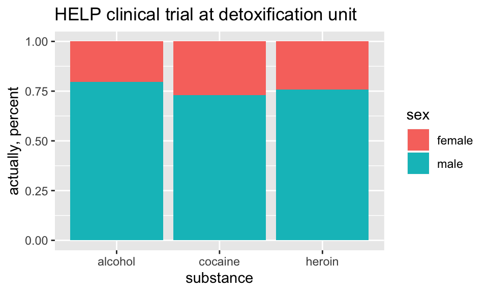


##### How old are people in the HELP study? {-}


```r
HELPrct %>% 
  ggplot(aes(x=age)) + 
  geom_histogram()+
  ggtitle("HELP clinical trial at detoxification unit")
```

```
## `stat_bin()` using `bins = 30`. Pick better value with `binwidth`.
```


Notice the messages

* `stat_bin`:  Histograms are not mapping the raw data but binned data.  
`stat_bin()` performs the data transformation.

* `binwidth`: a default `binwidth` has been selected, but we should really choose our own.

##### Setting the binwidth manually {-}


```r
HELPrct %>% 
  ggplot(aes(x=age)) + 
  geom_histogram(binwidth=2)+
  ggtitle("HELP clinical trial at detoxification unit")
```


##### How old are people in the HELP study? -- Other geoms {-}


```r
HELPrct %>% 
  ggplot(aes(x=age)) + 
  geom_freqpoly(binwidth=2)+
  ggtitle("HELP clinical trial at detoxification unit")
```


```r
HELPrct %>% 
  ggplot(aes(x=age)) + 
  geom_density()+
  ggtitle("HELP clinical trial at detoxification unit")
```


##### Selecting stat and geom manually {-}

Every geom comes with a default stat

* for simple cases, the stat is `stat_identity()` which does nothing
* we can mix and match geoms and stats however we like


```r
HELPrct %>% 
  ggplot(aes(x=age)) + 
  geom_line(stat="density")+
  ggtitle("HELP clinical trial at detoxification unit")
```


##### Selecting stat and geom manually {-}

Every stat comes with a default `geom`, every geom with a default stat

* we can specify stats instead of `geom`, if we prefer
* we can mix and match geoms and stats however we like


```r
HELPrct %>% 
  ggplot(aes(x=age)) + 
  stat_density( geom="line")+
  ggtitle("HELP clinical trial at detoxification unit")
```


##### More combinations {-}


```r
HELPrct %>% 
  ggplot(aes(x=age)) + 
  geom_point(stat="bin", binwidth=3) + 
  geom_line(stat="bin", binwidth=3)  +
  ggtitle("HELP clinical trial at detoxification unit")
```


```r
HELPrct %>% 
  ggplot(aes(x=age)) + 
  geom_area(stat="bin", binwidth=3) +
  ggtitle("HELP clinical trial at detoxification unit") 
```


```r
HELPrct %>% 
  ggplot(aes(x=age)) + 
  geom_point(stat="bin", binwidth=3, aes(size=..count..)) +
  geom_line(stat="bin", binwidth=3) +
  ggtitle("HELP clinical trial at detoxification unit")
```

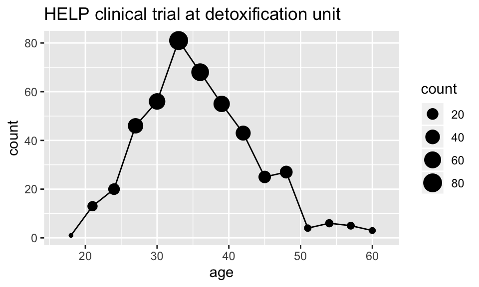

##### How much do they drink? (i1) {-}


```r
HELPrct %>% 
  ggplot(aes(x=i1)) + geom_histogram()+
  ggtitle("HELP clinical trial at detoxification unit")
```


```r
HELPrct %>% 
  ggplot(aes(x=i1)) + geom_density()+
  ggtitle("HELP clinical trial at detoxification unit")
```

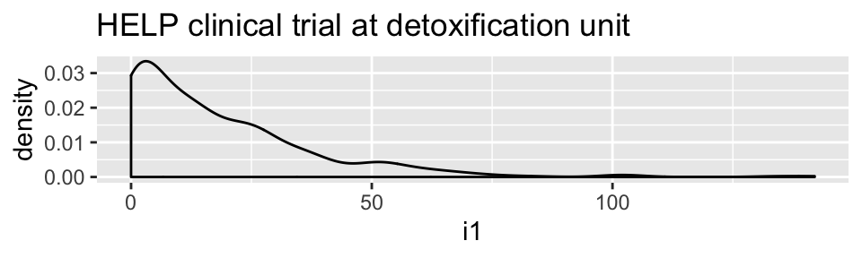


```r
HELPrct %>% 
  ggplot(aes(x=i1)) + geom_area(stat="density")+
  ggtitle("HELP clinical trial at detoxification unit")
```


##### Covariates: Adding in more variables {-}


Using `color` and `linetype`:


```r
HELPrct %>% 
  ggplot(aes(x=i1, color=substance, linetype=sex)) + 
  geom_line(stat="density")+
  ggtitle("HELP clinical trial at detoxification unit")
```


Using `color` and `facet`s


```r
HELPrct %>% 
  ggplot(aes(x=i1, color=substance)) + 
  geom_line(stat="density") + facet_grid( . ~ sex )+
  ggtitle("HELP clinical trial at detoxification unit")
```


```r
HELPrct %>% 
  ggplot(aes(x=i1, color=substance)) + 
  geom_line(stat="density") + facet_grid( sex ~ . )+
  ggtitle("HELP clinical trial at detoxification unit")
```

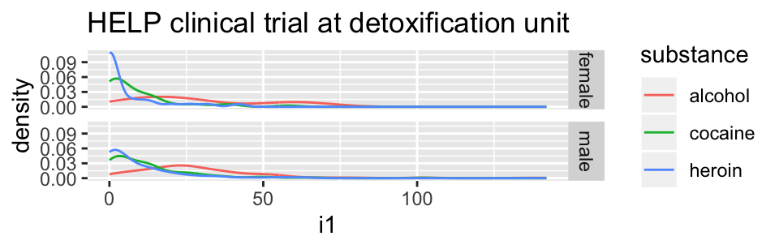


##### Boxplots {-}
Boxplots use `stat_quantile()`  which computes a five-number summary  (roughly the five quartiles of the data) and uses them to define a "box" and "whiskers".

The quantitative variable must be `y`, and there must be an additional `x` variable. 


```r
HELPrct %>% 
  ggplot(aes(x=substance, y=age, color=sex)) + 
  geom_boxplot()+
  ggtitle("HELP clinical trial at detoxification unit")
```


##### Horizontal boxplots {-}

Horizontal boxplots are obtained by flipping the coordinate system:

```r
HELPrct %>% 
  ggplot(aes(x=substance, y=age, color=sex)) + 
  geom_boxplot() +
  coord_flip()+
  ggtitle("HELP clinical trial at detoxification unit")
```

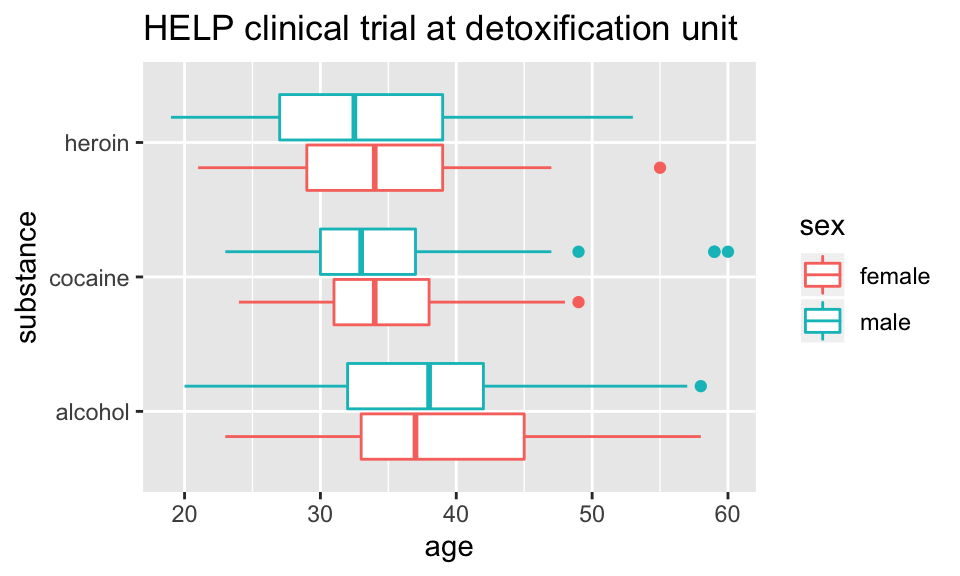

* `coord_flip()` may be used with other plots as well to reverse the roles
of `x` and `y` on the plot.


##### Axes scaling with boxplots {-}

We can scale the continuous axis

```r
HELPrct %>% 
  ggplot(aes(x=substance, y=age, color=sex)) + 
  geom_boxplot() +
  coord_trans(y="log")+
  ggtitle("HELP clinical trial at detoxification unit")
```


##### Give me some space {-}

We've triggered a new feature: `dodge` (for dodging things left/right). We can control how much if we set the dodge manually.


```r
HELPrct %>% 
  ggplot(aes(x=substance, y=age, color=sex)) + 
  geom_boxplot(position=position_dodge(width=1)) +
  ggtitle("HELP clinical trial at detoxification unit")
```


##### Issues with bigger data {-}


```r
require(NHANES)
dim(NHANES)
```

```
## [1] 10000    76
```

```r
NHANES %>%  ggplot(aes(x=Height, y=Weight)) +
  geom_point() + facet_grid( Gender ~ PregnantNow ) +
  ggtitle("National Health and Nutrition Examination Survey")
```


* Although we can see a generally positive association (as we would expect), the over plotting may be hiding information.

##### Using alpha (opacity) {-}

One way to deal with over plotting is to set the opacity low.


```r
NHANES %>% 
  ggplot(aes(x=Height, y=Weight)) +
  geom_point(alpha=0.01) + facet_grid( Gender ~ PregnantNow ) +
  ggtitle("National Health and Nutrition Examination Survey")
```


##### geom_density2d {-}

Alternatively (or simultaneously) we might prefer a different `geom` altogether.


```r
NHANES %>% 
  ggplot(aes(x=Height, y=Weight)) +
  geom_density2d() + facet_grid( Gender ~ PregnantNow ) +
  ggtitle("National Health and Nutrition Examination Survey")
```

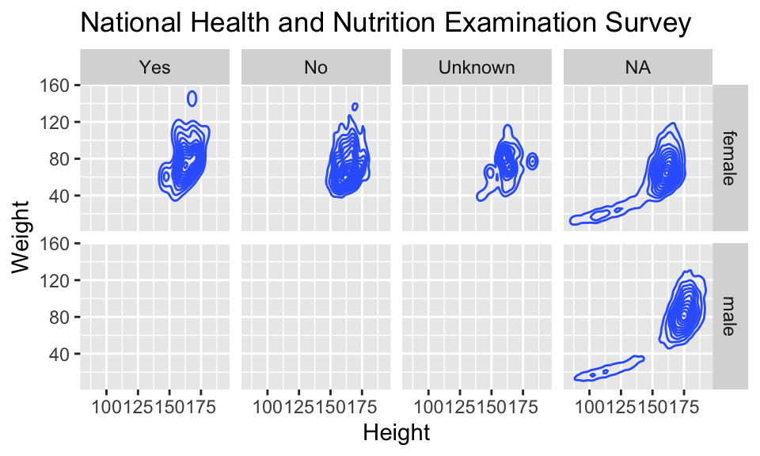


##### Multiple layers {-}


```r
ggplot( data=HELPrct, aes(x=sex, y=age)) +
  geom_boxplot(outlier.size=0) +
  geom_jitter(alpha=.6) +
  coord_flip()+
  ggtitle("HELP clinical trial at detoxification unit")
```

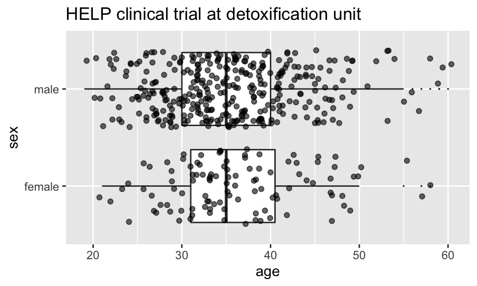

##### Multiple layers {-}


```r
ggplot( data=HELPrct, aes(x=sex, y=age)) +
  geom_boxplot(outlier.size=0) +
  geom_point(alpha=.6, position=position_jitter(width=.1, height=0)) +
  coord_flip()+
  ggtitle("HELP clinical trial at detoxification unit")
```

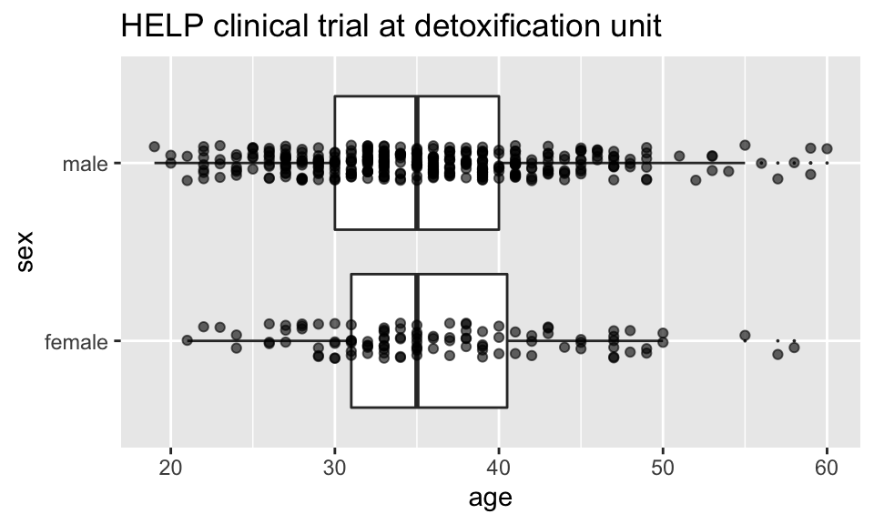


##### Things I haven't mentioned (much) {-}


 * coords (`coord_flip()` is good to know about)
 
 * themes (for customizing appearance)

 * position (`position_dodge()`, `position_jitterdodge()`, `position_stack()`, etc.)
 
 * transforming axes


```r
require(ggthemes)
ggplot(Births78, aes(x=date, y=births)) + geom_point() + 
          theme_wsj()
```

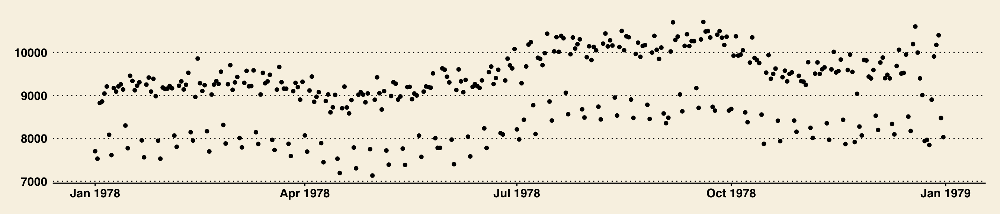

 

```r
ggplot(data=HELPrct, aes(x=substance, y=age, color=sex)) +
  geom_boxplot(coef = 10, position=position_dodge()) +
  geom_point(aes(color=sex, fill=sex), position=position_jitterdodge()) +
  ggtitle("HELP clinical trial at detoxification unit")
```

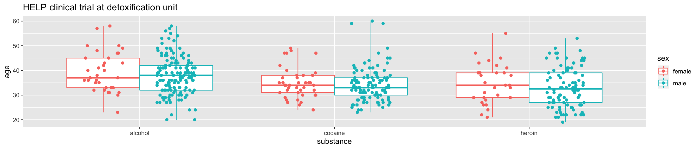


##### A little bit of everything {-}


```r
ggplot( data=HELPrct, aes(x=substance, y=age, color=sex)) +
  geom_boxplot(coef = 10, position=position_dodge(width=1)) +
  geom_point(aes(fill=sex), alpha=.5, 
             position=position_jitterdodge(dodge.width=1)) + 
  facet_wrap(~homeless)+
  ggtitle("HELP clinical trial at detoxification unit")
```

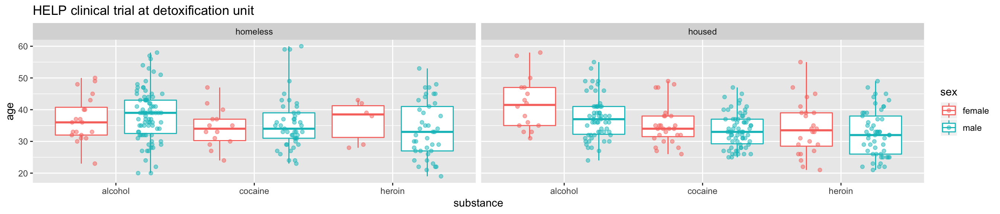


#### Want to learn more? {-}

 * [docs.ggplot2.org/](http://docs.ggplot2.org/)
 
 * Winston Chang's: *R Graphics Cookbook*
 


#### What else can we do? {-}


`shiny`

* interactive graphics / modeling

* https://shiny.rstudio.com/

`plotly` 

> `Plotly` is an R package for creating interactive web-based graphs via plotly's JavaScript graphing library, `plotly.js`. The `plotly` R library contains the `ggplotly` function , which will convert `ggplot2` figures into a Plotly object. Furthermore, you have the option of manipulating the Plotly object with the `style` function.
 
 * https://plot.ly/ggplot2/getting-started/
 
Dynamic documents

 * combination of `RMarkdown`, `ggvis`, and `shiny`
 
 
